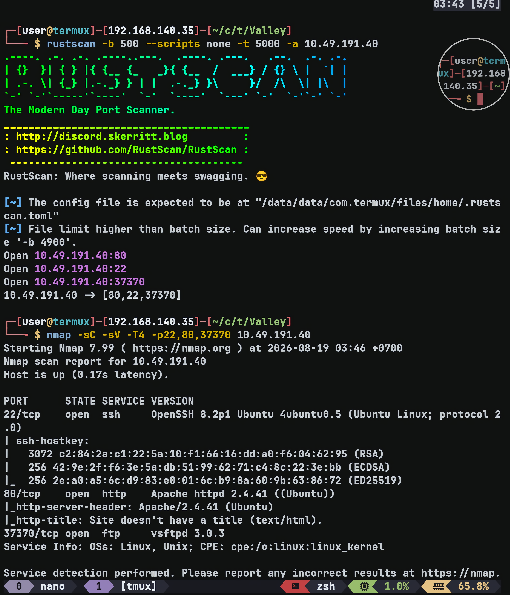
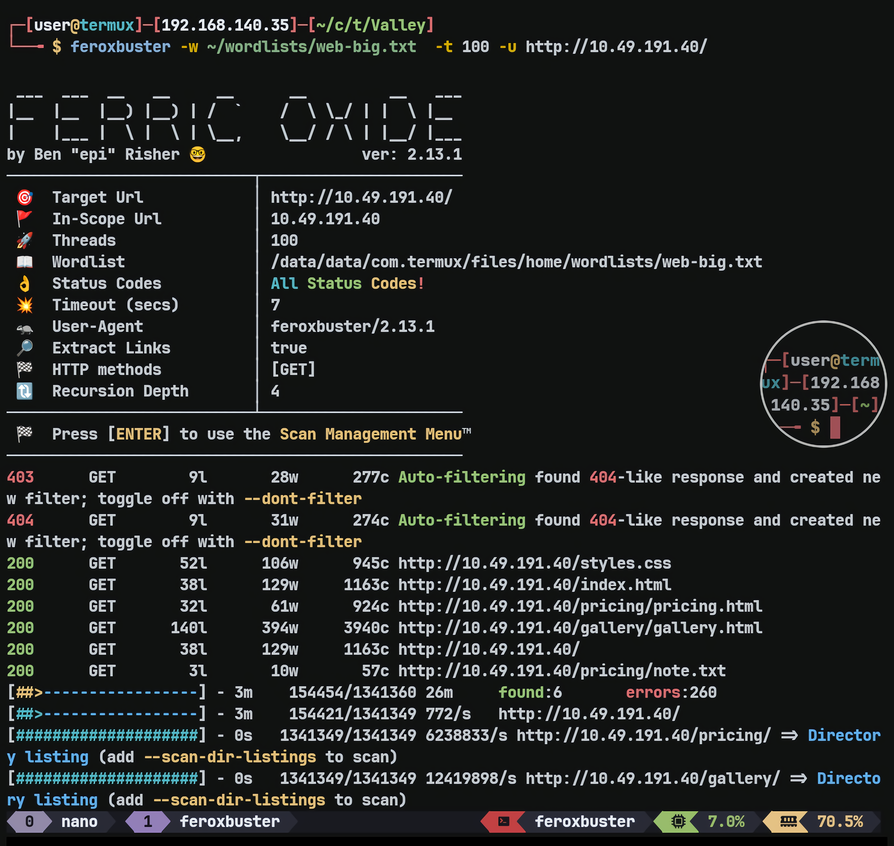
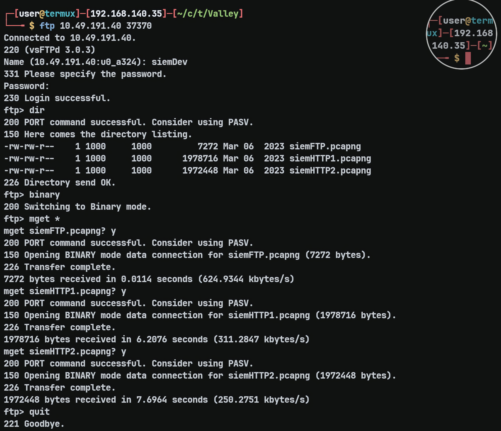
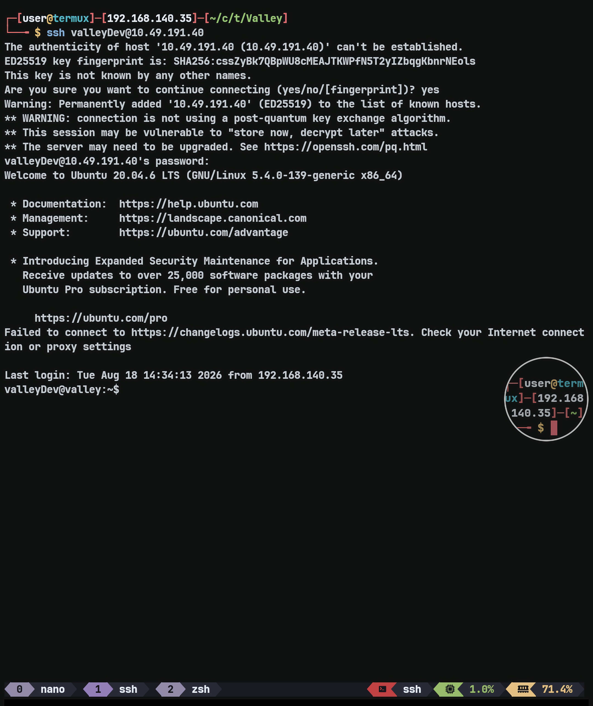
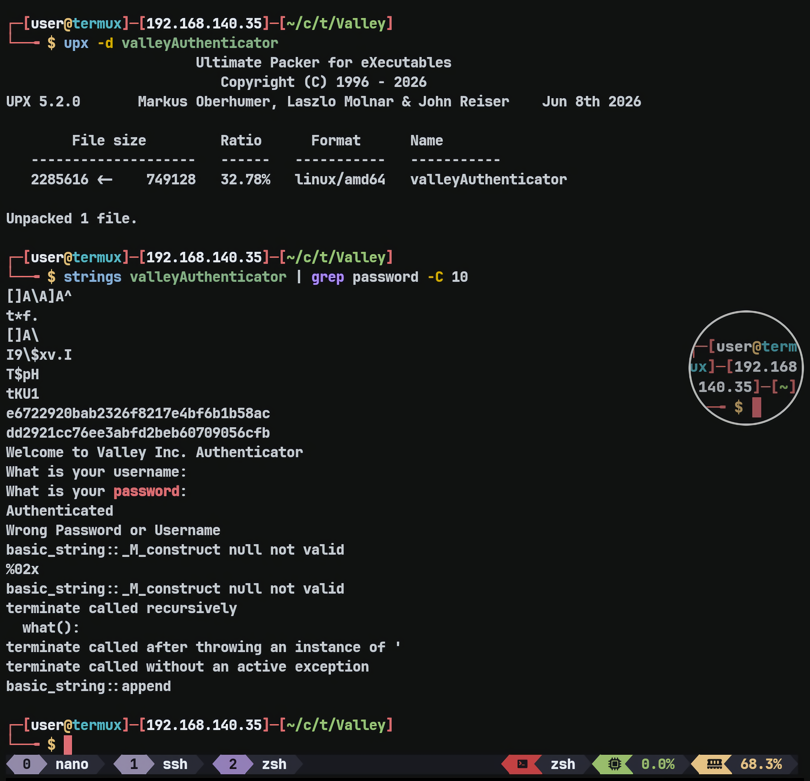
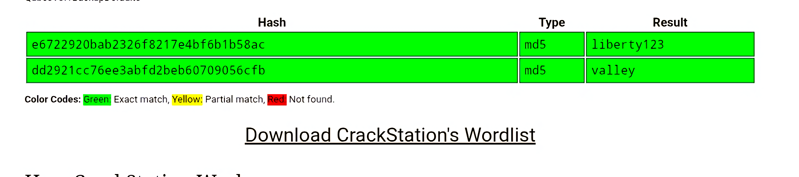
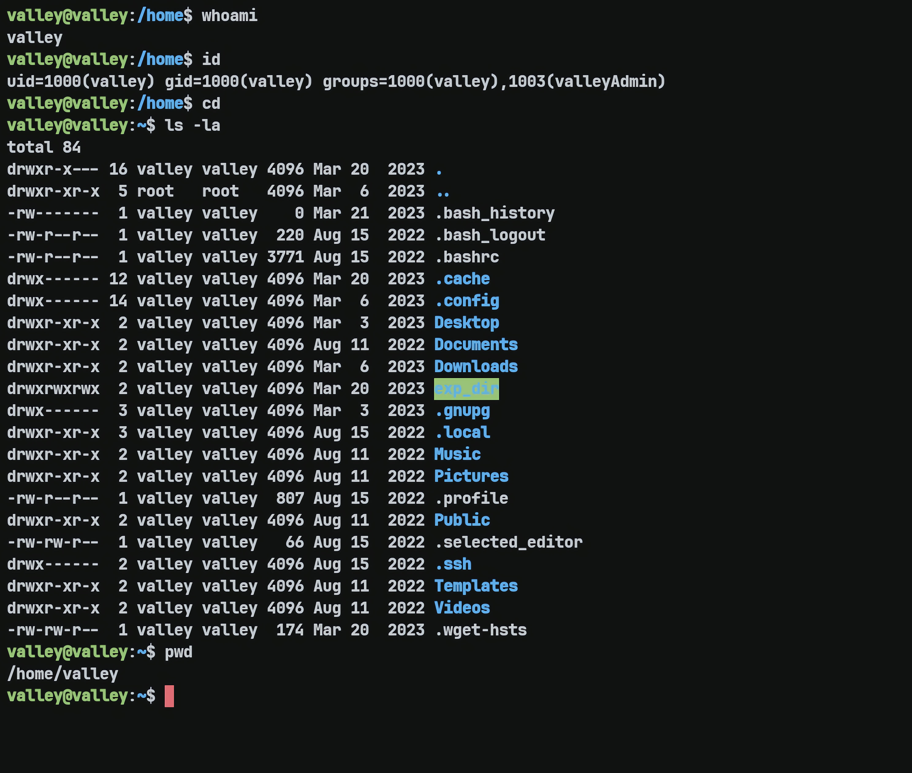
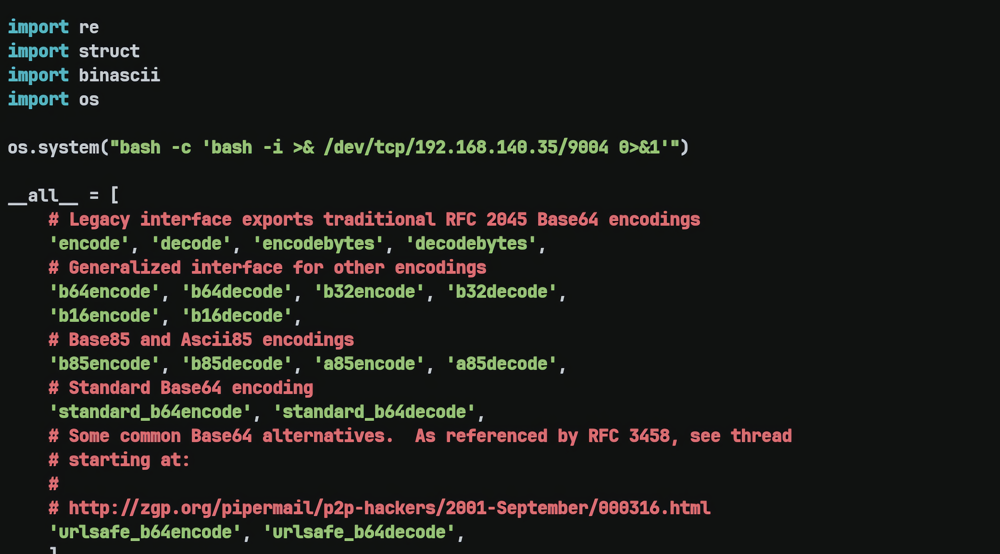
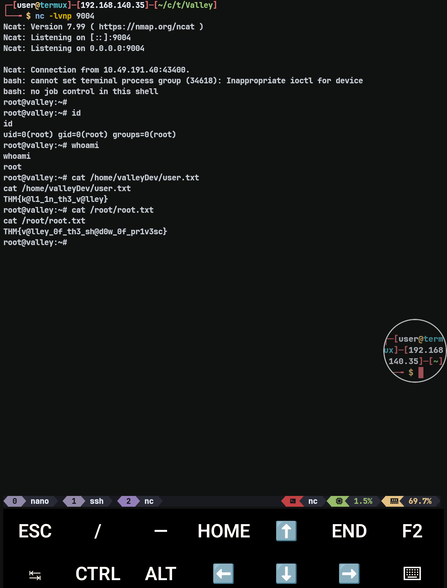

# Valley — TryHackMe Writeup

**Target:** Valley  
**Platform:** TryHackMe  
**Difficulty:** Easy  
**Kategori:** Web Enumeration, FTP, PCAP Analysis, Binary Analysis, Python Library Hijacking, Privilege Escalation

---

## Recon

Dimulai dengan Rustscan untuk melakukan port scanning.

```bash
rustscan -b 2000 --scripts none -t 5000 -a TARGET_IP
```

Dilanjutkan dengan Nmap untuk melakukan enumerasi service.

```bash
nmap -sC -sV -T4 -p22,80,37370 TARGET_IP
```



Terdapat FTP yang terbuka, tetapi kemungkinan tidak dapat digunakan untuk anonymous login. Karena itu saya mencoba melakukan enumerasi terhadap website terlebih dahulu.

---

## Web Enumeration

Saya menjalankan Feroxbuster di background untuk melakukan directory fuzzing.

```bash
feroxbuster -w ~/wordlists/web-big.txt -t 100 -u http://TARGET_IP/
```



Feroxbuster menemukan `/pricing/note.txt` yang berisi:

```text
J,
Please stop leaving notes randomly on the website
-RP
```

Kemungkinan terdapat note lain di website. Saya kemudian menemukan note lain pada `/static/00` yang berisi:

```text
dev notes from valleyDev:
-add wedding photo examples
-redo the editing on #4
-remove /dev1243224123123
-check for SIEM alerts
```

Dari note tersebut terdapat endpoint baru `/dev1243224123123`. Endpoint tersebut merupakan login page. Saat mengecek source code, terdapat:

```html
<script defer src="dev.js"></script>
```

Setelah mengecek `dev.js`, saya menemukan credential yang terekspos:

```javascript
if (username === "siemDev" && password === "california") {
    window.location.href = "/dev1243224123123/devNotes37370.txt";
} else {
```

Saya mencoba mengakses endpoint tersebut tanpa login dan ternyata berhasil.

Isi dev notes:

```text
dev notes for ftp server:
-stop reusing credentials
-check for any vulnerabilies
-stay up to date on patching
-change ftp port to normal port
```

Dari note tersebut, saya berasumsi bahwa credential `siemDev:california` mungkin juga digunakan untuk login FTP.

---

## FTP Enumeration

Saya mencoba login ke FTP menggunakan credential tersebut.



Login berhasil. Setelah itu saya mentransfer ketiga file yang tersedia untuk dianalisis lebih lanjut.

Dari analisis terhadap `siemHTTP1.pcapng`, ditemukan credential dari sebuah HTTP POST request:

```http
POST /index.html HTTP/1.1
Host: 192.168.111.136
Content-Type: application/x-www-form-urlencoded
Content-Length: 42

uname=valleyDev&psw=ph0t0s1234&remember=on
```

Credential yang ditemukan:

```text
Username: valleyDev
Password: ph0t0s1234
```

Saya kemudian berhasil login ke SSH menggunakan credential tersebut.



---

## Privilege Escalation — Cron Job

Setelah login, saya melanjutkan enumerasi dan menemukan cron job berikut:

```text
* * * * * root python3 /photos/script/photosEncrypt.py
```

Script tersebut dijalankan setiap satu menit sebagai root.

Isi script:

```python
#!/usr/bin/python3
import base64
for i in range(1,7):
# specify the path to the image file you want to encode
        image_path = "/photos/p" + str(i) + ".jpg"
# open the image file and read its contents
        with open(image_path, "rb") as image_file:
          image_data = image_file.read()

# encode the image data in Base64 format
        encoded_image_data = base64.b64encode(image_data)

# specify the path to the output file
        output_path = "/photos/photoVault/p" + str(i) + ".enc"

# write the Base64-encoded image data to the output file
        with open(output_path, "wb") as output_file:
          output_file.write(encoded_image_data)
```

Saya sempat berpikir untuk melakukan Python library hijacking karena script tersebut melakukan `import base64`.

Namun, permission pada library `base64.py` adalah:

```text
-rwxrwxr-x 1 root valleyAdmin 20382 Mar 13  2023 /usr/lib/python3.8/base64.py
```

Untuk dapat memodifikasi file tersebut, saya harus menjadi bagian dari group `valleyAdmin`. Karena user saya saat itu belum berada di group tersebut, saya memarkir jalur ini terlebih dahulu dan melanjutkan enumerasi.

---

## Binary Enumeration

Saat melakukan enumerasi lebih lanjut, saya menemukan binary:

```text
-rwxrwxr-x  1 valley    valley    749128 Aug 14  2022 valleyAuthenticator
```

Informasi file:

```text
/home/valleyAuthenticator: ELF 64-bit LSB executable, x86-64, version 1 (GNU/Linux), statically linked, no section header
```

Saat dijalankan, program tersebut meminta username dan password. Saya mencoba menggunakan credential SSH sebelumnya, tetapi gagal.

Karena itu saya mendownload binary tersebut ke mesin saya untuk dianalisis lebih lanjut.

Saat melakukan analisis, saya menemukan string:

```text
UPX!
```

yang mengindikasikan bahwa binary tersebut dibungkus menggunakan UPX.



Setelah binary didekompresi, saya mendapatkan lebih banyak data dari string dan menemukan dua hash:

```text
e6722920bab2326f8217e4bf6b1b58ac
dd2921cc76ee3abfd2beb60709056cfb
```

Saya kemudian mencoba melakukan cracking menggunakan CrackStation.



Dari hasil tersebut saya mendapatkan credential baru untuk user `valley`.



Setelah berhasil mendapatkan akses sebagai `valley`, saya mengecek group membership dan menemukan bahwa user tersebut berada di group `valleyAdmin`.

Dengan begitu, jalur Python library hijacking yang sebelumnya saya parkir sekarang dapat digunakan.

---

## Root — Python Library Hijacking

Karena user `valley` merupakan member dari group `valleyAdmin`, saya sekarang memiliki permission untuk memodifikasi:

```text
/usr/lib/python3.8/base64.py
```

Saya kemudian memodifikasi library tersebut dengan payload untuk mendapatkan shell root ketika `photosEncrypt.py` dijalankan oleh cron.



Setelah library berhasil dimodifikasi, saya hanya perlu menunggu hingga cron menjalankan `photosEncrypt.py` kembali.

Karena script dijalankan sebagai root dan melakukan `import base64`, payload yang saya masukkan ke dalam `base64.py` ikut dieksekusi dengan privilege root.



---

## Flags

### User Flag

```text
THM{k@l1_1n_th3_v@lley}
```

### Root Flag

```text
THM{v@lley_0f_th3_sh@d0w_0f_pr1v3sc}
```

